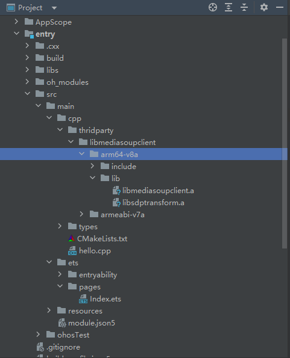
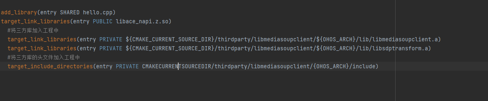
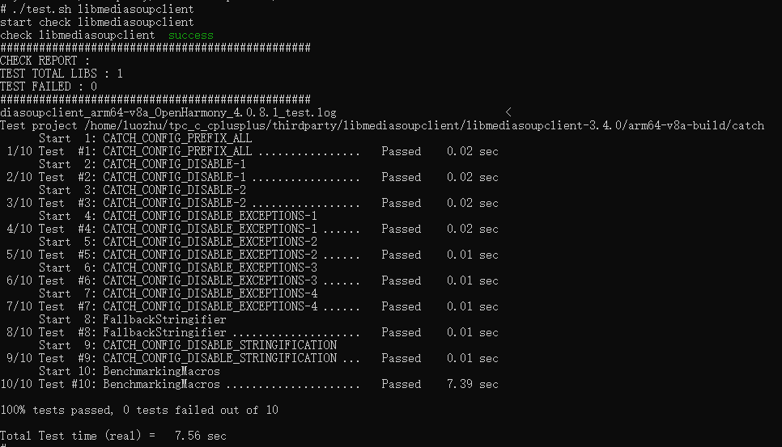

# libmediasoupclient集成到应用hap

本库是在RK3568开发板上基于OpenHarmony3.2 Release版本的镜像验证的，如果是从未使用过RK3568，可以先查看[润和RK3568开发板标准系统快速上手](https://gitee.com/openharmony-sig/knowledge_demo_temp/tree/master/docs/rk3568_helloworld)。

## 开发环境

- ubuntu20.04
- [OpenHarmony3.2Release镜像](https://gitee.com/link?target=https%3A%2F%2Frepo.huaweicloud.com%2Fopenharmony%2Fos%2F3.2-Release%2Fdayu200_standard_arm32.tar.gz)
- [ohos_sdk_public 4.0.8.1 (API Version 10 Release)](https://gitee.com/link?target=http%3A%2F%2Fdownload.ci.openharmony.cn%2Fversion%2FMaster_Version%2FOpenHarmony_4.0.8.1%2F20230608_091058%2Fversion-Master_Version-OpenHarmony_4.0.8.1-20230608_091058-ohos-sdk-public.tar.gz)
- [DevEco Studio 3.1 Release](https://gitee.com/link?target=https%3A%2F%2Fcontentcenter-vali-drcn.dbankcdn.cn%2Fpvt_2%2FDeveloperAlliance_package_901_9%2F81%2Fv3%2FtgRUB84wR72nTfE8Ir_xMw%2Fdevecostudio-windows-3.1.0.501.zip%3FHW-CC-KV%3DV1%26HW-CC-Date%3D20230621T074329Z%26HW-CC-Expire%3D315360000%26HW-CC-Sign%3D22F6787DF6093ECB4D4E08F9379B114280E1F65DA710599E48EA38CB24F3DBF2)
- [准备三方库构建环境](../../../lycium/README.md#1编译环境准备)
- [准备三方库测试环境](../../../lycium/README.md#3ci环境准备)

## 编译三方库

- 下载本仓库
  ```
  git clone https://gitee.com/openharmony-sig/tpc_c_cplusplus.git --depth=1
  ```
- 三方库目录结构
  ```
  tpc_c_cplusplus/thirdparty/libmediasoupclient  # 三方库libmediasoupclient的目录结构如下
  ├── docs                                       # 三方库相关文档的文件夹
  ├── HPKBUILD                                   # 编译脚本
  ├── HPKCHECK                                   # 测试脚本
  ├── OAT.xml                                    # OAT开源审查文本
  ├── libmediasoupclient_oh_pkg.patch            # patch文件
  ├── README.OpenSource                          # 说明三方库源码的下载地址，版本，license等信息
  ├── README_zh.md                               # 三方库说明文档
  ├── SHA512SUM                                  # 三方库校验文件
  ```

- 在lycium目录下编译三方库 
  libmediasoupclient库不需要依赖其它库，所以在build时只需要编译libmediasoupclient库即可
  编译环境的搭建参考[准备三方库构建环境](../../../lycium/README.md#1编译环境准备)
  ``` 
  cd lycium
  ./build.sh libmediasoupclient
  ```
- 三方库头文件及生成的库
  在lycium目录下会生成usr目录，该目录下存在已编译完成的32位和64位三方库
  ```
  libmediasoupclient/arm64-v8a   libmediasoupclient/armeabi-v7a
  ```

- [测试三方库](#测试三方库)

## 应用中使用三方库

- 在IDE的cpp目录下新增thirdparty目录，将编译生成的库和依赖库拷贝到该目录下，如下图所示
  &nbsp;


- 在最外层（cpp目录下）CMakeLists.txt中添加如下语句
  ```shell
  #将三方库加入工程中
  target_link_libraries(entry PRIVATE ${CMAKE_CURRENT_SOURCE_DIR}/thirdparty/libmediasoupclient/${OHOS_ARCH}/lib/libmediasoupclient.a)
  target_link_libraries(entry PRIVATE ${CMAKE_CURRENT_SOURCE_DIR}/thirdparty/libmediasoupclient/${OHOS_ARCH}/lib/libsdptransform.a)
  #将三方库的头文件加入工程中
  target_include_directories(entry PRIVATE CMAKECURRENTSOURCEDIR/thirdparty/libmediasoupclient/${OHOS_ARCH}/include)

  ```



## 测试三方库
三方库的测试使用自己编写的测试用例来做测试，[准备三方库测试环境](../../../lycium/README.md#3ci环境准备)

- 将编译生成的可执行文件及生成的动态库准备好

- 将准备好的文件推送到开发板，进入到构建的目录添加执行文件权限和lib库环境执行ctest
&nbsp;

## 参考资料
- [润和RK3568开发板标准系统快速上手](https://gitee.com/openharmony-sig/knowledge_demo_temp/tree/master/docs/rk3568_helloworld)
- [OpenHarmony三方库地址](https://gitee.com/openharmony-tpc)
- [OpenHarmony知识体系](https://gitee.com/openharmony-sig/knowledge)
- [通过DevEco Studio开发一个NAPI工程](https://gitee.com/openharmony-sig/knowledge_demo_temp/blob/master/docs/napi_study/docs/hello_napi.md)
