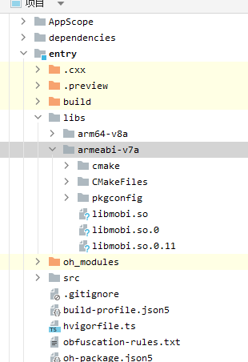
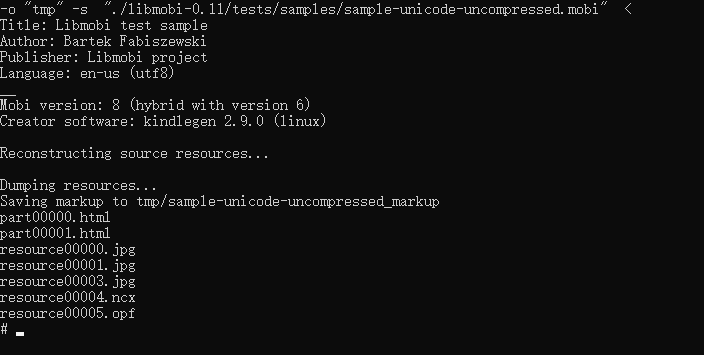

# libmobi集成到应用hap
本库是在RK3568开发板上基于OpenHarmony的镜像验证的，如果是从未使用过RK3568，可以先查看[润和RK3568开发板标准系统快速上手](https://gitee.com/openharmony-sig/knowledge_demo_temp/tree/master/docs/rk3568_helloworld)。
## 开发环境
- ubuntu22.04
- [准备三方库构建环境](../../../lycium/README.md#1编译环境准备)
- [准备三方库测试环境](../../../lycium/README.md#3ci环境准备)
## 编译三方库
- 下载本仓库
  ```
  git clone https://gitee.com/openharmony-sig/tpc_c_cplusplus.git --depth=1
  ```
  
- 三方库目录结构
  ```
  tpc_c_cplusplus/thirdparty/libmobi                      #三方库libmobi的目录结构如下
  ├── docs                                                #三方库相关文档的文件夹
  ├── HPKBUILD                                            #构建脚本
  ├── HPKCHECK						                    #测试脚本
  ├── SHA512SUM                                           #三方库校验文件
  ├── README.OpenSource                                   #说明三方库源码的下载地址，版本，license等信息
  ├── README_zh.md   										#三方库简介
  ├── OAT.xml												#扫描结果文件
  ```
  
- 在lycium目录下编译三方库
  编译环境的搭建参考[准备三方库构建环境](../../../lycium/README.md#1编译环境准备)
  ```
  cd lycium
  ./build.sh libmobi
  ```
  
- 三方库头文件及生成的库
  在lycium目录下会生成usr目录，该目录下存在已编译完成的32位和64位三方库
  
  ```
  libmobi/arm64-v8a   libmobi/armeabi-v7a
  ```
  
- [测试三方库](#测试三方库)

## 应用中使用三方库
- 拷贝库文件到`\\entry\libs\${OHOS_ARCH}\`目录：
  库文件需要在`\\entry\libs\${OHOS_ARCH}\`目录，才能集成到hap包中，所以需要将对应的库文件拷贝到对应CPU架构的目录
  
  
  
- 在最外层（cpp目录下）CMakeLists.txt中添加如下语句
  ```makefile
  
  #将三方库加入工程中
  target_link_libraries(entry PRIVATE ${CMAKE_CURRENT_SOURCE_DIR}/../../../libs/${OHOS_ARCH}/libmobi.so)
  #将三方库的头文件加入工程中
  target_include_directories(entry PRIVATE ${CMAKE_CURRENT_SOURCE_DIR}/thirdparty/libmobi/${OHOS_ARCH}/include)
  
  ```
## 测试三方库
三方库的测试使用原库自带的测试用例来做测试，[准备三方库测试环境](../../../lycium/README.md#3ci环境准备)

进入到构建目录准备测试，32位目录为 armeabi-v7a-build，64位为 arm64-v8a-build，测试用例

```
cd tpc_c_cplusplus/thirdparty/libmobi/libmobi-0.11/armeabi-v7a-build
mkidr tmp
./tools/mobitool -o "tmp" -d  "../tests/samples/sample-unicode-uncompressed.mobi"
```




## 参考资料
- [润和RK3568开发板标准系统快速上手](https://gitee.com/openharmony-sig/knowledge_demo_temp/tree/master/docs/rk3568_helloworld)
- [OpenHarmony三方库地址](https://gitee.com/openharmony-tpc)
- [OpenHarmony知识体系](https://gitee.com/openharmony-sig/knowledge)
- [通过DevEco Studio开发一个NAPI工程](https://gitee.com/openharmony-sig/knowledge_demo_temp/blob/master/docs/napi_study/docs/hello_napi.md)
