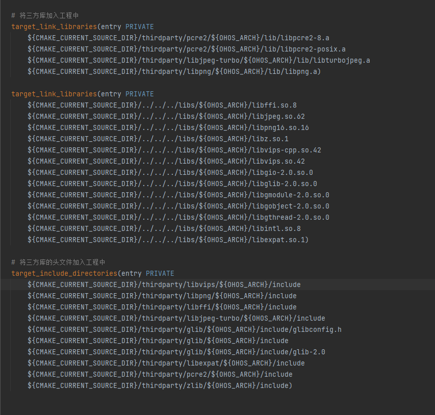
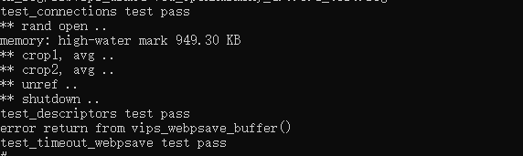

# libvips集成到应用hap

本库是在RK3568开发板上基于OpenHarmony3.2 Release版本的镜像验证的，如果是从未使用过RK3568，可以先查看[润和RK3568开发板标准系统快速上手](https://gitee.com/openharmony-sig/knowledge_demo_temp/tree/master/docs/rk3568_helloworld)。

## 开发环境

- [开发环境准备](../../../docs/hap_integrate_environment.md)

## 编译三方库

- 下载本仓库

  ```shell
  git clone https://gitee.com/openharmony-sig/tpc_c_cplusplus.git --depth=1
  ```

- 三方库目录结构

  ```shell
  tpc_c_cplusplus/thirdparty/libvips    # 三方库libvips的目录结构如下
  ├── docs                              # 三方库相关文档的文件夹
  ├── HPKBUILD                          # 编译脚本
  ├── HPKCHECK                          # 测试脚本
  ├── OAT.xml                           # OAT开源审查文本
  ├── README.OpenSource                 # 说明三方库源码的下载地址，版本，license等信息
  ├── README_zh.md                      # 三方库说明文档
  ├── SHA512SUM                         # 三方库校验文件
  ```

- 在lycium目录下编译三方库

  编译环境的搭建参考[准备三方库构建环境](../../../lycium/README.md#1编译环境准备)

  ```shell
  cd lycium
  ./build.sh libvips
  ```

- 三方库头文件及生成的库

  在lycium目录下会生成usr目录，该目录下存在已编译完成的32位和64位三方库

  ```shell
  libjpeg-turbo/arm64-v8a   libjpeg-turbo/armeabi-v7a
  glib/arm64-v8a            glib/armeabi-v7a
  libffi/arm64-v8a          libffi/armeabi-v7a
  pcre2/arm64-v8a           pcre2/armeabi-v7a
  libexpat/arm64-v8a        libexpat/armeabi-v7a
  libpng/arm64-v8a          libpng/armeabi-v7a
  libjpeg-turbo/arm64-v8a   libjpeg-turbo/armeabi-v7a
  zlib/arm64-v8a            zlib/armeabi-v7a
  ```

- [测试三方库](#测试三方库)

## 应用中使用三方库

- 在IDE的cpp目录下新增thirdparty目录，将编译生成的库拷贝到该目录下，如下图所示

  &nbsp;

  其中xxx代表的是库名，本库即为libvips。

- 在最外层（cpp目录下）CMakeLists.txt中添加如下语句

  ```shell
  # 将三方库加入工程中
  target_link_libraries(entry PRIVATE
      ${CMAKE_CURRENT_SOURCE_DIR}/thirdparty/pcre2/${OHOS_ARCH}/lib/libpcre2-8.a
      ${CMAKE_CURRENT_SOURCE_DIR}/thirdparty/pcre2/${OHOS_ARCH}/lib/libpcre2-posix.a
      ${CMAKE_CURRENT_SOURCE_DIR}/thirdparty/libjpeg-turbo/${OHOS_ARCH}/lib/libturbojpeg.a
      ${CMAKE_CURRENT_SOURCE_DIR}/thirdparty/libpng/${OHOS_ARCH}/lib/libpng.a)

  target_link_libraries(entry PRIVATE
      ${CMAKE_CURRENT_SOURCE_DIR}/../../../libs/${OHOS_ARCH}/libffi.so.8
      ${CMAKE_CURRENT_SOURCE_DIR}/../../../libs/${OHOS_ARCH}/libjpeg.so.62
      ${CMAKE_CURRENT_SOURCE_DIR}/../../../libs/${OHOS_ARCH}/libpng16.so.16
      ${CMAKE_CURRENT_SOURCE_DIR}/../../../libs/${OHOS_ARCH}/libz.so.1
      ${CMAKE_CURRENT_SOURCE_DIR}/../../../libs/${OHOS_ARCH}/libvips-cpp.so.42
      ${CMAKE_CURRENT_SOURCE_DIR}/../../../libs/${OHOS_ARCH}/libvips.so.42
      ${CMAKE_CURRENT_SOURCE_DIR}/../../../libs/${OHOS_ARCH}/libgio-2.0.so.0
      ${CMAKE_CURRENT_SOURCE_DIR}/../../../libs/${OHOS_ARCH}/libglib-2.0.so.0
      ${CMAKE_CURRENT_SOURCE_DIR}/../../../libs/${OHOS_ARCH}/libgmodule-2.0.so.0
      ${CMAKE_CURRENT_SOURCE_DIR}/../../../libs/${OHOS_ARCH}/libgobject-2.0.so.0
      ${CMAKE_CURRENT_SOURCE_DIR}/../../../libs/${OHOS_ARCH}/libgthread-2.0.so.0
      ${CMAKE_CURRENT_SOURCE_DIR}/../../../libs/${OHOS_ARCH}/libintl.so.8
      ${CMAKE_CURRENT_SOURCE_DIR}/../../../libs/${OHOS_ARCH}/libexpat.so.1)

  # 将三方库的头文件加入工程中
  target_include_directories(entry PRIVATE
      ${CMAKE_CURRENT_SOURCE_DIR}/thirdparty/libvips/${OHOS_ARCH}/include
      ${CMAKE_CURRENT_SOURCE_DIR}/thirdparty/libpng/${OHOS_ARCH}/include
      ${CMAKE_CURRENT_SOURCE_DIR}/thirdparty/libffi/${OHOS_ARCH}/include
      ${CMAKE_CURRENT_SOURCE_DIR}/thirdparty/libjpeg-turbo/${OHOS_ARCH}/include
      ${CMAKE_CURRENT_SOURCE_DIR}/thirdparty/glib/${OHOS_ARCH}/include/glibconfig.h
      ${CMAKE_CURRENT_SOURCE_DIR}/thirdparty/glib/${OHOS_ARCH}/include
      ${CMAKE_CURRENT_SOURCE_DIR}/thirdparty/glib/${OHOS_ARCH}/include/glib-2.0
      ${CMAKE_CURRENT_SOURCE_DIR}/thirdparty/libexpat/${OHOS_ARCH}/include
      ${CMAKE_CURRENT_SOURCE_DIR}/thirdparty/pcre2/${OHOS_ARCH}/include
      ${CMAKE_CURRENT_SOURCE_DIR}/thirdparty/zlib/${OHOS_ARCH}/include)
  ```


  

## 测试三方库

三方库的测试使用原库自带的测试用例来做测试，[准备三方库测试环境](../../../lycium/README.md#3ci环境准备)

进入到构建目录执行可执行程序运行测试用例（arm64-v8a-build为构建64位的目录，armeabi-v7a-build为构建32位的目录）

&nbsp;

## 参考资料

- [润和RK3568开发板标准系统快速上手](https://gitee.com/openharmony-sig/knowledge_demo_temp/tree/master/docs/rk3568_helloworld)
- [OpenHarmony三方库地址](https://gitee.com/openharmony-tpc)
- [OpenHarmony知识体系](https://gitee.com/openharmony-sig/knowledge)
- [通过DevEco Studio开发一个NAPI工程](https://gitee.com/openharmony-sig/knowledge_demo_temp/blob/master/docs/napi_study/docs/hello_napi.md)
