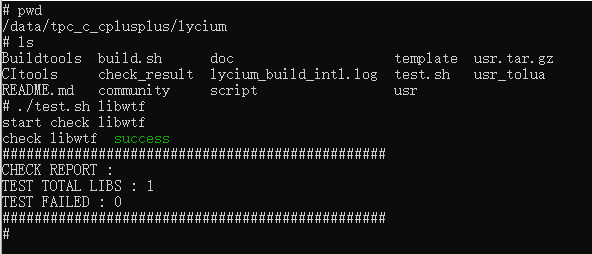

# libwtf 集成到应用hap

本库是在RK3568开发板上基于OpenHarmony3.2 Release版本的镜像验证的，如果是从未使用过RK3568，可以先查看[润和RK3568开发板标准系统快速上手](https://gitee.com/openharmony-sig/knowledge_demo_temp/tree/master/docs/rk3568_helloworld)。

## 开发环境

- [开发环境准备](../../../docs/hap_integrate_environment.md)

## 编译三方库

- 下载本仓库

  ```shell
  git clone https://gitee.com/openharmony-sig/tpc_c_cplusplus.git --depth=1
  ```

- 三方库目录结构

  ```shell
  tpc_c_cplusplus/thirdparty/libwtf     #三方库libwtf的目录结构如下
  ├── docs                              #三方库相关文档的文件夹
  ├── HPKBUILD                          #构建脚本
  ├── HPKCHECK                          #测试脚本
  ├── SHA512SUM                         #三方库校验文件 
  ├── OAT.xml                       	#OAT开源审查文本文件
  ├── README.OpenSource                 #说明三方库源码的下载地址，版本，license等信息
  ├── README_zh.md                      #三方库简介
  ├── JavaScriptCore_oh_pkg.patch       #原生库的补丁文件
  ```
  
- 在lycium目录下编译三方库

  编译环境的搭建参考[准备三方库构建环境](../../../lycium/README.md#1编译环境准备)

  ```shell
  cd lycium
  ./build.sh libwtf
  ```

- 三方库头文件及生成的库

  在lycium目录下会生成usr目录，该目录下存在已编译完成的64位三方库。原库CMakeList.txts中，写明暂不支持32位。

  ```shell
  libwtf/arm64-v8a
  ```

- [测试三方库](#测试三方库)

## 应用中使用三方库

- 在IDE的cpp目录下新增thirdparty目录，将编译生成的头文件拷贝到该目录下，将编译生成的三方库以及依赖库全部（动态库名字带版本号和不带版本号的都需要）拷贝到工程的libs目录下，如下图所示：

- 在最外层（cpp目录下）CMakeLists.txt中添加如下语句

  ```shell
  # 将三方库及依赖加入工程
  # icu依赖
  target_link_libraries(entry PRIVATE ${CMAKE_CURRENT_SOURCE_DIR}/thirdparty/icu/${OHOS_ARCH}/lib/libicudata.so)
  target_link_libraries(entry PRIVATE ${CMAKE_CURRENT_SOURCE_DIR}/thirdparty/icu/${OHOS_ARCH}/lib/libicui18n.so)
  target_link_libraries(entry PRIVATE ${CMAKE_CURRENT_SOURCE_DIR}/thirdparty/icu/${OHOS_ARCH}/lib/libicuio.so)
  target_link_libraries(entry PRIVATE ${CMAKE_CURRENT_SOURCE_DIR}/thirdparty/icu/${OHOS_ARCH}/lib/libicutu.so)
  target_link_libraries(entry PRIVATE ${CMAKE_CURRENT_SOURCE_DIR}/thirdparty/icu/${OHOS_ARCH}/lib/libicuuc.so)
  # 头文件
  target_include_directories(entry PRIVATE  ${CMAKE_CURRENT_SOURCE_DIR}/thirdparty/icu/${OHOS_ARCH}/include)
  
  # libwtf库
  target_link_libraries(entry PRIVATE ${CMAKE_CURRENT_SOURCE_DIR}/thirdparty/libwtf/${OHOS_ARCH}/lib/libWTF.a)
  target_link_libraries(entry PRIVATE ${CMAKE_CURRENT_SOURCE_DIR}/thirdparty/libwtf/${OHOS_ARCH}/lib/libJavaScriptCore.a)
  target_link_libraries(entry PRIVATE ${CMAKE_CURRENT_SOURCE_DIR}/thirdparty/libwtf/${OHOS_ARCH}/lib/libbmalloc.a)
  # 头文件64
  target_include_directories(entry PRIVATE ${CMAKE_CURRENT_SOURCE_DIR}/thirdparty/libwtf/${OHOS_ARCH}/include)
  ```
  **备注：源码有c++20语法，所以deveco中build-profile中修改参数`"cppFlags": "-std=c++20",`**

## 测试三方库

在lycium目录下，执行脚本
```shell
cd lycium
./test.sh libwtf
```
**注1:由于OpenHarmony环境下，char类型视为无符号类型，会导致char类型和有符号类型之间边界值测试失败，当前UnitTest_MathExtras.patch会对相关测试用例进行修复**

**注2：原册俄式用例,时区设置如果不是GMT-07:00，会有WF_DateMath.calculateLocalTimeOffset报错，当前UnitTest_MathExtras.patch会对相关测试用例进行屏蔽****

**注3: StackTraceTest堆栈打印错误日志和ubuntu一样,当前UnitTest_MathExtras.patch会对相关测试用例进行屏蔽**




## 参考资料

- [润和RK3568开发板标准系统快速上手](https://gitee.com/openharmony-sig/knowledge_demo_temp/tree/master/docs/rk3568_helloworld)
- [OpenHarmony三方库地址](https://gitee.com/openharmony-tpc)
- [OpenHarmony知识体系](https://gitee.com/openharmony-sig/knowledge)
- [通过DevEco Studio开发一个NAPI工程](https://gitee.com/openharmony-sig/knowledge_demo_temp/blob/master/docs/napi_study/docs/hello_napi.md)