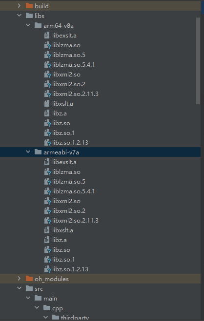
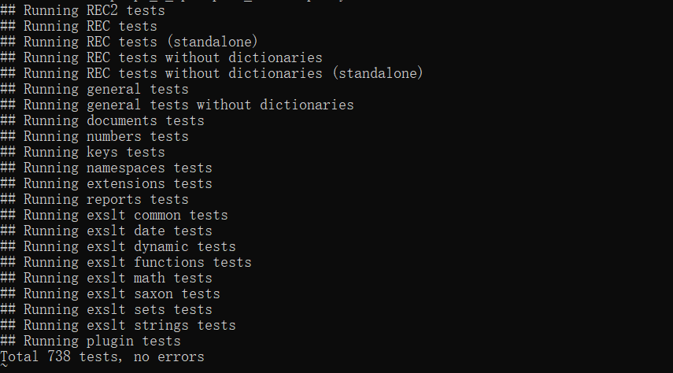

# libxslt集成到应用hap
本库是在RK3568开发板上基于OpenHarmony3.2 Release版本的镜像验证的，如果是从未使用过RK3568，可以先查看[润和RK3568开发板标准系统快速上手](https://gitee.com/openharmony-sig/knowledge_demo_temp/tree/master/docs/rk3568_helloworld)。
## 开发环境
- ubuntu20.04
- [OpenHarmony3.2Release镜像](https://gitee.com/link?target=https%3A%2F%2Frepo.huaweicloud.com%2Fopenharmony%2Fos%2F3.2-Release%2Fdayu200_standard_arm32.tar.gz)
- [ohos_sdk_public 4.0.8.1 (API Version 10 Release)](https://gitee.com/link?target=http%3A%2F%2Fdownload.ci.openharmony.cn%2Fversion%2FMaster_Version%2FOpenHarmony_4.0.8.1%2F20230608_091058%2Fversion-Master_Version-OpenHarmony_4.0.8.1-20230608_091058-ohos-sdk-public.tar.gz)
- [DevEco Studio 3.1 Release](https://gitee.com/link?target=https%3A%2F%2Fcontentcenter-vali-drcn.dbankcdn.cn%2Fpvt_2%2FDeveloperAlliance_package_901_9%2F81%2Fv3%2FtgRUB84wR72nTfE8Ir_xMw%2Fdevecostudio-windows-3.1.0.501.zip%3FHW-CC-KV%3DV1%26HW-CC-Date%3D20230621T074329Z%26HW-CC-Expire%3D315360000%26HW-CC-Sign%3D22F6787DF6093ECB4D4E08F9379B114280E1F65DA710599E48EA38CB24F3DBF2)
- [准备三方库构建环境](../../../lycium/README.md#1编译环境准备)
- [准备三方库测试环境](../../../lycium/README.md#3ci环境准备)

## 编译三方库
- 下载本仓库
  ```
  git clone https://gitee.com/openharmony-sig/tpc_c_cplusplus.git --depth=1
  ```
- 三方库目录结构
  ```
  tpc_c_cplusplus/thirdparty/libxslt     #三方库libxslt的目录结构如下
  ├── docs                              #三方库相关文档的文件夹
  ├── HPKBUILD                          #构建脚本
  ├── SHA512SUM                         #三方库校验文件
  ├── README.OpenSource                 #说明三方库源码的下载地址，版本，license等信息
  ├── HPKCHECK                          #自动化测试脚本
  ├── OAT.xml                           #版权检验文件  
  ├── README_zh.md      
  ```


- 在lycium目录下编译三方库
  编译环境的搭建参考[准备三方库构建环境](../../../lycium/README.md#1编译环境准备)
  
  ```
  
  cd lycium
  ./build.sh libxslt
  ```
- 三方库头文件及生成的库
  在lycium目录下会生成usr目录，该目录下存在已编译完成的32位和64位三方库
  
  ```
  libxslt/arm64-v8a   libxslt/armeabi-v7a          
  ```
  
- [测试三方库](#测试三方库)

## 应用中使用三方库
- 在IDE的libs目录下，将编译生成的库拷贝到该目录下.如下图所示
&nbsp;
- 在entry/src/main/cpp目录下的CMakeLists.txt中添加如下语句
  ```
  
  #将三方库加入工程中
  target_link_libraries(entry PRIVATE 
      ${CMAKE_CURRENT_SOURCE_DIR}/../../../libs/${OHOS_ARCH}/libxslt.a
      ${CMAKE_CURRENT_SOURCE_DIR}/../../../libs/${OHOS_ARCH}/libexslt.a
      ${CMAKE_CURRENT_SOURCE_DIR}/../../../libs/${OHOS_ARCH}/libz.a
      ${CMAKE_CURRENT_SOURCE_DIR}/../../../libs/${OHOS_ARCH}/libxml2.so.2
      ${CMAKE_CURRENT_SOURCE_DIR}/../../../libs/${OHOS_ARCH}/liblzma.so.5
      ${CMAKE_CURRENT_SOURCE_DIR}/../../../libs/${OHOS_ARCH}/libz.so.1)
  #将三方库的头文件加入工程中
  target_include_directories(entry PRIVATE 
      ${CMAKE_CURRENT_SOURCE_DIR}/thirdparty/libxml2/${OHOS_ARCH}/include/libxml2/libxml
      ${CMAKE_CURRENT_SOURCE_DIR}/thirdparty/libxslt/${OHOS_ARCH}/include/libexslt
      ${CMAKE_CURRENT_SOURCE_DIR}/thirdparty/libxslt/${OHOS_ARCH}/include/libxslt
      ${CMAKE_CURRENT_SOURCE_DIR}/thirdparty/xz/${OHOS_ARCH}/include
      ${CMAKE_CURRENT_SOURCE_DIR}/thirdparty/zlib/${OHOS_ARCH}/include)
  ```
## 测试三方库
三方库的测试使用原库自带的测试用例来做测试，[准备三方库测试环境](../../../lycium/README.md#3ci环境准备)


- 将测试资源导入到开发板
mount -o remount,rw /  #重新挂载系统
ln -s /usr/bin/busybox /usr/bin/sed #创建sed软连接
- 设置依赖服务程序路径
```
32位系统
export LD_LIBRARY_PATH=/data/local/tmp/tpc_c_cplusplus/lycium/usr/libxml2/armeabi-v7a/lib:/data/local/tmp/tpc_c_cplusplus/lycium/usr/libxslt/armeabi-v7a/lib:/data/local/tmp/tpc_c_cplusplus/lycium/usr/xz/armeabi-v7a/lib:/data/local/tmp/tpc_c_cplusplus/lycium/usr/zlib/armeabi-v7a/lib:/data/local/tmp/tpc_c_cplusplus/lycium/main/libxslt/libxslt-1.1.38-armeabi-v7a-build/tests/.libs

export LIBXSLT_PLUGINS_PATH=/data/local/tmp/tpc_c_cplusplus/lycium/main/libxslt/libxslt-1.1.38-armeabi-v7a-build/tests/.libs

##64位系统
export LD_LIBRARY_PATH=/data/local/tmp/tpc_c_cplusplus/lycium/usr/libxml2/arm64-v8a/lib:/data/local/tmp/tpc_c_cplusplus/lycium/usr/libxslt/arm64-v8a/lib:/data/local/tmp/tpc_c_cplusplus/lycium/usr/xz/arm64-v8a/lib:/data/local/tmp/tpc_c_cplusplus/lycium/usr/zlib/arm64-v8a/lib:/data/local/tmp/tpc_c_cplusplus/lycium/main/libxslt/libxslt-1.1.38-arm64-v8a-build/tests/.libs

export LIBXSLT_PLUGINS_PATH=/data/local/tmp/tpc_c_cplusplus/lycium/main/libxslt/libxslt-1.1.38-arm64-v8a-build/tests/.libs

```  
- 进入到构建目录$ARCH-build/tests下执行 /usr/bin/make check_test 运行测试用例，如下截图（arm64-v8a-build为构建64位的目录，armeabi-v7a-build为构建32位的目录）




## 参考资料
- [润和RK3568开发板标准系统快速上手](https://gitee.com/openharmony-sig/knowledge_demo_temp/tree/master/docs/rk3568_helloworld)
- [OpenHarmony三方库地址](https://gitee.com/openharmony-tpc)
- [OpenHarmony知识体系](https://gitee.com/openharmony-sig/knowledge)
- [通过DevEco Studio开发一个NAPI工程](https://gitee.com/openharmony-sig/knowledge_demo_temp/blob/master/docs/napi_study/docs/hello_napi.md)
