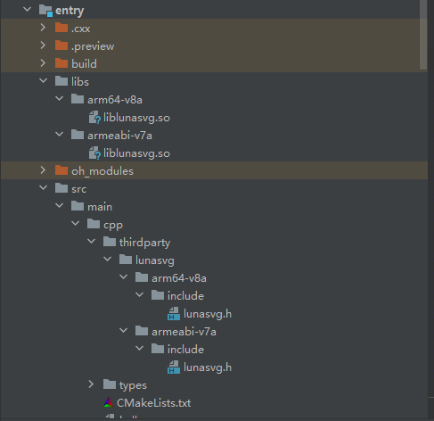
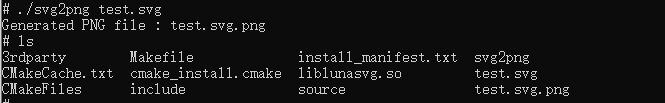

# lunasvg集成到应用hap

本库是在RK3568开发板上基于OpenHarmony3.2 Release版本的镜像验证的，如果是从未使用过RK3568，可以先查看[润和RK3568开发板标准系统快速上手](https://gitee.com/openharmony-sig/knowledge_demo_temp/tree/master/docs/rk3568_helloworld)。

## 开发环境

- [开发环境准备](../../../docs/hap_integrate_environment.md)

## 编译三方库

*   下载本仓库

    ```shell
    git clone https://gitee.com/openharmony-sig/tpc_c_cplusplus.git --depth=1
    ```

*   三方库目录结构

    ```shell
    tpc_c_cplusplus/thirdparty/lunasvg    #三方库lunasvg的目录结构如下
    ├── docs                              #三方库相关文档的文件夹
    ├── HPKBUILD                          #构建脚本
    ├── HPKCHECK                          #测试脚本
    ├── OAT.xml                           #扫描结果文件
    ├── SHA512SUM                         #三方库校验文件
    ├── README.OpenSource                 #说明三方库源码的下载地址，版本，license等信息
    ├── README_zh.md                      #三方库简介
    ├── lunasvgtest.svg                   #该文件用于执行测试用例
    ```

*   在lycium目录下编译三方库

    编译环境的搭建参考[准备三方库构建环境](../../../lycium/README.md#1编译环境准备)

    ```shell
    cd lycium
    ./build.sh luasvg
    ```

*   三方库头文件及生成的库

    在lycium目录下会生成usr目录，该目录下存在已编译完成的32位和64位三方库

    ```shell
    lunasvg-2.3.9/arm64-v8a-build   lunasvg-2.3.9/armeabi-v7a-build
    ```

*   [测试三方库](#测试三方库)

## 应用中使用三方库

- 在IDE的cpp目录下新增thirdparty目录，将编译生成的头文件拷贝到该目录下，将编译生成的三方库拷贝到工程的libs目录下，如下图所示：

&nbsp;

- 在最外层（cpp目录下）CMakeLists.txt中添加如下语句

  ```cmake
  #将三方库加入工程中
  target_link_libraries(entry PRIVATE ${CMAKE_CURRENT_SOURCE_DIR}/../../../libs/${OHOS_ARCH}/liblunasvg.so)
  #将三方库的头文件加入工程中
  target_include_directories(entry PRIVATE ${CMAKE_CURRENT_SOURCE_DIR}/thirdparty/lunasvg/${OHOS_ARCH}/include)
  ```
  

## 测试三方库

- 编译出可执行的文件进行测试，[准备三方库测试环境](../../../lycium/README.md#3ci环境准备)

-  进入到构建目录获取，事先准备一个svg测试文件用于转换为png。执行命令./svg2png test.svg，运行测试用例（lunasvg-2.3.9/arm64-v8a-build为构建64位的目录，lunasvg-2.3.9/armeabi-v7a-build为构建32位的目录）

&nbsp;

## 参考资料

*   [OpenHarmony三方库地址](https://gitee.com/openharmony-tpc)
*   [OpenHarmony知识体系](https://gitee.com/openharmony-sig/knowledge)
*   [lunasvg三方库地址](https://github.com/sammycage/lunasvg/blob/master/README.md)

