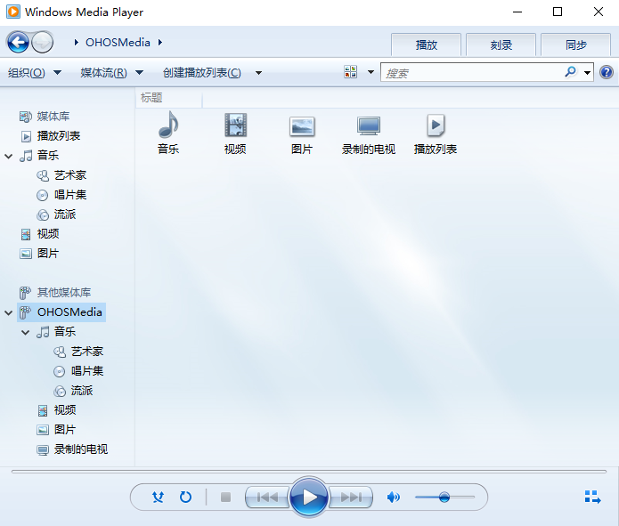
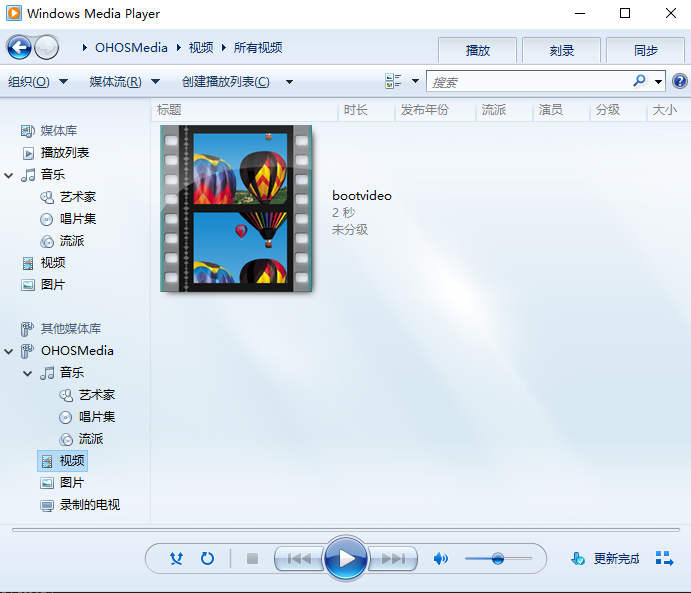
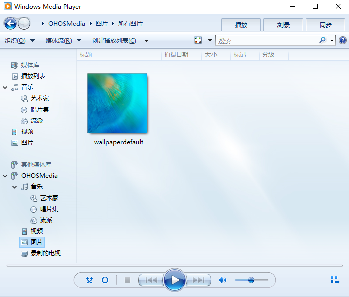
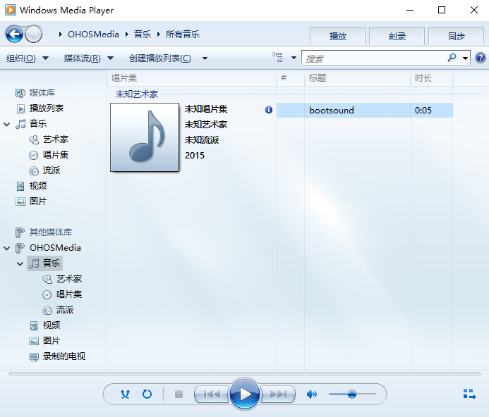
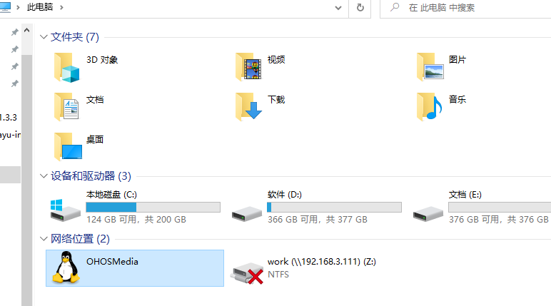
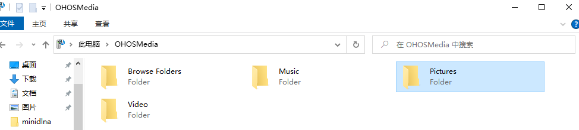

# minidlna集成到应用hap

本库是在RK3568开发板上基于OpenHarmony3.2 Release版本的镜像验证的，如果是从未使用过RK3568，可以先查看[润和RK3568开发板标准系统快速上手](https://gitee.com/openharmony-sig/knowledge_demo_temp/tree/master/docs/rk3568_helloworld)。

## 开发环境

- ubuntu20.04
- [OpenHarmony3.2Release镜像](https://gitee.com/link?target=https%3A%2F%2Frepo.huaweicloud.com%2Fopenharmony%2Fos%2F3.2-Release%2Fdayu200_standard_arm32.tar.gz)
- [ohos_sdk_public 4.0.8.1 (API Version 10 Release)](https://gitee.com/link?target=http%3A%2F%2Fdownload.ci.openharmony.cn%2Fversion%2FMaster_Version%2FOpenHarmony_4.0.8.1%2F20230608_091058%2Fversion-Master_Version-OpenHarmony_4.0.8.1-20230608_091058-ohos-sdk-public.tar.gz)
- [DevEco Studio 3.1 Release](https://gitee.com/link?target=https%3A%2F%2Fcontentcenter-vali-drcn.dbankcdn.cn%2Fpvt_2%2FDeveloperAlliance_package_901_9%2F81%2Fv3%2FtgRUB84wR72nTfE8Ir_xMw%2Fdevecostudio-windows-3.1.0.501.zip%3FHW-CC-KV%3DV1%26HW-CC-Date%3D20230621T074329Z%26HW-CC-Expire%3D315360000%26HW-CC-Sign%3D22F6787DF6093ECB4D4E08F9379B114280E1F65DA710599E48EA38CB24F3DBF2)
- [准备三方库构建环境](../../../lycium/README.md#1编译环境准备)
- [准备三方库测试环境](../../../lycium/README.md#3ci环境准备)

## 编译三方库

- 下载本仓库

  ```shell
  git clone https://gitee.com/openharmony-sig/tpc_c_cplusplus.git --depth=1
  ```

- 三方库目录结构

  ```shell
  tpc_c_cplusplus/thirdparty/minidlna   #三方库minidlna的目录结构如下
  ├── minidlna_oh_pkg.patch             #构建patch文件
  ├── docs                              #三方库相关文档的文件夹
  ├── HPKBUILD                          #构建脚本
  ├── HPKCHECK                          #自动化测试脚本
  ├── SHA512SUM                         #三方库校验文件
  ├── README.OpenSource                 #说明三方库源码的下载地址，版本，license等信息
  ├── README_zh.md                      #三方库说明文档
  ├── OAT.xml                           #开源扫描相关文件
  ```

- 在tpc_c_cplusplus/lycium目录下编译三方库

  编译环境的搭建参考[准备三方库构建环境](../../../lycium/README.md#1编译环境准备)

  ```shell
  cd tpc_c_cplusplus/lycium
  ./build.sh minidlna
  ```

- 三方库头文件及生成的库

  在lycium目录下会生成usr目录，该目录下存在已编译完成的32位和64位三方库和头文件

  ```shell
  minidlna/arm64-v8a   minidlna/armeabi-v7a
  ```
- [测试三方库](#测试三方库)

## 应用中使用三方库

- 该库是服务器程序，按照该库的官方编译指导编译出来的就是可执行程序及服务器相关配置文件，没有动态库和静态库可供应用直接使用。

## 测试三方库

三方库的测试使用原库自带的测试用例来做测试，[准备三方库测试环境](../../../lycium/README.md#3ci环境准备)

- 测试环境搭建

  1. 需要组建测试网络：测试设备与windows电脑处于同一局域网络，双向能ping通对方。
  2. 确保windows电脑的**启用网络发现**和**启用文件和打印机共享**两个配置项是打开的（检查方法：控制面板->网络和Internet->网络共享中心->更改高级共享设置）。

- 配置环境变量
  执行如下命令：

  ```shell
  export LD_LIBRARY_PATH=${LYCIUM_ROOT}/usr/jpeg/${ARCH}/lib:${LYCIUM_ROOT}/usr/FFmpeg/${ARCH}/lib:${LYCIUM_ROOT}/usr/libexif/${ARCH}/lib:${LYCIUM_ROOT}/usr/libvorbis/${ARCH}/lib:${LYCIUM_ROOT}/usr/sqlite/${ARCH}/lib:${LYCIUM_ROOT}/usr/flac/${ARCH}/lib:${LYCIUM_ROOT}/usr/libid3tag/${ARCH}/lib:${LYCIUM_ROOT}/usr/libogg/${ARCH}/lib:$LD_LIBRARY_PATH
  export PATH=${LYCIUM_ROOT}/usr/minidlna/${ARCH}/sbin:$PATH
  ```
  > 注意：LYCIUM_ROOT代表lycium所在目录的绝对路径；ARCH代表构建架构，64位为arm64-v8a，32位为armeabi-v7a。

- 创建配置文件/data/minidlna.conf，内容如下：
  ```shell
  media_dir=A,/data/Music
  media_dir=P,/data/Pictures
  media_dir=V,/data/Videos
  friendly_name=OHOSMedia
  db_dir=/data/minidlna/cache
  log_dir=/data/minidlna/log
  inotify=yes
  ```

- 拷贝媒体资源到指定目录
  ```
  mkdir -p /data/Music /data/Pictures /data/Video
  cp /system/etc/graphic/bootsound.wav /data/Music
  cp /system/etc/wallpaperdefault.jpeg /data/Pictures
  cp /system/etc/graphic/bootvideo.mp4 /data/Videos
  ```

- 启动minidlna服务器程序
  ```
  minidlnad -v -f /data/minidlna.conf -p 8080 -P /data/minidlna/minidlna.pid
  ```

- 查看minidlna运行状态
  minidlnad是守护进程，在后台运行，用以下命令查看进程是否存在：
  ```
  ps -ef | grep minidlnad | grep -v grep
  ```

Windows电脑端测试

- 使用Windows Media Player播放器测试
  1. 在播放器的《其他媒体库》下方有OHOSMedia设备存在



  2. 打开视频分类，可以看到视频文件，可以打开一个视频进行播放



  3. 打开图片分类，可以看到图片文件，可以打开一张图片进行预览



  4. 打开音乐分类，可以看到音乐文件，可以打开一个音乐进行播放



- 使用文件资源管理器进行测试
  打开文件资源管理器中的《网络位置》，我们也可以找到OHOSMedia



  打开OHOSMedia后可以看到Music、Pictures、Video等文件夹，同样可以进入对应的目录打开文件进行播放或预览



## 参考资料

- [润和RK3568开发板标准系统快速上手](https://gitee.com/openharmony-sig/knowledge_demo_temp/tree/master/docs/rk3568_helloworld)
- [OpenHarmony三方库地址](https://gitee.com/openharmony-tpc)
- [OpenHarmony知识体系](https://gitee.com/openharmony-sig/knowledge)
- [通过DevEco Studio开发一个NAPI工程](https://gitee.com/openharmony-sig/knowledge_demo_temp/blob/master/docs/napi_study/docs/hello_napi.md)
