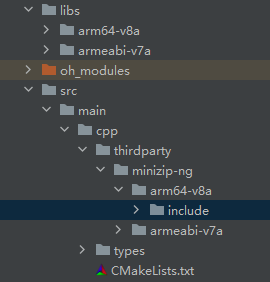
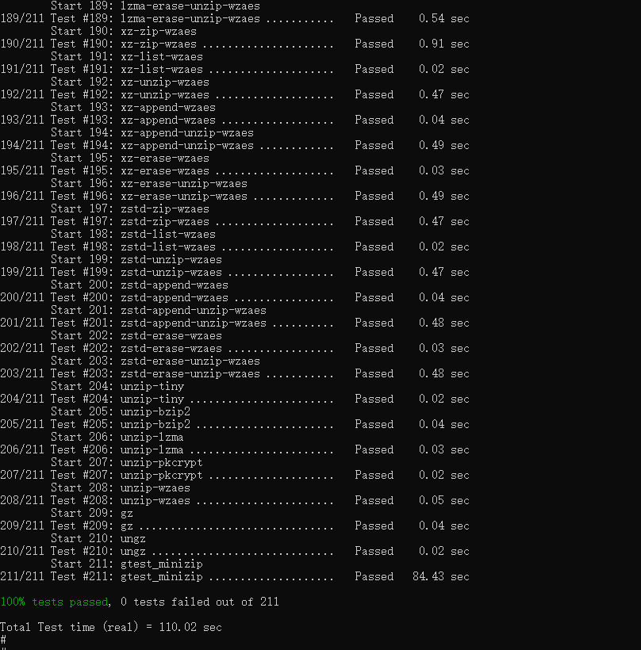

# minizip 集成到应用hap

本库是在RK3568开发板上基于OpenHarmony3.2 Release版本的镜像验证的，如果是从未使用过RK3568，可以先查看[润和RK3568开发板标准系统快速上手](https://gitee.com/openharmony-sig/knowledge_demo_temp/tree/master/docs/rk3568_helloworld)。

## 开发环境

- ubuntu20.04
- [OpenHarmony3.2.1Release镜像](https://gitee.com/link?target=https%3A%2F%2Frepo.huaweicloud.com%2Fopenharmony%2Fos%2F3.2.1%2Fdayu200_standard_arm32.tar.gz)
- [ohos_sdk_public 3.2.12.5](https://gitee.com/link?target=https%3A%2F%2Frepo.huaweicloud.com%2Fopenharmony%2Fos%2F3.2.1%2Fohos-sdk-windows_linux-public.tar.gz)
- [DevEco Studio 3.1 Beta2](https://gitee.com/link?target=https%3A%2F%2Fcontentcenter-vali-drcn.dbankcdn.cn%2Fpvt_2%2FDeveloperAlliance_package_901_9%2Ff3%2Fv3%2FuJyuq3syQ2ak4hE1QZmAug%2Fdevecostudio-windows-3.1.0.400.zip%3FHW-CC-KV%3DV1%26HW-CC-Date%3D20230408T013335Z%26HW-CC-Expire%3D315360000%26HW-CC-Sign%3D96262721EDC9B34E6F62E66884AB7AE2A94C2A7B8C28D6F7FC891F46EB211A70)
- [准备三方库构建环境](../../../lycium/README.md#1编译环境准备)
- [准备三方库测试环境](../../../lycium/README.md#3ci环境准备)

## 编译三方库

- 下载本仓库

  ```shell
  git clone https://gitee.com/openharmony-sig/tpc_c_cplusplus.git --depth=1
  ```

- 三方库目录结构

  ```shell
  tpc_c_cplusplus/thirdparty/minizip-ng # 三方库minizip-ng的目录结构如下
  ├── docs                              # 三方库相关文档的文件夹
  ├── BUILD.gn                          # 构建脚本，支持rom包集成
  ├── bundle.json                       # 三方库组件定义文件
  ├── CMakeLists.txt                    # 构建脚本，支持hap包集成
  ├── HPKBUILD                          # 构建脚本,可生成北向应用调用的so文件
  ├── SHA512SUM                         # 三方库校验文件
  ├── README.OpenSource                 # 说明三方库源码的下载地址，版本，license等信息
  ├── README_zh.md   
  ```

- 在lycium目录下编译三方库

  编译环境的搭建参考[准备三方库构建环境](../../../lycium/README.md#1编译环境准备)

  ```shell
  cd lycium
  ./build.sh minizip-ng googletest xz zstd bzip2 openssl
  ```

- 三方库头文件及生成的库

  在lycium目录下会生成usr目录，该目录下存在已编译完成的32位和64位三方库及其依赖库

  ```shell
  minizip-ng/arm64-v8a minizip-ng/armeabi-v7a 
  # 依赖库
  openssl/arm64-v8a openssl/armeabi-v7a xz/arm64-v8a xz/armeabi-v7a zstd/arm64-v8a zstd/armeabi-v7a bzip2/arm64-v8a bzip2/armeabi-v7a
  ```

- [测试三方库](#测试三方库)

## 应用中使用三方库

- 在IDE的cpp目录下新增thirdparty目录，将编译生成的头文件拷贝到该目录下，将编译生成的三方库以及依赖库全部（动态库名字带版本号和不带版本号的都需要）拷贝到工程的libs目录下，如下图所示：
  
  &nbsp;

- 在最外层（cpp目录下）CMakeLists.txt中添加如下语句

  ```shell
  #将三方库加入工程中
  target_link_libraries(entry PRIVATE ${CMAKE_SOURCE_DIR}/../../../libs/${OHOS_ARCH}/libminizip.so)
  #将三方库的头文件加入工程中
  target_include_directories(entry PRIVATE ${CMAKE_CURRENT_SOURCE_DIR}/thirdparty/minizip-ng/${OHOS_ARCH}/include)
  ```
  

## 测试三方库

三方库的测试使用原库自带的测试用例来做测试，[准备三方库测试环境](../../../lycium/README.md#3ci环境准备)

进入到构建目录执行`ctest`运行测试用例（arm64-v8a-build为构建64位的目录，armeabi-v7a-build为构建32位的目录）

&nbsp;

## 参考资料

- [润和RK3568开发板标准系统快速上手](https://gitee.com/openharmony-sig/knowledge_demo_temp/tree/master/docs/rk3568_helloworld)
- [OpenHarmony三方库地址](https://gitee.com/openharmony-tpc)
- [OpenHarmony知识体系](https://gitee.com/openharmony-sig/knowledge)
- [通过DevEco Studio开发一个NAPI工程](https://gitee.com/openharmony-sig/knowledge_demo_temp/blob/master/docs/napi_study/docs/hello_napi.md)
