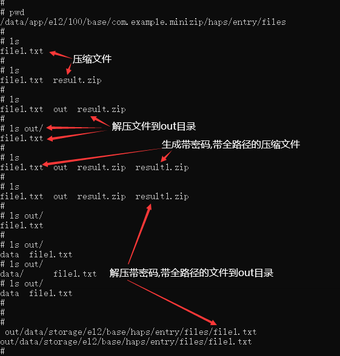

# minizip-ng 如何集成到应用hap

## 准备应用工程

本库是基于OpenHarmony SDK API Version 9版本，在润和RK3568开发板上验证的。如果是从未使用过RK3568，可以先查看[润和RK3568开发板标准系统快速上手](https://gitee.com/openharmony-sig/knowledge_demo_temp/tree/master/docs/rk3568_helloworld)。

### 准备应用开发环境

- IDE版本：DevEco Studio 3.0 Release
- SDK版本：OpenHarmony SDK
- API版本：API Version 9

应用环境准备具体可参照文档[通过IDE开发一个Napi工程](https://gitee.com/openharmony-sig/knowledge_demo_temp/blob/master/docs/napi_study/docs/hello_napi.md)

### 增加构建脚本及配置文件

- 下载本仓库代码  <br />
  通过[C/C++三方库TCP仓](https://gitee.com/openharmony-sig/tpc_c_cplusplus)下载本三方库代码并将其解压。
- 仓库代码目录结构说明

  ```shell
  tpc_c_cplusplus/thirdparty/minizip-ng
  ├── docs                    # 存放三方库相关文档的文件夹
  ├── BUILD.gn                # 构建脚本，支持rom包集成
  ├── bundle.json             # 三方库组件定义文件
  ├── CMakeLists.txt          # 构建脚本，支持hap包集成
  ├── README.OpenSource       # 说明三方库源码的下载地址，版本，license等信息
  ├── README_zh.md            # 三方库说明文档
  ```

- 将minizip-ng目录及其下面所有文件拷贝到工程的entry\src\main\cpp\third_party目录下。

### 准备三方库源码

- 准备三方库源码
  通过[minizip-ng的github网站](https://github.com/zlib-ng/minizip-ng)下载3.0.4版本的源码包，并将源码包解压后拷贝到entry\src\main\cpp\third_party\minizip-ng目录，如下所示：

  ```shell
  minizip-ng
  ├── docs                    # 存放三方库相关文档的文件夹
  ├── BUILD.gn                # 构建脚本，支持rom包集成
  ├── bundle.json             # 三方库组件定义文件
  ├── minizip-ng              # 三方库minizip-ng源码目录
  ├── CMakeLists.txt          # 构建脚本，支持hap包集成
  ├── README.OpenSource       # 说明三方库源码的下载地址，版本，license等信息
  ├── README_zh.md
  ```

- 准备依赖库
  minizip依赖了zstd，libiconv，lz4，xz，bzip2以及zlib等库，除了zlib是SDK中已有的，其他库都需要下载。
  - [libiconv适配文件](../../iconv/docs/rom_integrate.md): 参照文档下载适配代码，将整个iconv文件夹拷贝到/entry/src/main/cpp/third_party <br />
    [libiconv源码](https://ftp.gnu.org/gnu/libiconv/libiconv-1.7.tar.gz):下载解压后改名为libiconv，并将该源码目录拷贝到iconv文件夹中
  - [zstd](https://github.com/facebook/zstd):下载v1.5.2版本，解压后并改为zstd
  - [lz4](https://gitee.com/openharmony/third_party_lz4/repository/archive/master.zip):下载解压后并改名为lz4
  - [bzip2](https://gitee.com/openharmony/third_party_bzip2/repository/archive/master.zip):下载解压后并改名为bzip2
  - [xz适配文件](../../xz/docs/rom_integrate.md): 参照文档下载适配代码，将整个xz文件夹拷贝到/entry/src/main/cpp/third_party <br />
    [xz源码](https://tukaani.org/xz/xz-5.2.6.tar.gz):下载解压后改名为libxz，并将该源码目录拷贝到xz文件夹中
     所有依赖库都拷贝到/entry/src/main/cpp/third_party下.

## 应用中使用三方库

- 应用中引入三方库，三方库目录如下:

  ```shell
  third_party
  ├── minizip-ng              # 三方库minizip-ng构建目录
  |      ├── CMakeLists.txt          # 构建脚本，支持hap包集成
  ├── zstd                    # 三方库minizip-ng的依赖库zstd源码目录
  ├── iconv                   # 三方库minizip-ng 的依赖库libiconv构建目录
  |      ├── libiconv         # libiconv源码目录
  |      ├── adapter          # libiconv适配代码目录
  ├── lz4                     # 三方库minizip-ng的依赖库lz4源码目录
  ├── bzip2                   # 三方库minizip-ng的依赖库bzip2源码目录
  ├── xz                      # 三方库minizip-ng的依赖库xz源码目录
  ```

- 修改CMakeLists.txt文件
  在工程的entry\src\main\cpp\CMakeLists.txt中做以下修改:

  ```cmake
  add_subdirectory(${CMAKE_CURRENT_SOURCE_DIR}/thirdparty/minizip-ng)
  add_library(entry SHARED minizipNapi.cpp minizip.cpp)
  target_include_directories(entry PUBLIC thirdparty/minizip-ng/minizip-ng)
  target_link_libraries(entry PUBLIC libace_napi.z.so minizip_shared)
  ```

- 应用中导入对应的库文件

  ```js
  import minizip from "libentry.so"
  ```

- 完整demo参考：
  [minizip三方库测试源码](https://gitee.com/openharmony-sig/knowledge_demo_temp/tree/master/FA/thirdparty/minizip_demo)

## 编译工程

- 连接上设备后，DevEco Studio就会显示被发现设备。然后，点击“运行”，即可依次完成该应用“编译”和“安装”的过程，如图：
  &nbsp;

## 运行效果

安装hap应用后，在ets界面依次完成：压缩文件、解压缩文件、生成带密码和带全路径的压缩文件、解压带密码和带全路径的压缩文件操作后的结果，如下图：<br />
&nbsp;

## 参考资料

- [润和RK3568开发板标准系统快速上手](https://gitee.com/openharmony-sig/knowledge_demo_temp/tree/master/docs/rk3568_helloworld)
- [通过IDE开发一个Napi工程](https://gitee.com/openharmony-sig/knowledge_demo_temp/blob/master/docs/napi_study/docs/hello_napi.md)
- [minizip三方库测试源码](https://gitee.com/openharmony-sig/knowledge_demo_temp/tree/master/FA/thirdparty/minizip_demo)
- [OpenHarmony知识体系](https://gitee.com/openharmony-sig/knowledge)

