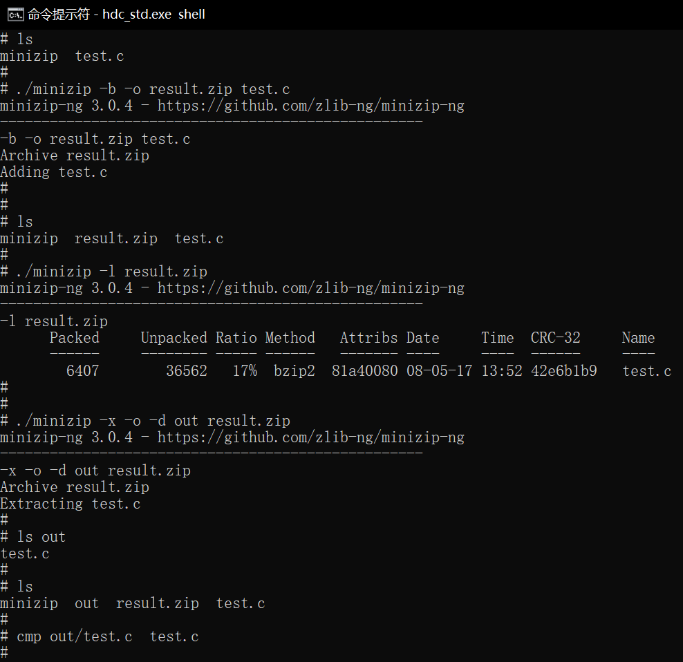

# minizip-ng如何集成到系统Rom
## 准备源码工程
本库是基于OpenHarmony-v3.2-Beta1版本，在润和RK3568开发板上验证的。如果是从未使用过RK3568，可以先查看[润和RK3568开发板标准系统快速上手](https://gitee.com/openharmony-sig/knowledge_demo_temp/tree/master/docs/rk3568_helloworld)。
## 准备系统Rom源码
源码获取方法请参照：[OpenHarmony源码下载](https://gitee.com/openharmony/docs/blob/OpenHarmony-v3.2-Beta1/zh-cn/release-notes/OpenHarmony-v3.2-beta1.md#%E6%BA%90%E7%A0%81%E8%8E%B7%E5%8F%96)
## 增加构建脚本及配置文件
- 下载本仓库代码
  ```
  cd ~/
  git clone git@gitee.com:openharmony-sig/tpc_c_cplusplus.git --depth=1      # 将本仓库下载到本地
  ```
- 仓库代码目录结构说明
  ```
  tpc_c_cplusplus/thirdparty/minizip-ng
  |-- docs			        # 存放三方库相关文档的文件夹
  |-- BUILD.gn		        # 构建脚本，支持rom包集成
  |-- bundle.json			    # 三方库组件定义文件
  ├── README.OpenSource       # 说明三方库源码的下载地址，版本，license等信息
  ├── README_zh.md  
  ```
- 将本仓库文件夹拷贝到third_party下
  ```
  cp ~/tpc_c_cplusplus/thirdparty/minizipi-ng   ~/openharmony/third_party/ -rf
  ```
## 准备三方库源码
- 将源码下载到minizip-ng目录并将其解压出来。
```
cd ~/OpenHarmony/third_party/minizip-ng		                         # 进入到minizip目录
git clone -b 3.0.4 https://github.com/zlib-ng/minizip-ng.git         # 下载三方库
```
## 系统Rom中引入三方库测试程序
准备完三方库代码后，我们需要将三方库加入到编译构建体系中。标准系统编译构建可以参考文档[标准系统编译构建指导](https://gitee.com/openharmony/docs/blob/OpenHarmony-3.2-Beta1/zh-cn/device-dev/subsystems/subsys-build-standard-large.md)。
我们默认三方库是属于OpenHarmony的thirdparty子系统，如果需要自己定义子系统参考文档[如何为三方库组件中添加一个三方库](https://gitee.com/openharmony-sig/knowledge/blob/master/docs/openharmony_getstarted/port_thirdparty/README.md)
在OpenHarmony源码的vendor/hihope/rk356/config.json文件，新增需要编译的组件，如下：
```
{
   "subsystem": "thirdparty",
   "components": [
       {
	     "component": "musl",
	     "features": []
	  },
	  {
	     "component": "minizip",
	     "features": []
	  }
   ]
}
```
## 系统Rom中引入三方库测试程序
在OpenHarmony源码的vendor/hihope/rk356/config.json文件,对应组件的features中打开编译选项，如下：
```
{
	"subsystem": "thirdparty",
	"components": [
	  {
		"component": "musl",
		"features": []
	  },
	  {
		"component": "minizip",
		"features": ["enable_minizip_test=true"]
	 }
   ]
}
```
## 编译工程
在OpenHarmony源码根目录下
```
cd ~/openharmony
```
- 选择产品
```
hb set                          # 该命令会列出所有可选平台，这里我们选择rk3568
```
- 运行编译
```
hb build --target-cpu arm64     # 编译64位系统使用:arm64， 编译32位系统使用:arm
```
- 生成文件的路径，可执行文件和库文件都在out/rk3568/thirdparty/minizip目录下，同时也打包到了镜像中
## 运行效果
将编译生成的库和测试文件放到板子上运行，为避免每次将文件推入设备都烧录整个镜像，我们使用hdc_std工具将文件推到开发板上
- 首先将hdc_std工具编译出来
  ```
  hb set             # 首先，源码根目录下使用hb set 选择产品ohos-sdk
  hb build           # 然后，编译。最后，工具编译出来在out/sdk/ohos-sdk/windows/toolchains/hdc_std.exe
  ```
- 将工具拷贝到Windows，可以为工具目录配置环境变量，也可以在工具所在目录打开windows命令行
- 将原生库测试需要的所有文件打包成minizip.tar,并拷贝到windows下
- 将文件推送到开发板，在windows命令行进行如下操作
  ```
  hdc_std shell mount -o remount,rw /          # 修改系统权限为可读写
  hdc_std file send minizip.tar /              # 将文件包推入开发板
  hdc_std shell                                # 进入开发板
  tar xvf minizip.tar                          # 解压
  cd minizip                                   # 进入minizip目录
  mv libminizip_shared.z.so /system/lib64/     # 64位系统需要将库文件拷贝到系统lib64目录, 32位系统则是lib目录
  ```
- 运行测试程序
  程序安装完后，由于测试用例较多，我们准备了1个测试文件 test.c，测试了该库常用的zip文件压缩和解压缩功能，并和期望结果做对比，内容一致，如图：
  &nbsp;
## 参考资料
- [润和RK3568开发板标准系统快速上手](https://gitee.com/openharmony-sig/knowledge_demo_temp/tree/master/docs/rk3568_helloworld)
- [OpenHarmony三方库地址](https://gitee.com/openharmony-tpc)
- [OpenHarmony知识体系](https://gitee.com/openharmony-sig/knowledge)
- [OpenHarmony源码下载](https://gitee.com/openharmony/docs/blob/OpenHarmony-v3.2-Beta1/zh-cn/release-notes/OpenHarmony-v3.2-beta1.md#%E6%BA%90%E7%A0%81%E8%8E%B7%E5%8F%96)
- [标准系统编译构建指导](https://gitee.com/openharmony/docs/blob/OpenHarmony-3.2-Beta1/zh-cn/device-dev/subsystems/subsys-build-standard-large.md)
- [如何为三方库组件中添加一个三方库](https://gitee.com/openharmony-sig/knowledge/blob/master/docs/openharmony_getstarted/port_thirdparty/README.md)