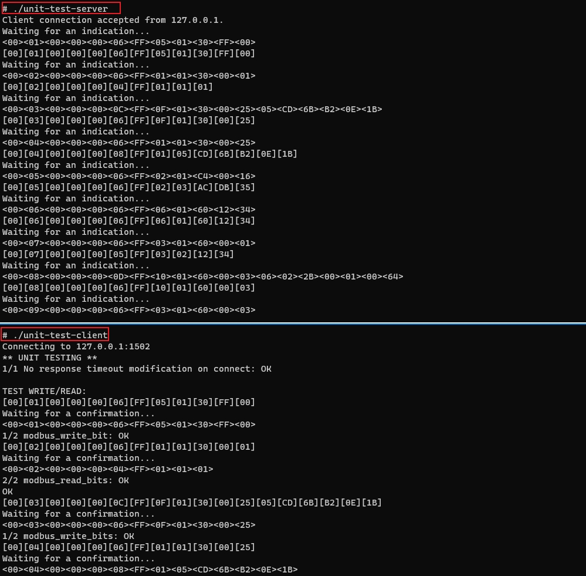

# modbus如何集成到系统Rom

## 准备源码工程

本库是基于OpenHarmony 3.2 beta4版本，在润和RK3568开发板上验证的。如果是从未使用过RK3568，可以先查看[润和RK3568开发板标准系统快速上手](https://gitee.com/openharmony-sig/knowledge_demo_temp/tree/master/docs/rk3568_helloworld)。

### 准备系统Rom源码

系统源码获取方法请参照：[OpenHarmony3.2beta4源码下载](https://gitee.com/openharmony/docs/blob/OpenHarmony-v3.2-Beta5/zh-cn/release-notes/OpenHarmony-v3.2-beta4.md#源码获取)

### 增加构建脚本及配置文件

- 下载本仓库代码

  ```shell
  cd ~/
  git clone git@gitee.com:openharmony-sig/tpc_c_cplusplus.git --depth=1
  ```

- 仓库代码目录结构说明

  ```shell
  cd  ~/tpc_c_cplusplus/thirdparty/modbus/  # 进入到仓库代码库目录
  ```

  ```shell
  modbus
    |-- adapted           # 存放三方库适配需要的代码文件
    |-- docs              # 存放 modbus 相关文档的文件夹
    |-- BUILD.gn          # 编译构建脚本
    |-- bundle.json       # 三方库组件定义文件
    |-- README_zh.md      # modbus 主页说明文档
    |-- README.OpenSource # modbus 源码的下载地址，版本，license等信息
  ```
  
- 将本仓库文件夹拷贝到OpenHarmony源码的third_party目录下

  ```shell
  cp -arf ~/tpc_c_cplusplus/thirdparty/modbus ~/OpenHarmony/third_party
  ```

### 准备三方库源码

- 三方库源码下载

  modbus-3.1.10源码下载到modbus目录。

  ```shell
  cd ~/OpenHarmony/third_party/modbus
  git clone https://github.com/stephane/libmodbus.git -b v3.1.10
  ```

## 系统Rom中引入三方库

准备完三方库代码后，我们需要将三方库加入到编译构建体系中。标准系统编译构建可以参考文档[编译构建指导](https://gitee.com/openharmony/docs/blob/OpenHarmony-3.2-Beta4/zh-cn/device-dev/subsystems/subsys-build-all.md)。  <br />
我们默认三方库是属于OpenHarmony的thirdparty子系统，如果需要自己定义子系统参考文档[如何为三方库组件中添加一个三方库](https://gitee.com/openharmony-sig/knowledge/blob/master/docs/openharmony_getstarted/port_thirdparty/README.md)。<br />
新增需要编译的组件,在OpenHarmony源码的productdefine/common/inherit/rich.json文件中，新增需要编译的组件，如下代码段所示，在thirdparty子系统下面新增modbus组件

```json
{
  "subsystem": "thirdparty",
  "components": [
    {
      "component": "musl",
      "features": []
    },
    {
      "component": "modbus",
      "features": []
    }
  ]
}
```

## 系统Rom中引入三方库测试程序

如果需要编译测试用例，在OpenHarmony源码的productdefine/common/inherit/rich.json文件,在对应组件的features中打开编译选项，如下

```json
{
  "subsystem": "thirdparty",
  "components": [
    {
      "component": "musl",
      "features": []
    },
    {
      "component": "modbus",
      "features": [ "enable_modbus_test=true" ]
    }
  ]
}
```

## 编译工程

- 进入源码根目录

  ```shell
  cd ~/openharmony
  ```

- 选择产品

  ```shell
  hb set    # 运行hb set后会出现产品列表，在此我们选择 rk3568
  ```

- 执行编译

  ```shell
  hb build --target-cpu arm      #编译32位系统
  hb build --target-cpu arm64    #编译64位系统
  ```

- 生成的可执行文件和库文件都在out/rk3568/thirdparty/modbus目录下，同时也打包到了镜像中

## 运行效果

将编译生成的库和测试文件放到板子上运行，为避免每次将文件推入设备都要烧录整个镜像，我们使用hdc_std工具将文件推到开发板上

- 首先将hdc_std工具编译出来 </br>
  执行以下命令进行编译hdc_std工具(工具编译出来所在路径out/sdk/ohos-sdk/windows/toolchains/hdc_std.exe):

  ```shell
  hb set     #源码根目录下使用hb set 选择产品ohos-sdk
  hb build   #然后编译
  ```

- 将工具拷贝到Windows，可以为工具目录配置环境变量，也可以在工具所在目录打开windows命令行
- 将原生库测试需要的所有文件打包成modbus.tar,并拷贝到windows下
- 将文件推送到开发板，在windows命令行进行如下操作
  
  ```shell
  hdc_std shell mount -o remount,rw /    #修改系统权限为可读写
  hdc_std file send modbus.tar /         #将文件包推入开发板
  hdc_std shell                          #进入开发板
  tar xvf modbus.tar                     #解压
                                         #注意需要将库拷贝到/system/lib 或者/system/lib64目录下
  ```
  
- 运行测试程序
  在测试目录运行测试程序unit-test-server，然后再另一个窗口运行测试程序unit-test-client，则两个窗口会同时看到数据发送和接收的打印信息，如下图所示：<br />
  &nbsp;

## 参考资料

- [润和RK3568开发板标准系统快速上手](https://gitee.com/openharmony-sig/knowledge_demo_temp/tree/master/docs/rk3568_helloworld)。
- [OpenHarmony3.2beta4](https://gitee.com/openharmony/docs/blob/OpenHarmony-v3.2-Beta5/zh-cn/release-notes/OpenHarmony-v3.2-beta4.md)。
- [OpenHarmony三方库组织地址](https://gitee.com/openharmony-tpc)。
- [如何为三方库组件中添加一个三方库](https://gitee.com/openharmony-sig/knowledge/blob/master/docs/openharmony_getstarted/port_thirdparty/README.md)。
- [知识体系](https://gitee.com/openharmony-sig/knowledge)。
