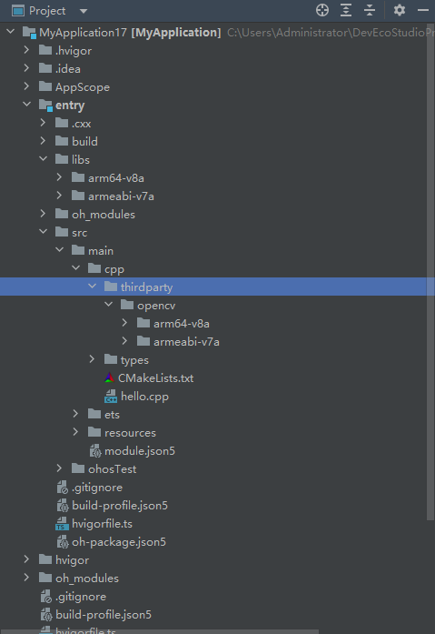
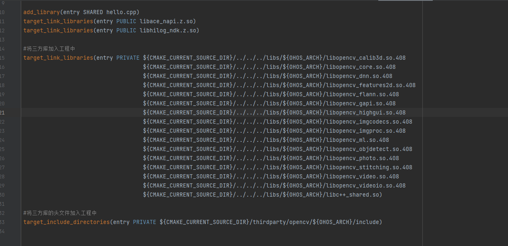

# opencv 集成到应用 hap

本库是在 RK3568 开发板上基于 OpenHarmony3.2 Release 版本的镜像验证的，如果是从未使用过 RK3568，可以先查看[润和 RK3568 开发板标准系统快速上手](https://gitee.com/openharmony-sig/knowledge_demo_temp/tree/master/docs/rk3568_helloworld)。

## 开发环境

- [开发环境准备](../../../docs/hap_integrate_environment.md)

## 编译三方库

- 下载本仓库
  ```
  git clone https://gitee.com/openharmony-sig/tpc_c_cplusplus.git --depth=1
  ```
- 三方库目录结构

  ```
  tpc_c_cplusplus/thirdparty/opencv     #三方库opencv的目录结构如下
  ├── docs                              #三方库相关文档的文件夹
  ├── HPKBUILD                          #构建脚本
  ├── SHA512SUM                         #三方库校验文件
  ├── README.OpenSource                 #说明三方库源码的下载地址，版本，license等信息
  ├── HPKCHECK                          #自动化测试脚本
  ├── OAT.xml                           #版权检验文件
  ├── README_zh.md                      #三方库说明文档
  ```

- 在 lycium 目录下编译三方库
  编译环境的搭建参考[准备三方库构建环境](../../../lycium/README.md#1编译环境准备)

  ```

  cd lycium
  ./build.sh opencv
  ```

- 三方库头文件及生成的库
  在 lycium 目录下会生成 usr 目录，该目录下存在已编译完成的 32 位和 64 位三方库

  ```
  opencv/arm64-v8a   opencv/armeabi-v7a
  ```

- [测试三方库](#测试三方库)

## 应用中使用三方库

- 在 IDE 的 libs 目录下，将编译生成的库拷贝到该目录下.如下图所示
  &nbsp;
- 在 entry/src/main/cpp 目录下的 CMakeLists.txt 中添加如下语句

```shell

#将三方库加入工程中
target_link_libraries(entry PRIVATE ${CMAKE_CURRENT_SOURCE_DIR}/../../../libs/${OHOS_ARCH}/libopencv_calib3d.so.408
                                   ${CMAKE_CURRENT_SOURCE_DIR}/../../../libs/${OHOS_ARCH}/libopencv_core.so.408
                                   ${CMAKE_CURRENT_SOURCE_DIR}/../../../libs/${OHOS_ARCH}/libopencv_dnn.so.408
                                   ${CMAKE_CURRENT_SOURCE_DIR}/../../../libs/${OHOS_ARCH}/libopencv_features2d.so.408
                                   ${CMAKE_CURRENT_SOURCE_DIR}/../../../libs/${OHOS_ARCH}/libopencv_flann.so.408
                                   ${CMAKE_CURRENT_SOURCE_DIR}/../../../libs/${OHOS_ARCH}/libopencv_gapi.so.408
                                   ${CMAKE_CURRENT_SOURCE_DIR}/../../../libs/${OHOS_ARCH}/libopencv_highgui.so.408
                                   ${CMAKE_CURRENT_SOURCE_DIR}/../../../libs/${OHOS_ARCH}/libopencv_imgcodecs.so.408
                                   ${CMAKE_CURRENT_SOURCE_DIR}/../../../libs/${OHOS_ARCH}/libopencv_imgproc.so.408
                                   ${CMAKE_CURRENT_SOURCE_DIR}/../../../libs/${OHOS_ARCH}/libopencv_ml.so.408
                                   ${CMAKE_CURRENT_SOURCE_DIR}/../../../libs/${OHOS_ARCH}/libopencv_objdetect.so.408
                                   ${CMAKE_CURRENT_SOURCE_DIR}/../../../libs/${OHOS_ARCH}/libopencv_photo.so.408
                                   ${CMAKE_CURRENT_SOURCE_DIR}/../../../libs/${OHOS_ARCH}/libopencv_stitching.so.408
                                   ${CMAKE_CURRENT_SOURCE_DIR}/../../../libs/${OHOS_ARCH}/libopencv_video.so.408
                                   ${CMAKE_CURRENT_SOURCE_DIR}/../../../libs/${OHOS_ARCH}/libopencv_videoio.so.408)

#将三方库的头文件加入工程中
target_include_directories(entry PRIVATE ${CMAKE_CURRENT_SOURCE_DIR}/thirdparty/opencv/${OHOS_ARCH}/include)

```



## 测试三方库

三方库的测试使用自己编写的测试用例来做测试，[准备三方库测试环境](../../../lycium/README.md#3ci环境准备)

- 将编译生成的可执行文件及生成的动态库准备好

- 将准备好的文件推送到开发板，进入到构建的目录添加执行文件权限和 lib 库环境执行可执行文件

备注: 其中 1 个用例 opencv_test_gapi 测试失败问题官方在 4.9.0 已修复。

## 参考资料

- [润和 RK3568 开发板标准系统快速上手](https://gitee.com/openharmony-sig/knowledge_demo_temp/tree/master/docs/rk3568_helloworld)
- [OpenHarmony 三方库地址](https://gitee.com/openharmony-tpc)
- [OpenHarmony 知识体系](https://gitee.com/openharmony-sig/knowledge)
- [通过 DevEco Studio 开发一个 NAPI 工程](https://gitee.com/openharmony-sig/knowledge_demo_temp/blob/master/docs/napi_study/docs/hello_napi.md)
