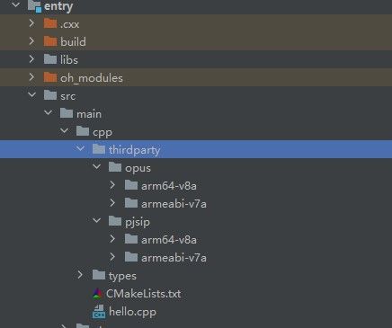
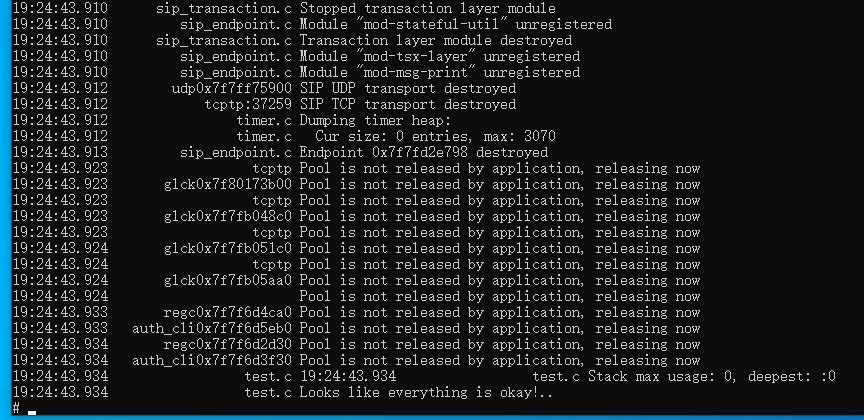

# pjsip集成到应用hap
本库是在RK3568开发板上基于OpenHarmony3.2 Release版本的镜像验证的，如果是从未使用过RK3568，可以先查看[润和RK3568开发板标准系统快速上手](https://gitee.com/openharmony-sig/knowledge_demo_temp/tree/master/docs/rk3568_helloworld)。
## 开发环境
- ubuntu20.04
- [OpenHarmony3.2Release镜像](https://gitee.com/link?target=https%3A%2F%2Frepo.huaweicloud.com%2Fopenharmony%2Fos%2F3.2-Release%2Fdayu200_standard_arm32.tar.gz)
- [ohos_sdk_public 4.0.8.1 (API Version 10 Release)](http://download.ci.openharmony.cn/version/Master_Version/OpenHarmony_4.0.8.1/20230608_091016/version-Master_Version-OpenHarmony_4.0.8.1-20230608_091016-ohos-sdk-full.tar.gz)
- [DevEco Studio 3.1 Release](https://contentcenter-vali-drcn.dbankcdn.cn/pvt_2/DeveloperAlliance_package_901_9/81/v3/tgRUB84wR72nTfE8Ir_xMw/devecostudio-windows-3.1.0.501.zip?HW-CC-KV=V1&HW-CC-Date=20230621T074329Z&HW-CC-Expire=315360000&HW-CC-Sign=22F6787DF6093ECB4D4E08F9379B114280E1F65DA710599E48EA38CB24F3DBF2)
- [准备三方库构建环境](../../../lycium/README.md#1编译环境准备)
- [准备三方库测试环境](../../../lycium/README.md#3ci环境准备)
## 编译三方库
- 下载本仓库
  ```
  git clone https://gitee.com/openharmony-sig/tpc_c_cplusplus.git --depth=1
  ```
- 三方库目录结构
  ```
  tpc_c_cplusplus/thirdparty/pjsip  #三方库pjsip的目录结构如下
  ├── docs                          #三方库相关文档的文件夹
  ├── HPKBUILD                      #构建脚本
  ├── HPKCHECK                      #自动化测试脚本
  ├── OAT.xml                       #OAT开源审查文本
  ├── pjsip_oh_pkg.patch            #编译patch
  ├── README.OpenSource             #说明三方库源码的下载地址，版本，license等信息
  ├── README_zh.md                  #三方库说明文档
  └── SHA512SUM                     #校验文档
  ```
  
- 进入lycium目录下
  ```
  cd tpc_c_cplusplus/lycium
  ```
- 在lycium目录下编译三方库 
  pjsip库需要依赖opus库，所以在build时需要编译pjsip库和opus库
  编译环境的搭建参考[准备三方库构建环境](../../../lycium/README.md#1编译环境准备)
  ```
  ./build.sh pjsip (默认编译依赖库)
  ```
- 三方库头文件及生成的库
  在lycium目录下会生成usr目录，该目录下存在已编译完成的32位和64位三方库
  ```
  pjsip/arm64-v8a   pjsip/armeabi-v7a
  opus/arm64-v8a   opus/armeabi-v7a
  ```

- [测试三方库](#测试三方库)

## 应用中使用三方库

- 在IDE的cpp目录下新增thirdparty目录，将编译生成的库拷贝到该目录下，如下图所示
  
&nbsp;

- 在最外层（cpp目录下）CMakeLists.txt中添加如下语句
  ```
  #将三方库加入工程中
  if(${OHOS_ARCH} STREQUAL "arm64-v8a")
  target_link_libraries(entry PRIVATE ${CMAKE_CURRENT_SOURCE_DIR}/thirdparty/opus/${OHOS_ARCH}/lib/libopus.a
                              ${CMAKE_CURRENT_SOURCE_DIR}/thirdparty/pjsip/${OHOS_ARCH}/lib/libg7221codec-aarch64-unknown-linux-gnu.a
                              ${CMAKE_CURRENT_SOURCE_DIR}/thirdparty/pjsip/${OHOS_ARCH}/lib/libgsmcodec-aarch64-unknown-linux-gnu.a
                              ${CMAKE_CURRENT_SOURCE_DIR}/thirdparty/pjsip/${OHOS_ARCH}/lib/libilbccodec-aarch64-unknown-linux-gnu.a
                              ${CMAKE_CURRENT_SOURCE_DIR}/thirdparty/pjsip/${OHOS_ARCH}/lib/libpj-aarch64-unknown-linux-gnu.a
                              ${CMAKE_CURRENT_SOURCE_DIR}/thirdparty/pjsip/${OHOS_ARCH}/lib/libpjlib-util-aarch64-unknown-linux-gnu.a
                              ${CMAKE_CURRENT_SOURCE_DIR}/thirdparty/pjsip/${OHOS_ARCH}/lib/libpjmedia-aarch64-unknown-linux-gnu.a
                              ${CMAKE_CURRENT_SOURCE_DIR}/thirdparty/pjsip/${OHOS_ARCH}/lib/libpjmedia-audiodev-aarch64-unknown-linux-gnu.a
                              ${CMAKE_CURRENT_SOURCE_DIR}/thirdparty/pjsip/${OHOS_ARCH}/lib/libpjmedia-codec-aarch64-unknown-linux-gnu.a
                              ${CMAKE_CURRENT_SOURCE_DIR}/thirdparty/pjsip/${OHOS_ARCH}/lib/libpjmedia-videodev-aarch64-unknown-linux-gnu.a
                              ${CMAKE_CURRENT_SOURCE_DIR}/thirdparty/pjsip/${OHOS_ARCH}/lib/libpjnath-aarch64-unknown-linux-gnu.a
                              ${CMAKE_CURRENT_SOURCE_DIR}/thirdparty/pjsip/${OHOS_ARCH}/lib/libpjsip-aarch64-unknown-linux-gnu.a
                              ${CMAKE_CURRENT_SOURCE_DIR}/thirdparty/pjsip/${OHOS_ARCH}/lib/libpjsip-simple-aarch64-unknown-linux-gnu.a
                              ${CMAKE_CURRENT_SOURCE_DIR}/thirdparty/pjsip/${OHOS_ARCH}/lib/libpjsip-ua-aarch64-unknown-linux-gnu.a
                              ${CMAKE_CURRENT_SOURCE_DIR}/thirdparty/pjsip/${OHOS_ARCH}/lib/libpjsua-aarch64-unknown-linux-gnu.a
                              ${CMAKE_CURRENT_SOURCE_DIR}/thirdparty/pjsip/${OHOS_ARCH}/lib/libpjsua2-aarch64-unknown-linux-gnu.a
                              ${CMAKE_CURRENT_SOURCE_DIR}/thirdparty/pjsip/${OHOS_ARCH}/lib/libresample-aarch64-unknown-linux-gnu.a
                              ${CMAKE_CURRENT_SOURCE_DIR}/thirdparty/pjsip/${OHOS_ARCH}/lib/libspeex-aarch64-unknown-linux-gnu.a
                              ${CMAKE_CURRENT_SOURCE_DIR}/thirdparty/pjsip/${OHOS_ARCH}/lib/libsrtp-aarch64-unknown-linux-gnu.a
                              ${CMAKE_CURRENT_SOURCE_DIR}/thirdparty/pjsip/${OHOS_ARCH}/lib/libyuv-aarch64-unknown-linux-gnu.a)
  else()
  target_link_libraries(entry PRIVATE ${CMAKE_CURRENT_SOURCE_DIR}/thirdparty/opus/${OHOS_ARCH}/lib/libopus.a
                              ${CMAKE_CURRENT_SOURCE_DIR}/thirdparty/pjsip/${OHOS_ARCH}/lib/libg7221codec-arm-unknown-linux-gnu.a
                              ${CMAKE_CURRENT_SOURCE_DIR}/thirdparty/pjsip/${OHOS_ARCH}/lib/libgsmcodec-arm-unknown-linux-gnu.a
                              ${CMAKE_CURRENT_SOURCE_DIR}/thirdparty/pjsip/${OHOS_ARCH}/lib/libilbccodec-arm-unknown-linux-gnu.a
                              ${CMAKE_CURRENT_SOURCE_DIR}/thirdparty/pjsip/${OHOS_ARCH}/lib/libpj-arm-unknown-linux-gnu.a
                              ${CMAKE_CURRENT_SOURCE_DIR}/thirdparty/pjsip/${OHOS_ARCH}/lib/libpjlib-util-arm-unknown-linux-gnu.a
                              ${CMAKE_CURRENT_SOURCE_DIR}/thirdparty/pjsip/${OHOS_ARCH}/lib/libpjmedia-arm-unknown-linux-gnu.a
                              ${CMAKE_CURRENT_SOURCE_DIR}/thirdparty/pjsip/${OHOS_ARCH}/lib/libpjmedia-audiodev-arm-unknown-linux-gnu.a
                              ${CMAKE_CURRENT_SOURCE_DIR}/thirdparty/pjsip/${OHOS_ARCH}/lib/libpjmedia-codec-arm-unknown-linux-gnu.a
                              ${CMAKE_CURRENT_SOURCE_DIR}/thirdparty/pjsip/${OHOS_ARCH}/lib/libpjmedia-videodev-arm-unknown-linux-gnu.a
                              ${CMAKE_CURRENT_SOURCE_DIR}/thirdparty/pjsip/${OHOS_ARCH}/lib/libpjnath-arm-unknown-linux-gnu.a
                              ${CMAKE_CURRENT_SOURCE_DIR}/thirdparty/pjsip/${OHOS_ARCH}/lib/libpjsip-arm-unknown-linux-gnu.a
                              ${CMAKE_CURRENT_SOURCE_DIR}/thirdparty/pjsip/${OHOS_ARCH}/lib/libpjsip-simple-arm-unknown-linux-gnu.a
                              ${CMAKE_CURRENT_SOURCE_DIR}/thirdparty/pjsip/${OHOS_ARCH}/lib/libpjsip-ua-arm-unknown-linux-gnu.a
                              ${CMAKE_CURRENT_SOURCE_DIR}/thirdparty/pjsip/${OHOS_ARCH}/lib/libpjsua-arm-unknown-linux-gnu.a
                              ${CMAKE_CURRENT_SOURCE_DIR}/thirdparty/pjsip/${OHOS_ARCH}/lib/libpjsua2-arm-unknown-linux-gnu.a
                              ${CMAKE_CURRENT_SOURCE_DIR}/thirdparty/pjsip/${OHOS_ARCH}/lib/libresample-arm-unknown-linux-gnu.a
                              ${CMAKE_CURRENT_SOURCE_DIR}/thirdparty/pjsip/${OHOS_ARCH}/lib/libspeex-arm-unknown-linux-gnu.a
                              ${CMAKE_CURRENT_SOURCE_DIR}/thirdparty/pjsip/${OHOS_ARCH}/lib/libsrtp-arm-unknown-linux-gnu.a
                              ${CMAKE_CURRENT_SOURCE_DIR}/thirdparty/pjsip/${OHOS_ARCH}/lib/libyuv-arm-unknown-linux-gnu.a)
  endif()

  #将三方库的头文件加入工程中
  target_include_directories(entry PRIVATE ${CMAKE_CURRENT_SOURCE_DIR}/thirdparty/opus/${OHOS_ARCH}/include/opus/
                                  ${CMAKE_CURRENT_SOURCE_DIR}/thirdparty/pjsip/${OHOS_ARCH}/include/
                                  ${CMAKE_CURRENT_SOURCE_DIR}/thirdparty/pjsip/${OHOS_ARCH}/include/pj/
                                  ${CMAKE_CURRENT_SOURCE_DIR}/thirdparty/pjsip/${OHOS_ARCH}/include/pj/compat/
                                  ${CMAKE_CURRENT_SOURCE_DIR}/thirdparty/pjsip/${OHOS_ARCH}/include/pj++/
                                  ${CMAKE_CURRENT_SOURCE_DIR}/thirdparty/pjsip/${OHOS_ARCH}/include/pjlib-util/
                                  ${CMAKE_CURRENT_SOURCE_DIR}/thirdparty/pjsip/${OHOS_ARCH}/include/pjmedia/
                                  ${CMAKE_CURRENT_SOURCE_DIR}/thirdparty/pjsip/${OHOS_ARCH}/include/pjmedia-audiodev/
                                  ${CMAKE_CURRENT_SOURCE_DIR}/thirdparty/pjsip/${OHOS_ARCH}/include/pjmedia-codec/
                                  ${CMAKE_CURRENT_SOURCE_DIR}/thirdparty/pjsip/${OHOS_ARCH}/include/pjmedia-videodev/
                                  ${CMAKE_CURRENT_SOURCE_DIR}/thirdparty/pjsip/${OHOS_ARCH}/include/pjnath/
                                  ${CMAKE_CURRENT_SOURCE_DIR}/thirdparty/pjsip/${OHOS_ARCH}/include/pjsip/
                                  ${CMAKE_CURRENT_SOURCE_DIR}/thirdparty/pjsip/${OHOS_ARCH}/include/pjsip-simple/
                                  ${CMAKE_CURRENT_SOURCE_DIR}/thirdparty/pjsip/${OHOS_ARCH}/include/pjsip-ua/
                                  ${CMAKE_CURRENT_SOURCE_DIR}/thirdparty/pjsip/${OHOS_ARCH}/include/pjsua2/
                                  ${CMAKE_CURRENT_SOURCE_DIR}/thirdparty/pjsip/${OHOS_ARCH}/include/pjsua-lib/)
  ```

## 测试三方库
三方库的测试使用原库自带的测试用例来做测试，[准备三方库测试环境](../../../lycium/README.md#3ci环境准备)

- 将编译生成的可执行文件及生成的动态库准备好

- 将准备好的文件推送到开发板，进入到构建的目录pjsip-arm64-v8a-build(32位在pjsip-armeabi-v7a-build)下执行make selftest

&nbsp;

## 参考资料
- [润和RK3568开发板标准系统快速上手](https://gitee.com/openharmony-sig/knowledge_demo_temp/tree/master/docs/rk3568_helloworld)
- [OpenHarmony三方库地址](https://gitee.com/openharmony-tpc)
- [OpenHarmony知识体系](https://gitee.com/openharmony-sig/knowledge)
- [通过DevEco Studio开发一个NAPI工程](https://gitee.com/openharmony-sig/knowledge_demo_temp/blob/master/docs/napi_study/docs/hello_napi.md)
