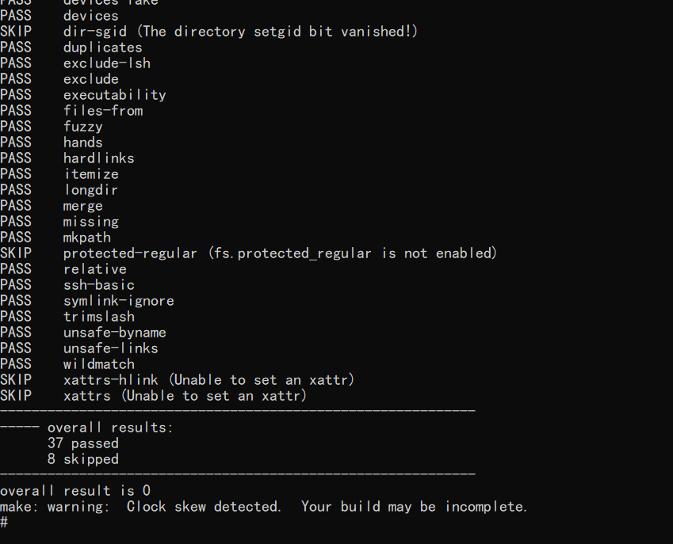

# rsync集成到应用hap

本库是在RK3568开发板上基于OpenHarmony3.2 Release版本的镜像验证的，如果是从未使用过RK3568，可以先查看[润和RK3568开发板标准系统快速上手](https://gitee.com/openharmony-sig/knowledge_demo_temp/tree/master/docs/rk3568_helloworld)。

## 开发环境

- [开发环境准备](../../../docs/hap_integrate_environment.md)

## 编译三方库

*   下载本仓库

    ```shell
    git clone https://gitee.com/openharmony-sig/tpc_c_cplusplus.git --depth=1
    ```

*   三方库目录结构

    ```shell
    tpc_c_cplusplus/thirdparty/rsync      #三方库rsync的目录结构如下
    ├── docs                              #三方库相关文档的文件夹
    ├── HPKBUILD                          #构建脚本
    ├── HPKCHECK                          #测试脚本
    ├── OAT.xml                           #扫描结果文件
    ├── SHA512SUM                         #三方库校验文件
    ├── README.OpenSource                 #说明三方库源码的下载地址，版本，license等信息
    ├── README_zh.md                      #三方库简介
    ├── rsync_oh_pkg.patch                #用于rsync库编译的补丁
    ```
    
*   在lycium目录下编译三方库

    编译环境的搭建参考[准备三方库构建环境](../../../lycium/README.md#1编译环境准备)

    ```shell
    cd lycium
    ./build.sh rsync
    ```

*   三方库头文件及生成的库

    在lycium目录下会生成usr目录，该目录下存在已编译完成的32位和64位三方库

    ```shell
    rsync/arm64-v8a   rsync/armeabi-v7a
    ```

*   [测试三方库](#测试三方库)

## 应用中使用三方库

​	rsync最终生成的是rsync可执行文件，无需引入测试编译，引用原生库的测试逻辑即可。

## 测试三方库

- 编译出可执行的文件进行测试，[准备三方库测试环境](../../../lycium/README.md#3ci环境准备)
- 将libc++_shared.so拷贝到开发板系统data目录。执行export LD_LIBRARY_PATH="/data/:/data/tpc_c_cplusplus/lycium/usr/openssl/armeabi-v7a/lib/:/data/tpc_c_cplusplus/lycium/usr/xxHash/armeabi-v7a/lib/:/data/tpc_c_cplusplus/lycium/usr/zstd/armeabi-v7a/lib/"


- 进入到构建目录运行单元测试用例（注意arm64-v8a为构建64位的目录，armeabi-v7a为构建32位的目录），执行结果如图所示

```shell
  cd /data/tpc_c_cplusplus/thirdparty/rsync/rsync-3.3.0-armeabi-v7a-build 
  make test
```

&nbsp;

## 参考资料

*   [OpenHarmony三方库地址](https://gitee.com/openharmony-tpc)
*   [OpenHarmony知识体系](https://gitee.com/openharmony-sig/knowledge)
*   [rsync三方库地址](https://github.com/RsyncProject/rsync)

