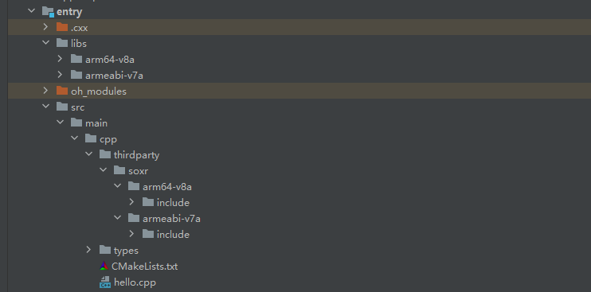
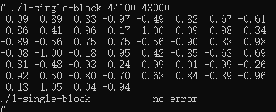
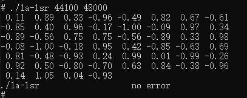
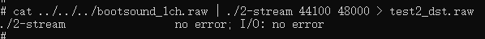
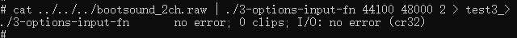
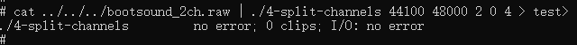
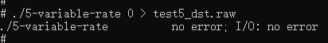

# soxr集成到应用hap

本库是在RK3568开发板上基于OpenHarmony3.2 Release版本的镜像验证的，如果是从未使用过RK3568，可以先查看[润和RK3568开发板标准系统快速上手](https://gitee.com/openharmony-sig/knowledge_demo_temp/tree/master/docs/rk3568_helloworld)。

## 开发环境

- ubuntu20.04
- [OpenHarmony3.2Release镜像](https://gitee.com/link?target=https%3A%2F%2Frepo.huaweicloud.com%2Fopenharmony%2Fos%2F3.2-Release%2Fdayu200_standard_arm32.tar.gz)
- [ohos_sdk_public 4.0.8.1 (API Version 10 Release)](http://download.ci.openharmony.cn/version/Master_Version/OpenHarmony_4.0.8.1/20230608_091016/version-Master_Version-OpenHarmony_4.0.8.1-20230608_091016-ohos-sdk-full.tar.gz)
- [DevEco Studio 3.1 Release](https://contentcenter-vali-drcn.dbankcdn.cn/pvt_2/DeveloperAlliance_package_901_9/81/v3/tgRUB84wR72nTfE8Ir_xMw/devecostudio-windows-3.1.0.501.zip?HW-CC-KV=V1&HW-CC-Date=20230621T074329Z&HW-CC-Expire=315360000&HW-CC-Sign=22F6787DF6093ECB4D4E08F9379B114280E1F65DA710599E48EA38CB24F3DBF2)
- [准备三方库构建环境](../../../lycium/README.md#1编译环境准备)
- [准备三方库测试环境](../../../lycium/README.md#3ci环境准备)

## 编译三方库

- 下载本仓库

  ```shell
  git clone https://gitee.com/openharmony-sig/tpc_c_cplusplus.git --depth=1
  ```

- 三方库目录结构

  ```shell
  tpc_c_cplusplus/thirdparty/soxr       #三方库soxr的目录结构如下
  ├── docs                              #三方库相关文档的文件夹
  ├── HPKBUILD                          #构建脚本
  ├── SHA512SUM                         #三方库校验文件
  ├── README.OpenSource                 #说明三方库源码的下载地址，版本，license等信息
  ├── README_zh.md   
  ```

- 在lycium目录下编译三方库

  编译环境的搭建参考[准备三方库构建环境](../../../lycium/README.md#1编译环境准备)

  ```shell
  cd lycium
  ./build.sh soxr
  ```

- 三方库头文件及生成的库

  在lycium目录下会生成usr目录，该目录下存在已编译完成的32位和64位三方库和头文件

  ```shell
  soxr/arm64-v8a   soxr/armeabi-v7a
  ```
  
- [测试三方库](#测试三方库)

## 应用中使用三方库

- 在IDE的cpp目录下新增thirdparty目录，将编译生成的头文件拷贝到该目录下，将编译生成的三方库全部（动态库名字带版本号和不带版本号的都需要）拷贝到该目录下，如下图所示
  &nbsp;

  &nbsp;

- 在最外层（cpp目录下）CMakeLists.txt中添加如下语句

  ```shell
  #将三方库加入工程中
  target_link_libraries(entry PRIVATE
	${CMAKE_CURRENT_SOURCE_DIR}/../../../libs/${OHOS_ARCH}/libsoxr.so
	${CMAKE_CURRENT_SOURCE_DIR}/../../../libs/${OHOS_ARCH}/libsoxr-lsr.so
	)
  #将三方库的头文件加入工程中
  target_include_directories(entry PRIVATE ${CMAKE_CURRENT_SOURCE_DIR}/thirdparty/soxr/${OHOS_ARCH}/include)
  ```


## 测试三方库

三方库的测试使用原库自带的测试用例来做测试，[准备三方库测试环境](../../../lycium/README.md#3ci环境准备)

进入到构建目录下面的examples目录,执行其示例程序如下（arm64-v8a-build为构建64位的目录，armeabi-v7a-build为构建32位的目录）
- 首先将编译生成的so路径（根据实际编译路径填写）添加到环境变量：
```shell
export LD_LIBRARY_PATH=/data/lycium/main/soxr/soxr-0.1.3-Source/arm64-v8a-build/src
```
- 执行测试项：

```shell
./1-single-block 44100 48000
```
&nbsp;
```shell
./1a-lsr 44100 48000
```
&nbsp;
```shell
cat ../../../bootsound_1ch.raw | ./2-stream 44100 48000 > test2_dst.raw
```
&nbsp;
```shell
cat ../../../bootsound_2ch.raw | ./3-options-input-fn 44100 48000 2 > test3_dst.raw
```
&nbsp;
```shell
cat ../../../bootsound_2ch.raw | ./4-split-channels 44100 48000 2 0 4 > test4_dst.raw
```
&nbsp;
```shell
./5-variable-rate 0 > test5_dst.raw
```
&nbsp;

打印“no error”代表执行成功，命令中有“>”符号的后面文件名表示产生输出的音频文件。

## 参考资料

- [润和RK3568开发板标准系统快速上手](https://gitee.com/openharmony-sig/knowledge_demo_temp/tree/master/docs/rk3568_helloworld)
- [OpenHarmony三方库地址](https://gitee.com/openharmony-tpc)
- [OpenHarmony知识体系](https://gitee.com/openharmony-sig/knowledge)
- [通过DevEco Studio开发一个NAPI工程](https://gitee.com/openharmony-sig/knowledge_demo_temp/blob/master/docs/napi_study/docs/hello_napi.md)
