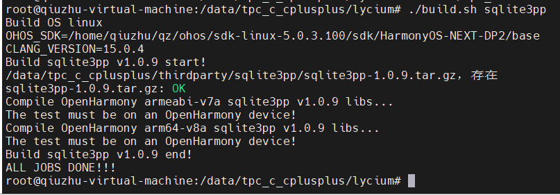
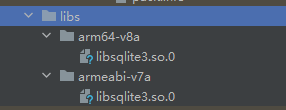
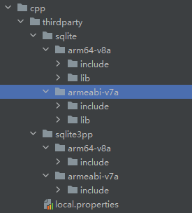
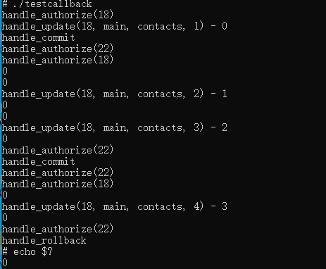

# sqlite3pp集成到应用hap

本库是在RK3568开发板上基于OpenHarmony3.2 Release版本的镜像验证的，如果是从未使用过RK3568，可以先查看[润和RK3568开发板标准系统快速上手](https://gitee.com/openharmony-sig/knowledge_demo_temp/tree/master/docs/rk3568_helloworld)。

## 开发环境

- [开发环境准备](../../../docs/hap_integrate_environment.md)

## 编译三方库

- 下载本仓库

  ```shell
  git clone https://gitee.com/openharmony-sig/tpc_c_cplusplus.git --depth=1
  ```

- 三方库目录结构

  ```shell
  tpc_c_cplusplus/thirdparty/sqlite3pp   #三方库sqlite3pp的目录结构如下
  ├── docs                             	#三方库相关文档的文件夹
  ├── HPKBUILD                         	#构建脚本
  ├── HPKCHECK                         	#测试脚本
  ├── SHA512SUM                        	#三方库校验文件
  ├── README.OpenSource                	#说明三方库源码的下载地址，版本、license等信息
  ├── README_zh.md
  ├── sqlite3pp_oh_pkg.patch            #CMakeLists.txt编译文件的patch
  ```
  
- 在lycium目录下编译三方库

  编译环境的搭建参考[准备三方库构建环境](../../../lycium/README.md#1编译环境准备)

  ```shell
  cd lycium
  ./build.sh sqlite3pp
  ```
- 

- 三方库头文件

  在lycium目录下会生成usr目录，该目录下存在已编译完成的32位和64位三方库

  ```shell
  sqlite3pp/arm64-v8a   sqlite3pp/armeabi-v7a
  ```
  
- [测试三方库](#测试三方库)

## 应用中使用三方库

- 需要将sqlite3pp依赖的sqlite的名字为soname的库文件拷贝到entry/libs目录下，如下图

- 

- 在IDE的cpp目录下新增thirdparty目录，生成的二进制文件以及头文件拷贝到该目录下，如下图所示
  
- 

- 在最外层（cpp目录下）CMakeLists.txt中添加如下语句

```
#将三方头文件加入工程中
target_include_directories(entry PRIVATE ${CMAKE_CURRENT_SOURCE_DIR}/thirdparty/sqlite3pp/${OHOS_ARCH}/include)
#将三方头文件依赖的sqlite库文件和头文件加入工程中
target_link_libraries(entry PRIVATE ${CMAKE_CURRENT_SOURCE_DIR}/thirdparty/sqlite/${OHOS_ARCH}/lib/libsqlite3.so.0)
target_include_directories(entry PRIVATE ${CMAKE_CURRENT_SOURCE_DIR}/thirdparty/sqlite/${OHOS_ARCH}/include)
```

## 测试三方库

三方库的测试使用原库自带的测试用例来做测试，[准备三方库测试环境](../../../lycium/README.md#3ci环境准备)

进入到构建目录运行测试用例（注意arm64-v8a为构建64位的目录，armeabi-v7a为构建32位的目录），可以查看HPKCHECK里面单独执行每条用例的方法，这里执行一条测试用例testcallback作为示范，在手动执行前先做准备工作如下
```
  # 进入到构建目录
  cd /data/tpc_c_cplusplus/thirdparty/sqlite3pp/sqlite3pp-1.0.9/armeabi-v7a-build(或者cd /data/tpc_c_cplusplus/thirdparty/sqlite3pp/sqlite3pp-1.0.9/arm64-v8a-build)

  # 连接到临时数据库foods.db，在临时数据库foods.db中创建episodes和foods表
  # 注意将${ARCH}替换为arm64-v8a或者armeabi-v7a
  /data/tpc_c_cplusplus/lycium/usr/sqlite/${ARCH}/bin/sqlite3 foods.db (不要退出sqlite3执行)

  CREATE TABLE foods (id INT PRIMARY KEY,name TEXT NOT NULL,type_id INTEGER NOT NULL);
  CREATE TABLE episodes (id INTEGER PRIMARY KEY,contact_id INTEGER,title TEXT,description TEXT,FOREIGN KEY (contact_id) REFERENCES contacts(id));

  # 向foods表插入一条测试数据
  INSERT INTO foods (id, name, type_id) VALUES (1, 'AAAA', 1234); (插入完数据退出sqlite3执行)

  # 连接到临时数据库test.db，在临时数据库test.db中创建contacts表
  /data/tpc_c_cplusplus/lycium/usr/sqlite/${ARCH}/bin/sqlite3 test.db (不要退出sqlite3执行)
  CREATE TABLE contacts (id INTEGER PRIMARY KEY,name TEXT NOT NULL,phone TEXT NOT NULL,address TEXT,UNIQUE(name, phone)); (创建完contacts表退出sqlite3执行)
```

执行./testcallback, 结果如图所示
```
  ./testcallback
```
- 

## 参考资料

- [OpenHarmony三方库地址](https://gitee.com/openharmony-tpc)
- [OpenHarmony知识体系](https://gitee.com/openharmony-sig/knowledge)
- [sqlite3pp三方库地址](https://github.com/iwongu/sqlite3pp)
