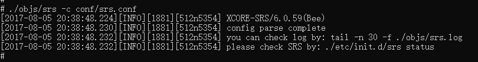
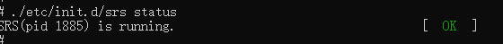
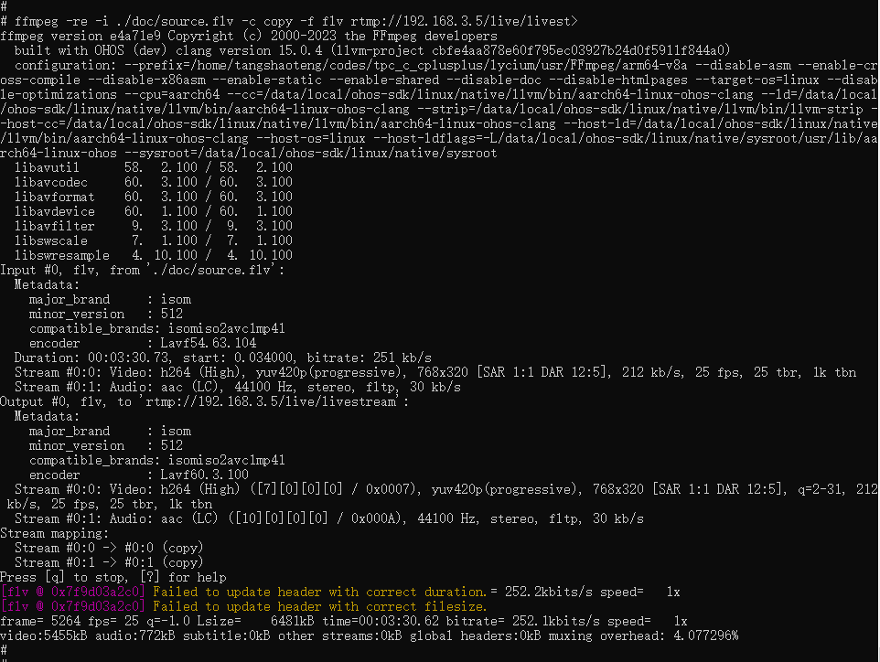
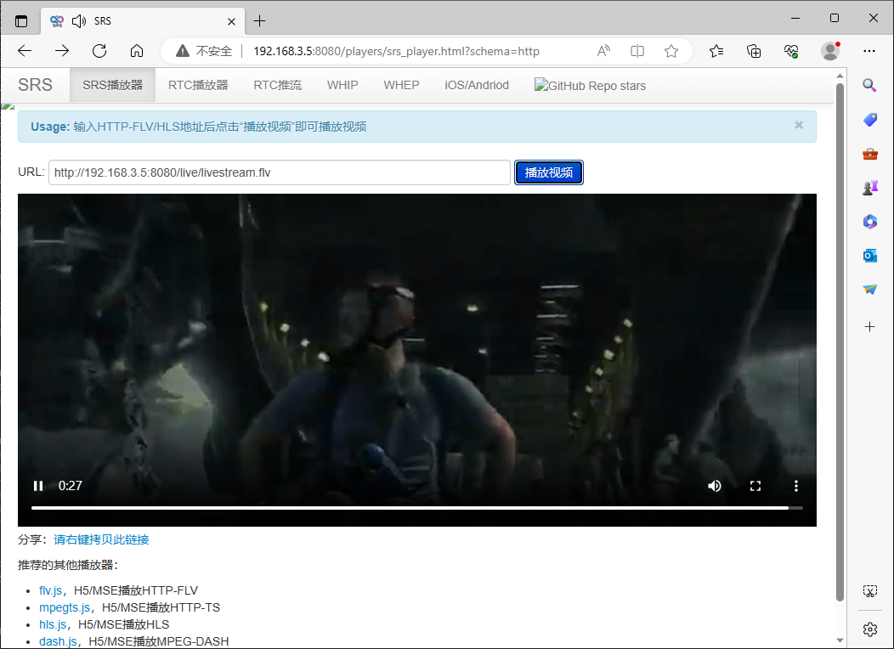
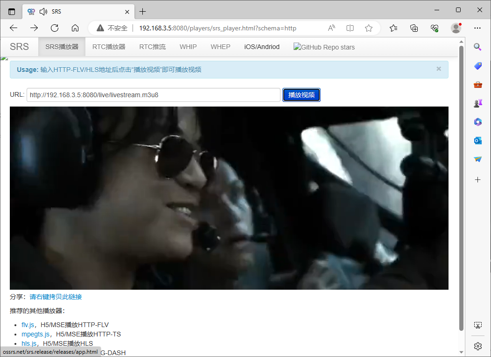

# srs集成到应用hap

本库是在RK3568开发板上基于OpenHarmony3.2 Release版本的镜像验证的，如果是从未使用过RK3568，可以先查看[润和RK3568开发板标准系统快速上手](https://gitee.com/openharmony-sig/knowledge_demo_temp/tree/master/docs/rk3568_helloworld)。

## 开发环境

- ubuntu20.04
- [OpenHarmony3.2Release镜像](https://gitee.com/link?target=https%3A%2F%2Frepo.huaweicloud.com%2Fopenharmony%2Fos%2F3.2-Release%2Fdayu200_standard_arm32.tar.gz)
- [ohos_sdk_public 4.0.8.1 (API Version 10 Release)](https://gitee.com/link?target=http%3A%2F%2Fdownload.ci.openharmony.cn%2Fversion%2FMaster_Version%2FOpenHarmony_4.0.8.1%2F20230608_091058%2Fversion-Master_Version-OpenHarmony_4.0.8.1-20230608_091058-ohos-sdk-public.tar.gz)
- [DevEco Studio 3.1 Release](https://gitee.com/link?target=https%3A%2F%2Fcontentcenter-vali-drcn.dbankcdn.cn%2Fpvt_2%2FDeveloperAlliance_package_901_9%2F81%2Fv3%2FtgRUB84wR72nTfE8Ir_xMw%2Fdevecostudio-windows-3.1.0.501.zip%3FHW-CC-KV%3DV1%26HW-CC-Date%3D20230621T074329Z%26HW-CC-Expire%3D315360000%26HW-CC-Sign%3D22F6787DF6093ECB4D4E08F9379B114280E1F65DA710599E48EA38CB24F3DBF2)
- [准备三方库构建环境](../../../lycium/README.md#1编译环境准备)
- [准备三方库测试环境](../../../lycium/README.md#3ci环境准备)

## 编译三方库

- 下载本仓库

  ```shell
  git clone https://gitee.com/openharmony-sig/tpc_c_cplusplus.git --depth=1
  ```

- 三方库目录结构

  ```shell
  tpc_c_cplusplus/thirdparty/srs        #三方库srs的目录结构如下
  ├── srs_oh_pkg.patch                  #构建patch文件
  ├── docs                              #三方库相关文档的文件夹
  ├── HPKBUILD                          #构建脚本
  ├── HPKCHECK                          #自动化测试脚本
  ├── SHA512SUM                         #三方库校验文件
  ├── README.OpenSource                 #说明三方库源码的下载地址，版本，license等信息
  ├── README_zh.md                      #三方库说明文档
  ├── OAT.xml                           #开源扫描相关文件
  ```

- 在tpc_c_cplusplus/lycium目录下编译三方库

  编译环境的搭建参考[准备三方库构建环境](../../../lycium/README.md#1编译环境准备)

  ```shell
  cd tpc_c_cplusplus/lycium
  ./build.sh srs
  ```

- 三方库头文件及生成的库

  在lycium目录下会生成usr目录，该目录下存在已编译完成的32位和64位三方库和头文件

  ```shell
  srs/arm64-v8a   srs/armeabi-v7a
  ```
- [测试三方库](#测试三方库)

## 应用中使用三方库

- 该库是服务器程序，按照该库的官方编译指导编译出来的就是可执行程序及服务器相关配置文件，没有动态库和静态库可供应用直接使用。

## 测试三方库

三方库的测试使用原库自带的测试用例来做测试，[准备三方库测试环境](../../../lycium/README.md#3ci环境准备)

- 测试环境搭建

  1. 需要组建测试网络：测试设备与PC电脑（windows或者linux等）处于同一局域网络，双向能ping通对方。
  2. 下载安装VLC视频播放器。

- srs服务器启动

  进入到构建目录下的trunk目录,执行如下命令:（arm64-v8a-build为构建64位的目录，armeabi-v7a-build为构建32位的目录）
  ```shell
  export LD_LIBRARY_PATH=./:${LYCIUM_ROOT}/usr/FFmpeg/${ARCH}/lib:$LD_LIBRARY_PATH
  export PATH=${LYCIUM_ROOT}/usr/FFmpeg/${ARCH}/bin:$PATH
  ./objs/srs -c conf/srs.conf
  ```
  > 注意：LYCIUM_ROOT代表lycium所在目录的绝对路径；ARCH代表构建架构，64位为arm64-v8a，32位为armeabi-v7a。



- 查看srs服务运行状态
  ```shell
  ./etc/init.d/srs status
  ```



- 推视频流
  ```shell
  ffmpeg -re -i ./doc/source.flv -c copy -f flv rtmp://${IP}/live/livestream
  ```
  > 注意：IP是指测试设备的IP地址（格式为：192.168.x.x）



- http-flv视频流播放

  在PC电脑浏览器里面输入测试设备的IP地址和8080端口号（格式为：192.168.x.x:8080）即可打开srs服务器主页，点击“SRS播放器”，然后点击页面中URL栏的“播放视频”即可播放（播放url默认自动填的为flv格式，示例：htpp://192.168.x.x:8080/live/livestream.flv）。



- hls视频流播放

  参照上面《http-flv视频流播放》方法，将播放页面中的URL后缀flv改为m3u8（示例：192.168.x.x:8080/live/livestream.m3u8），再点击页面中的“播放视频”即可。



- rtmp视频流播放

  使用VLC视频播放器播放rtmp视频流，点击播放器上的菜单“媒体”->“流”->“网络”，输入rtmp视频流url（示例：rtmp://192.168.x.x/live/livestream），然后在确认按钮处选择“播放”即可播放。


## 参考资料

- [润和RK3568开发板标准系统快速上手](https://gitee.com/openharmony-sig/knowledge_demo_temp/tree/master/docs/rk3568_helloworld)
- [OpenHarmony三方库地址](https://gitee.com/openharmony-tpc)
- [OpenHarmony知识体系](https://gitee.com/openharmony-sig/knowledge)
- [通过DevEco Studio开发一个NAPI工程](https://gitee.com/openharmony-sig/knowledge_demo_temp/blob/master/docs/napi_study/docs/hello_napi.md)
