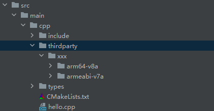
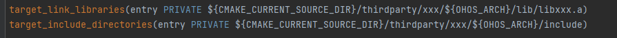
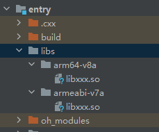
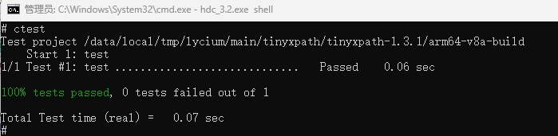

# xxx如何集成到应用hap

## 准备应用工程

本库是在RK3568开发板上基于OpenHarmony3.2 Release版本的镜像验证的，如果是从未使用过RK3568，可以先查看[润和RK3568开发板标准系统快速上手](https://gitee.com/openharmony-sig/knowledge_demo_temp/tree/master/docs/rk3568_helloworld)。

### 准备应用开发环境

- ubuntu20.04
- [OpenHarmony3.2Release镜像](https://gitee.com/link?target=https%3A%2F%2Frepo.huaweicloud.com%2Fopenharmony%2Fos%2F3.2-Release%2Fdayu200_standard_arm32.tar.gz)
- [ohos_sdk_public 3.2.11.9 (API Version 9 Release)](https://gitee.com/link?target=https%3A%2F%2Frepo.huaweicloud.com%2Fopenharmony%2Fos%2F3.2-Release%2Fohos-sdk-windows_linux-public.tar.gz)
- [DevEco Studio 3.1 Beta2](https://gitee.com/link?target=https%3A%2F%2Fcontentcenter-vali-drcn.dbankcdn.cn%2Fpvt_2%2FDeveloperAlliance_package_901_9%2Ff3%2Fv3%2FuJyuq3syQ2ak4hE1QZmAug%2Fdevecostudio-windows-3.1.0.400.zip%3FHW-CC-KV%3DV1%26HW-CC-Date%3D20230408T013335Z%26HW-CC-Expire%3D315360000%26HW-CC-Sign%3D96262721EDC9B34E6F62E66884AB7AE2A94C2A7B8C28D6F7FC891F46EB211A70)
- [准备三方库构建环境](../../../lycium/README.md#1编译环境准备)
- [准备三方库测试环境](../../../lycium/README.md#3ci环境准备)

## 编译三方库

- 下载本仓库

  ```shell
  git clone https://gitee.com/openharmony-sig/tpc_c_cplusplus.git --depth=1
  ```

- 三方库目录结构
  
  ```shell
  tpc_c_cplusplus/thirdparty/xxx          #三方库xxx的目录结构如下
    ├── docs                              #三方库相关文档的文件夹
    ├── HPKBUILD                          #构建脚本
    ├── SHA512SUM                         #三方库校验文件
    ├── README.OpenSource                 #说明三方库源码的下载地址，版本，license等信息
    ├── README_zh.md   
  ```

- 将xxx拷贝至lycium/main目录下
  
  ```shell
  cd tpc_c_cplusplus
  cp thirdparty/xxx lycium/main -rf
  ```

- 在lycium目录下编译三方库
  
  编译环境的搭建参考[准备三方库构建环境](../../../lycium/README.md#1编译环境准备)

  ```shell
  cd lycium
  ./build.sh xxx    ### xxx是对应的三方库名
  ```

- 三方库头文件及生成的库
  
  在lycium目录下会生成usr目录，该目录下存在已编译完成的32位和64位三方库

  ```shell
  xxx/arm64-v8a   xxx/armeabi-v7a   ### xxx是对应的三方库名
  ```

- [测试三方库](#测试三方库)

## 应用中使用三方库

### 静态库的使用

- 在IDE的cpp目录下新增thirdparty目录，将编译生成的库拷贝到该目录下，如下图所示：

  &nbsp;

- 在最外层（cpp目录下）CMakeLists.txt中添加如下语句：
  
  ```shell
  #将三方库加入工程中，xxx是对应的三方库名
  target_link_libraries(entry PRIVATE ${CMAKE_CURRENT_SOURCE_DIR}/thirdparty/xxx/${OHOS_ARCH}/lib/libxxx.a)
  #将三方库的头文件加入工程中，xxx是对应的三方库名
  target_include_directories(entry PRIVATE ${CMAKE_CURRENT_SOURCE_DIR}/thirdparty/xxx/${OHOS_ARCH}/include)
  ```

  

### 动态库的使用

- 在IDE的cpp目录下新增thirdparty目录，将编译生成的库拷贝到该目录下，如下图所示：

  &nbsp;

- 拷贝动态库到`\\entry\libs\${OHOS_ARCH}\`目录：
  
  动态库需要在`\\entry\libs\${OHOS_ARCH}\`目录，才能集成到hap包中，所以需要将对应的so文件拷贝到对应CPU架构的目录：

  &nbsp;

  动态库说明：</br>
  此动态库不能是带有版本号(libxxx.so.0.1),通过编译生成的就是libxxx.so,如果生成的so带版本号，可以通过命令进行修改:

  ```shell
  patchelf --set-soname libxxx.so libxxx.so.0.1   ## 将原库中的soname改成不带版本号的。libxxx.so是修改后的名字，libxxx.so.0.1原带版本号的库名
  mv libxxx.so.0.1 libxxx.so    ## 修改库名字
  ```
  
- 在最外层（cpp目录下）CMakeLists.txt中添加如下语句：
  
  ```shell
  #将三方库加入工程中，xxx是对应的三方库名
  target_link_libraries(entry PRIVATE ${CMAKE_CURRENT_SOURCE_DIR}/thirdparty/xxx/${OHOS_ARCH}/lib/libxxx.so)
  #将三方库的头文件加入工程中，xxx是对应的三方库名
  target_include_directories(entry PRIVATE ${CMAKE_CURRENT_SOURCE_DIR}/thirdparty/xxx/${OHOS_ARCH}/include)
  ```

  

## 测试三方库

三方库的测试使用原库自带的测试用例来做测试，[准备三方库测试环境](../../../lycium/README.md#3ci环境准备)

进入到构建目录执行 对应的测试命令(在[HPKBUILD](../HPKBUILD)文件中的check()函数中有说明) 运行测试用例（arm64-v8a-build为构建64位的目录，armeabi-v7a-build为构建32位的目录）,
如`tinyxpath`三方库的测试结果：

&nbsp;

## 参考资料

- [本文档涉及的技术补充说明](hap_integrate.md)
- [本文档引用的相关参考](hap_integrate.md)
- [相关案例参考](hap_integrate.md)
