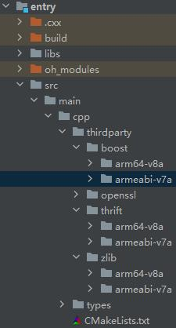
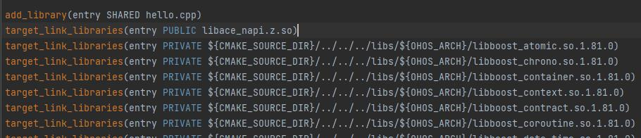
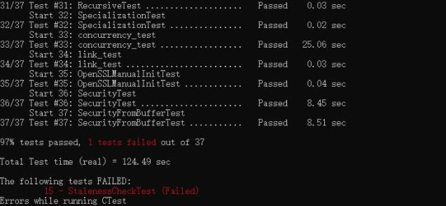

# thrift集成到应用hap
本库是在RK3568开发板上基于OpenHarmony3.2 Release版本的镜像验证的，如果是从未使用过RK3568，可以先查看[润和RK3568开发板标准系统快速上手](https://gitee.com/openharmony-sig/knowledge_demo_temp/tree/master/docs/rk3568_helloworld)。
## 开发环境
- ubuntu20.04
- [OpenHarmony3.2Release镜像](https://gitee.com/link?target=https%3A%2F%2Frepo.huaweicloud.com%2Fopenharmony%2Fos%2F3.2-Release%2Fdayu200_standard_arm32.tar.gz)
- [ohos_sdk_public 4.0.8.1 (API Version 10 Release)](http://download.ci.openharmony.cn/version/Master_Version/OpenHarmony_4.0.8.1/20230608_091016/version-Master_Version-OpenHarmony_4.0.8.1-20230608_091016-ohos-sdk-full.tar.gz)
- [DevEco Studio 3.1 Release](https://contentcenter-vali-drcn.dbankcdn.cn/pvt_2/DeveloperAlliance_package_901_9/81/v3/tgRUB84wR72nTfE8Ir_xMw/devecostudio-windows-3.1.0.501.zip?HW-CC-KV=V1&HW-CC-Date=20230621T074329Z&HW-CC-Expire=315360000&HW-CC-Sign=22F6787DF6093ECB4D4E08F9379B114280E1F65DA710599E48EA38CB24F3DBF2)
- [准备三方库构建环境](../../../lycium/README.md#1编译环境准备)
- [准备三方库测试环境](../../../lycium/README.md#3ci环境准备)
## 编译三方库
- 下载本仓库
  ```
  git clone https://gitee.com/openharmony-sig/tpc_c_cplusplus.git --depth=1
  ```
  
- 三方库目录结构
  ```
  tpc_c_cplusplus/thirdparty/thrift  #三方库thrift的目录结构如下
  ├── docs                              #三方库相关文档的文件夹
  ├── HPKBUILD                          #构建脚本
  ├── SHA512SUM                         #三方库校验文件
  ├── README.OpenSource                 #说明三方库源码的下载地址，版本，license等信息
  ├── README_zh.md 
  ```
  
- 编译三方库 
  thrift库需要依赖boost openssl zlib这三个库，所以在build时需要会自动将依赖库一起编译进来
  编译环境的搭建参考[准备三方库构建环境](../../../lycium/README.md#1编译环境准备)
  
  ```
  cd lycium
  ./build.sh thrift
  ```
  
- 三方库头文件及生成的库
  在lycium目录下会生成usr目录，该目录下存在已编译完成的32位和64位三方库
  ```
  thrift/arm64-v8a   thrift/armeabi-v7a
  boost/arm64-v8a   boost/armeabi-v7a
  openssl/arm64-v8a   openssl/armeabi-v7a 
  zlib/arm64-v8a   zlib/armeabi-v7a  
  ```

- [测试三方库](#测试三方库)

## 应用中使用三方库

- 在IDE的cpp目录下新增thirdparty目录，将编译生成的库拷贝到该目录下，如下图所示
  

&nbsp;

- 在最外层（cpp目录下）CMakeLists.txt中添加如下语句
  ```
  #将三方库加入工程中
  target_link_libraries(entry PRIVATE ${CMAKE_CURRENT_SOURCE_DIR}/thirdparty/boost/${OHOS_ARCH}/lib/libboost_atomic.so.1.81.0
            ${CMAKE_CURRENT_SOURCE_DIR}/thirdparty/boost/${OHOS_ARCH}/lib/libboost_chrono.so.1.81.0
            ${CMAKE_CURRENT_SOURCE_DIR}/thirdparty/boost/${OHOS_ARCH}/lib/libboost_container.so.1.81.0
            ${CMAKE_CURRENT_SOURCE_DIR}/thirdparty/boost/${OHOS_ARCH}/lib/libboost_context.so.1.81.0
            ${CMAKE_CURRENT_SOURCE_DIR}/thirdparty/boost/${OHOS_ARCH}/lib/libboost_contract.so.1.81.0
            ${CMAKE_CURRENT_SOURCE_DIR}/thirdparty/boost/${OHOS_ARCH}/lib/libboost_coroutine.so.1.81.0
            ${CMAKE_CURRENT_SOURCE_DIR}/thirdparty/boost/${OHOS_ARCH}/lib/libboost_date_time.so.1.81.0
            ${CMAKE_CURRENT_SOURCE_DIR}/thirdparty/boost/${OHOS_ARCH}/lib/libboost_fiber.so.1.81.0
            ${CMAKE_CURRENT_SOURCE_DIR}/thirdparty/boost/${OHOS_ARCH}/lib/libboost_filesystem.so.1.81.0
            ${CMAKE_CURRENT_SOURCE_DIR}/thirdparty/boost/${OHOS_ARCH}/lib/libboost_graph.so.1.81.0
            ${CMAKE_CURRENT_SOURCE_DIR}/thirdparty/boost/${OHOS_ARCH}/lib/libboost_iostreams.so.1.81.0
            ${CMAKE_CURRENT_SOURCE_DIR}/thirdparty/boost/${OHOS_ARCH}/lib/libboost_json.so.1.81.0
            ${CMAKE_CURRENT_SOURCE_DIR}/thirdparty/boost/${OHOS_ARCH}/lib/libboost_math_c99f.so.1.81.0
            ${CMAKE_CURRENT_SOURCE_DIR}/thirdparty/boost/${OHOS_ARCH}/lib/libboost_math_c99l.so.1.81.0
            ${CMAKE_CURRENT_SOURCE_DIR}/thirdparty/boost/${OHOS_ARCH}/lib/libboost_math_c99.so.1.81.0
            ${CMAKE_CURRENT_SOURCE_DIR}/thirdparty/boost/${OHOS_ARCH}/lib/libboost_math_tr1f.so.1.81.0
            ${CMAKE_CURRENT_SOURCE_DIR}/thirdparty/boost/${OHOS_ARCH}/lib/libboost_math_tr1l.so.1.81.0
            ${CMAKE_CURRENT_SOURCE_DIR}/thirdparty/boost/${OHOS_ARCH}/lib/libboost_math_tr1.so.1.81.0
            ${CMAKE_CURRENT_SOURCE_DIR}/thirdparty/boost/${OHOS_ARCH}/lib/libboost_nowide.so.1.81.0
            ${CMAKE_CURRENT_SOURCE_DIR}/thirdparty/boost/${OHOS_ARCH}/lib/libboost_prg_exec_monitor.so.1.81.0
            ${CMAKE_CURRENT_SOURCE_DIR}/thirdparty/boost/${OHOS_ARCH}/lib/libboost_program_options.so.1.81.0
            ${CMAKE_CURRENT_SOURCE_DIR}/thirdparty/boost/${OHOS_ARCH}/lib/libboost_random.so.1.81.0
            ${CMAKE_CURRENT_SOURCE_DIR}/thirdparty/boost/${OHOS_ARCH}/lib/libboost_regex.so.1.81.0
            ${CMAKE_CURRENT_SOURCE_DIR}/thirdparty/boost/${OHOS_ARCH}/lib/libboost_serialization.so.1.81.0
            ${CMAKE_CURRENT_SOURCE_DIR}/thirdparty/boost/${OHOS_ARCH}/lib/libboost_stacktrace_basic.so.1.81.0
            ${CMAKE_CURRENT_SOURCE_DIR}/thirdparty/boost/${OHOS_ARCH}/lib/libboost_stacktrace_noop.so.1.81.0
            ${CMAKE_CURRENT_SOURCE_DIR}/thirdparty/boost/${OHOS_ARCH}/lib/libboost_system.so.1.81.0
            ${CMAKE_CURRENT_SOURCE_DIR}/thirdparty/boost/${OHOS_ARCH}/lib/libboost_url.so.1.81.0
            ${CMAKE_CURRENT_SOURCE_DIR}/thirdparty/boost/${OHOS_ARCH}/lib/libboost_thread.so.1.81.0
            ${CMAKE_CURRENT_SOURCE_DIR}/thirdparty/boost/${OHOS_ARCH}/lib/libboost_timer.so.1.81.0
            ${CMAKE_CURRENT_SOURCE_DIR}/thirdparty/boost/${OHOS_ARCH}/lib/libboost_type_erasure.so.1.81.0
            ${CMAKE_CURRENT_SOURCE_DIR}/thirdparty/boost/${OHOS_ARCH}/lib/libboost_unit_test_framework.so.1.81.0
            ${CMAKE_CURRENT_SOURCE_DIR}/thirdparty/boost/${OHOS_ARCH}/lib/libboost_wave.so.1.81.0
            ${CMAKE_CURRENT_SOURCE_DIR}/thirdparty/boost/${OHOS_ARCH}/lib/libboost_wserialization.so.1.81.0)
  
  target_link_libraries(entry PRIVATE -L${CMAKE_CURRENT_SOURCE_DIR}/thirdparty/openssl/${OHOS_ARCH}/lib/engines-1.1/afalg.so
            -L${CMAKE_CURRENT_SOURCE_DIR}/thirdparty/openssl/${OHOS_ARCH}/lib/engines-1.1/capi.so
            -L${CMAKE_CURRENT_SOURCE_DIR}/thirdparty/openssl/${OHOS_ARCH}/lib/engines-1.1/padlock.so
            ${CMAKE_CURRENT_SOURCE_DIR}/thirdparty/openssl/${OHOS_ARCH}/lib/libcrypto.so.1.1
            ${CMAKE_CURRENT_SOURCE_DIR}/thirdparty/openssl/${OHOS_ARCH}/lib/libssl.so.1.1)
  
  target_link_libraries(entry PRIVATE ${CMAKE_CURRENT_SOURCE_DIR}/thirdparty/zlib/${OHOS_ARCH}/lib/libz.so.1.2.13)
  
  target_link_libraries(entry PRIVATE ${CMAKE_CURRENT_SOURCE_DIR}/thirdparty/thrift/${OHOS_ARCH}/lib/libthrift.a
            ${CMAKE_CURRENT_SOURCE_DIR}/thirdparty/thrift/${OHOS_ARCH}/lib/libthriftz.a)
  
  #将三方库的头文件加入工程中
  target_include_directories(entry PRIVATE ${CMAKE_CURRENT_SOURCE_DIR}/thirdparty/boost/${OHOS_ARCH}/include)
  target_include_directories(entry PRIVATE ${CMAKE_CURRENT_SOURCE_DIR}/thirdparty/openssl/${OHOS_ARCH}/include)
  target_include_directories(entry PRIVATE ${CMAKE_CURRENT_SOURCE_DIR}/thirdparty/zlib/${OHOS_ARCH}/include)
  target_include_directories(entry PRIVATE ${CMAKE_CURRENT_SOURCE_DIR}/thirdparty/thrift/${OHOS_ARCH}/include)
  ```

&nbsp;

## 测试三方库
三方库的测试使用原库自带的测试用例来做测试，[准备三方库测试环境](../../../lycium/README.md#3ci环境准备)

- 将编译生成的可执行文件及生成的动态库准备好

- 将准备好的文件推送到开发板，进入到构建的目录添加执行文件权限和lib库环境执行ctest

&nbsp;

StalenessCheckTest测试选项需要依赖python环境,导致测试错误
## 参考资料
- [润和RK3568开发板标准系统快速上手](https://gitee.com/openharmony-sig/knowledge_demo_temp/tree/master/docs/rk3568_helloworld)
- [OpenHarmony三方库地址](https://gitee.com/openharmony-tpc)
- [OpenHarmony知识体系](https://gitee.com/openharmony-sig/knowledge)
- [通过DevEco Studio开发一个NAPI工程](https://gitee.com/openharmony-sig/knowledge_demo_temp/blob/master/docs/napi_study/docs/hello_napi.md)
