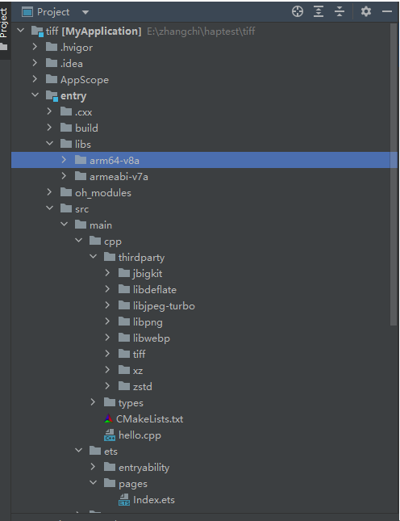
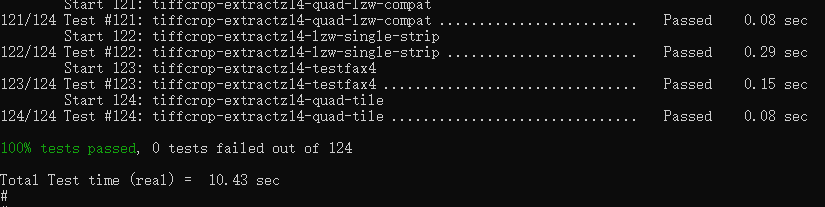

# tiff集成到应用hap
本库是在RK3568开发板上基于OpenHarmony3.2 Release版本的镜像验证的，如果是从未使用过RK3568，可以先查看[润和RK3568开发板标准系统快速上手](https://gitee.com/openharmony-sig/knowledge_demo_temp/tree/master/docs/rk3568_helloworld)。
## 开发环境
- ubuntu20.04
- [OpenHarmony3.2Release镜像](https://gitee.com/link?target=https%3A%2F%2Frepo.huaweicloud.com%2Fopenharmony%2Fos%2F3.2-Release%2Fdayu200_standard_arm32.tar.gz)
- [ohos_sdk_public 4.0.8.1 (API Version 10 Release)](http://download.ci.openharmony.cn/version/Master_Version/OpenHarmony_4.0.8.1/20230608_091016/version-Master_Version-OpenHarmony_4.0.8.1-20230608_091016-ohos-sdk-full.tar.gz)
- [DevEco Studio 3.1 Release](https://contentcenter-vali-drcn.dbankcdn.cn/pvt_2/DeveloperAlliance_package_901_9/81/v3/tgRUB84wR72nTfE8Ir_xMw/devecostudio-windows-3.1.0.501.zip?HW-CC-KV=V1&HW-CC-Date=20230621T074329Z&HW-CC-Expire=315360000&HW-CC-Sign=22F6787DF6093ECB4D4E08F9379B114280E1F65DA710599E48EA38CB24F3DBF2)
- [准备三方库构建环境](../../../lycium/README.md#1编译环境准备)
- [准备三方库测试环境](../../../lycium/README.md#3ci环境准备)

## 编译三方库
- 下载本仓库
  ```
  git clone https://gitee.com/openharmony-sig/tpc_c_cplusplus.git --depth=1
  ```
  
- 三方库目录结构
  ```
  tpc_c_cplusplus/thirdparty/tiff       #三方库tiff的目录结构如下
  ├── docs                              #三方库相关文档的文件夹
  ├── HPKBUILD                          #构建脚本
  ├── SHA512SUM                         #三方库校验文件
  ├── README.OpenSource                 #说明三方库源码的下载地址，版本，license等信息
  ├── HPKCHECK                          #自动化测试脚本
  ├── OAT.xml                           #版权检验文件  
  ├── README_zh.md
  ```
  
- 编译三方库
  编译环境的搭建参考[准备三方库构建环境](../../../lycium/README.md#1编译环境准备)
  
  ```
  (tiff库所需要的依赖库有 libpng giflib zstd libjpeg-turbo xz libdeflate jbigkit libwebp， 所以编译时会自动一起编译)
  cd lycium
  ./build.sh  tiff
  ```
  
- 三方库头文件及生成的库
  在lycium目录下会生成usr目录，该目录下存在已编译完成的32位和64位三方库
  
  ```
  tiff/arm64-v8a   tiff/armeabi-v7a                             libpng/arm64-v8a      libpng/armeabi-v7a               
  libjpeg-turbo/arm64-v8a libjpeg-turbo/armeabi-v7a             libwebp/arm64-v8a      libwebp/armeabi-v7a              
  zstd/arm64-v8a         zstd/armeabi-v7a                       xz/arm64-v8a            xz/armeabi-v7a                libdeflate/arm64-v8a   libdeflate/armeabi-v7a       jbigkit/arm64-v8a   jbigkit/armeabi-v7a       
  ```
  
- [测试三方库](#测试三方库)

## 应用中使用三方库
- 拷贝动态库到`\\entry\libs\${OHOS_ARCH}\`目录：
  动态库需要在`\\entry\libs\${OHOS_ARCH}\`目录，才能集成到hap包中，所以需要将编译生成的所有库的so文件拷贝到对应的目录
- 在IDE的cpp目录下新增thirdparty目录，将编译生成的库拷贝到该目录下，如下图所示
&nbsp;
- 在最外层（cpp目录下）CMakeLists.txt中添加如下语句
  ```
  #将三方库加入工程中
   target_link_libraries(entry PRIVATE ${CMAKE_CURRENT_SOURCE_DIR}/../../../libs/${OHOS_ARCH}/libtiff.so.6
                        ${CMAKE_CURRENT_SOURCE_DIR}/../../../libs/${OHOS_ARCH}/libdeflate.so.0
                        ${CMAKE_CURRENT_SOURCE_DIR}/../../../libs/${OHOS_ARCH}/libjpeg.so.62
                        ${CMAKE_CURRENT_SOURCE_DIR}/../../../libs/${OHOS_ARCH}/liblzma.so.5
                        ${CMAKE_CURRENT_SOURCE_DIR}/../../../libs/${OHOS_ARCH}/libzstd.so.1
                        ${CMAKE_CURRENT_SOURCE_DIR}/../../../libs/${OHOS_ARCH}/libwebp.so.7)
  #将三方库的头文件加入工程中
  target_include_directories(entry PRIVATE ${CMAKE_CURRENT_SOURCE_DIR}/thirdparty/tiff/${OHOS_ARCH}/include
                        ${CMAKE_CURRENT_SOURCE_DIR}/thirdparty/jbigkit/${OHOS_ARCH}/include
                        ${CMAKE_CURRENT_SOURCE_DIR}/thirdparty/libdeflate/${OHOS_ARCH}/include
                        ${CMAKE_CURRENT_SOURCE_DIR}/thirdparty/libjpeg-turbo/${OHOS_ARCH}/include
                        ${CMAKE_CURRENT_SOURCE_DIR}/thirdparty/libpng/${OHOS_ARCH}/include
                        ${CMAKE_CURRENT_SOURCE_DIR}/thirdparty/libwebp/${OHOS_ARCH}/include
                        ${CMAKE_CURRENT_SOURCE_DIR}/thirdparty/xz/${OHOS_ARCH}/include
                        ${CMAKE_CURRENT_SOURCE_DIR}/thirdparty/zstd/${OHOS_ARCH}/include)
  ```
## 测试三方库
三方库的测试使用原库自带的测试用例来做测试，[准备三方库测试环境](../../../lycium/README.md#3ci环境准备)


- 设置MAKE执行程序路径
  ```
  mkdir -p /data/local/tmp/ohos-sdk/linux/native/build-lycium/cmake
  ln -s /usr/bin  /data/local/tmp/ohos-sdk/linux/native/build-lycium/cmake/bin
  ```
- 拷贝CMAKE安装路径到单板
  ```
  将编译机的/usr/share 目录下面cmake-3.26.X 进行压缩并传送到单板
  hdc.exe  file send Z:\code\cmake-3.26.3.tar.gz /data/
  mv /data/cmake-3.26.3.tar.gz /usr/share
  tar zxvf cmake-3.26.3.tar.gz
  mv cmake-3.26.3 cmake-3.26
  ```
- 将测试资源导入到开发板
- 设置依赖库路径
```
32位系统
export LD_LIBRARY_PATH=/data/local/tmp/lycium/usr/libjpeg-turbo/armeabi-v7a/lib:/data/local/tmp/lycium/usr/libdeflate/armeabi-v7a/lib:/data/local/tmp/lycium/usr/xz/armeabi-v7a/lib:/data/local/tmp/lycium/usr/zstd/armeabi-v7a/lib:/data/local/tmp/lycium/usr/libpng/armeabi-v7a/lib:/data/local/tmp/lycium/usr/tiff/armeabi-v7a/lib:/data/local/tmp/lycium/usr/libwebp/armeabi-v7a/lib:/data/local/tmp/lycium/usr/jbigkit/armeabi-v7a/lib
##64位系统
export LD_LIBRARY_PATH=/data/local/tmp/lycium/usr/libjpeg-turbo/arm64-v8a/lib:/data/local/tmp/lycium/usr/libdeflate/arm64-v8a/lib:/data/local/tmp/lycium/usr/xz/arm64-v8a/lib:/data/local/tmp/lycium/usr/zstd/arm64-v8a/lib:/data/local/tmp/lycium/usr/libpng/arm64-v8a/lib:/data/local/tmp/lycium/usr/tiff/arm64-v8a/lib:/data/local/tmp/lycium/usr/libwebp/arm64-v8a/lib:/data/local/tmp/lycium/usr/jbigkit/arm64-v8a/lib
```
- 进入到构建目录输入以下指令
```
find . -name "CTestTestfile.cmake" | xargs sed -i 's#".*/cmake"#"/usr/bin/cmake"#g'
```
- 进入到构建目录执行 ctest 运行测试用例，如下截图（arm64-v8a-build为构建64位的目录，armeabi-v7a-build为构建32位的目录）

&nbsp;

## 参考资料
- [润和RK3568开发板标准系统快速上手](https://gitee.com/openharmony-sig/knowledge_demo_temp/tree/master/docs/rk3568_helloworld)
- [OpenHarmony三方库地址](https://gitee.com/openharmony-tpc)
- [OpenHarmony知识体系](https://gitee.com/openharmony-sig/knowledge)
- [通过DevEco Studio开发一个NAPI工程](https://gitee.com/openharmony-sig/knowledge_demo_temp/blob/master/docs/napi_study/docs/hello_napi.md)
