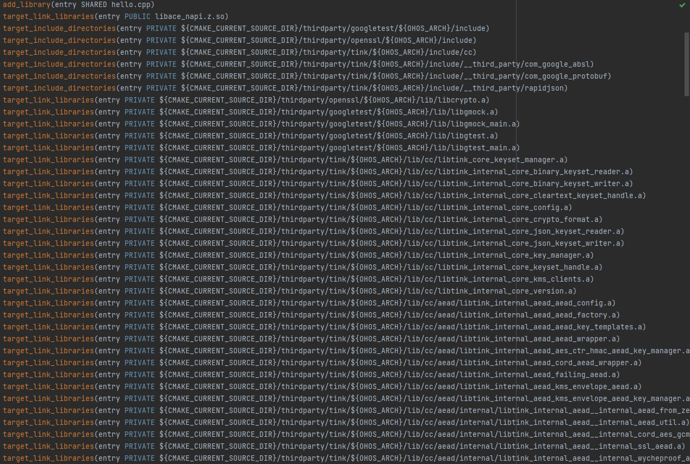
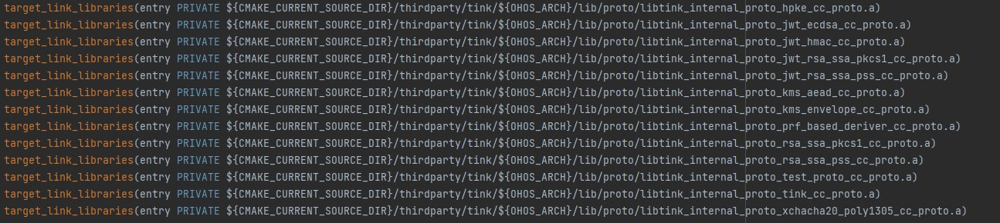
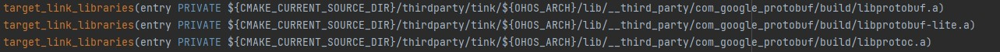
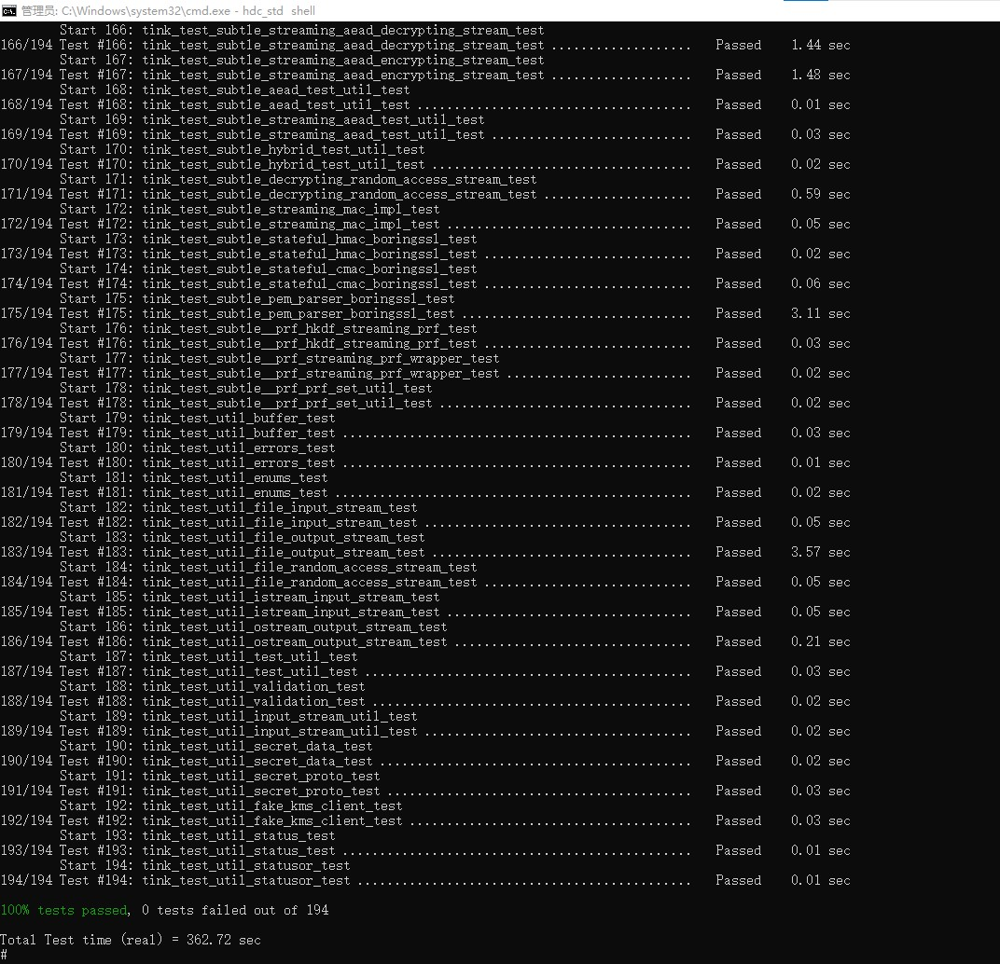

# tink集成到应用hap

本库是在RK3568开发板上基于OpenHarmony3.2 Release版本的镜像验证的，如果是从未使用过RK3568，可以先查看[润和RK3568开发板标准系统快速上手](https://gitee.com/openharmony-sig/knowledge_demo_temp/tree/master/docs/rk3568_helloworld)。

## 开发环境

- ubuntu20.04
- [OpenHarmony3.2Release镜像](https://gitee.com/link?target=https%3A%2F%2Frepo.huaweicloud.com%2Fopenharmony%2Fos%2F3.2-Release%2Fdayu200_standard_arm32.tar.gz)
- [ohos_sdk_public 4.0.8.1 (API Version 10 Release)](https://gitee.com/link?target=http%3A%2F%2Fdownload.ci.openharmony.cn%2Fversion%2FMaster_Version%2FOpenHarmony_4.0.8.1%2F20230608_091058%2Fversion-Master_Version-OpenHarmony_4.0.8.1-20230608_091058-ohos-sdk-public.tar.gz)
- [DevEco Studio 3.1 Release](https://gitee.com/link?target=https%3A%2F%2Fcontentcenter-vali-drcn.dbankcdn.cn%2Fpvt_2%2FDeveloperAlliance_package_901_9%2F81%2Fv3%2FtgRUB84wR72nTfE8Ir_xMw%2Fdevecostudio-windows-3.1.0.501.zip%3FHW-CC-KV%3DV1%26HW-CC-Date%3D20230621T074329Z%26HW-CC-Expire%3D315360000%26HW-CC-Sign%3D22F6787DF6093ECB4D4E08F9379B114280E1F65DA710599E48EA38CB24F3DBF2)
- [准备三方库构建环境](../../../lycium/README.md#1编译环境准备)
- [准备三方库测试环境](../../../lycium/README.md#3ci环境准备)

## 编译三方库
- 下载本仓库
  ```
  git clone https://gitee.com/openharmony-sig/tpc_c_cplusplus.git --depth=1
  ```
- 三方库目录结构
  ```
  tpc_c_cplusplus/thirdparty/tink  #三方库tink的目录结构如下
  ├── docs                              #三方库相关文档的文件夹
  ├── HPKBUILD                          #构建脚本
  ├── tink_oh_pkg.patch                 #补丁
  ├── SHA512SUM                         #三方库校验文件
  ├── README.OpenSource                 #说明三方库源码的下载地址，版本，license等信息
  ├── README_zh.md 
  ```
  
- 在lycium目录下编译三方库
  编译环境的搭建参考[准备三方库构建环境](../../../lycium/README.md#1编译环境准备)

  ```
  cd lycium
  ./build.sh tink
  ```
- 三方库头文件及生成的库
  在lycium目录下会生成usr目录，该目录下存在已编译完成的32位和64位三方库
  ```
  tink/arm64-v8a   tink/armeabi-v7a
  googletest/arm64-v8a  googletest/armeabi-v7a
  openssl/arm64-v8a  openssl/armeabi-v7a
  ```

- [测试三方库](#测试三方库)

## 应用中使用三方库

- 在IDE的cpp目录下新增thirdparty目录，将编译生成的库和依赖库拷贝到该目录下，如下图所示
  &nbsp;
  

- 在最外层（cpp目录下）CMakeLists.txt中添加如下语句
  ```shell
  #将三方库加入工程中 
  target_link_libraries(entry PRIVATE ${CMAKE_CURRENT_SOURCE_DIR}/thirdparty/openssl/${OHOS_ARCH}/lib/libcrypto.a)
  target_link_libraries(entry PRIVATE ${CMAKE_CURRENT_SOURCE_DIR}/thirdparty/googletest/${OHOS_ARCH}/lib/libgmock.a)
  target_link_libraries(entry PRIVATE ${CMAKE_CURRENT_SOURCE_DIR}/thirdparty/googletest/${OHOS_ARCH}/lib/libgmock_main.a)
  target_link_libraries(entry PRIVATE ${CMAKE_CURRENT_SOURCE_DIR}/thirdparty/googletest/${OHOS_ARCH}/lib/libgtest.a)
  target_link_libraries(entry PRIVATE ${CMAKE_CURRENT_SOURCE_DIR}/thirdparty/googletest/${OHOS_ARCH}/lib/libgtest_main.a)
  target_link_libraries(entry PRIVATE ${CMAKE_CURRENT_SOURCE_DIR}/thirdparty/tink/${OHOS_ARCH}/lib/cc/libtink_core_keyset_manager.a)
  target_link_libraries(entry PRIVATE ${CMAKE_CURRENT_SOURCE_DIR}/thirdparty/tink/${OHOS_ARCH}/lib/cc/libtink_internal_core_binary_keyset_reader.a)
  target_link_libraries(entry PRIVATE ${CMAKE_CURRENT_SOURCE_DIR}/thirdparty/tink/${OHOS_ARCH}/lib/cc/libtink_internal_core_binary_keyset_writer.a)
  target_link_libraries(entry PRIVATE ${CMAKE_CURRENT_SOURCE_DIR}/thirdparty/tink/${OHOS_ARCH}/lib/cc/libtink_internal_core_cleartext_keyset_handle.a)
  target_link_libraries(entry PRIVATE ${CMAKE_CURRENT_SOURCE_DIR}/thirdparty/tink/${OHOS_ARCH}/lib/cc/libtink_internal_core_config.a)
  target_link_libraries(entry PRIVATE ${CMAKE_CURRENT_SOURCE_DIR}/thirdparty/tink/${OHOS_ARCH}/lib/cc/libtink_internal_core_crypto_format.a)
  target_link_libraries(entry PRIVATE ${CMAKE_CURRENT_SOURCE_DIR}/thirdparty/tink/${OHOS_ARCH}/lib/cc/libtink_internal_core_json_keyset_reader.a)
  target_link_libraries(entry PRIVATE ${CMAKE_CURRENT_SOURCE_DIR}/thirdparty/tink/${OHOS_ARCH}/lib/cc/libtink_internal_core_json_keyset_writer.a)
  target_link_libraries(entry PRIVATE ${CMAKE_CURRENT_SOURCE_DIR}/thirdparty/tink/${OHOS_ARCH}/lib/cc/libtink_internal_core_key_manager.a)
  target_link_libraries(entry PRIVATE ${CMAKE_CURRENT_SOURCE_DIR}/thirdparty/tink/${OHOS_ARCH}/lib/cc/libtink_internal_core_keyset_handle.a)
  target_link_libraries(entry PRIVATE ${CMAKE_CURRENT_SOURCE_DIR}/thirdparty/tink/${OHOS_ARCH}/lib/cc/libtink_internal_core_kms_clients.a)
  target_link_libraries(entry PRIVATE ${CMAKE_CURRENT_SOURCE_DIR}/thirdparty/tink/${OHOS_ARCH}/lib/cc/libtink_internal_core_version.a)
  target_link_libraries(entry PRIVATE ${CMAKE_CURRENT_SOURCE_DIR}/thirdparty/tink/${OHOS_ARCH}/lib/cc/aead/libtink_internal_aead_aead_config.a)
  target_link_libraries(entry PRIVATE ${CMAKE_CURRENT_SOURCE_DIR}/thirdparty/tink/${OHOS_ARCH}/lib/cc/aead/libtink_internal_aead_aead_factory.a)
  target_link_libraries(entry PRIVATE ${CMAKE_CURRENT_SOURCE_DIR}/thirdparty/tink/${OHOS_ARCH}/lib/cc/aead/libtink_internal_aead_aead_key_templates.a)
  target_link_libraries(entry PRIVATE ${CMAKE_CURRENT_SOURCE_DIR}/thirdparty/tink/${OHOS_ARCH}/lib/cc/aead/libtink_internal_aead_aead_wrapper.a)
  target_link_libraries(entry PRIVATE ${CMAKE_CURRENT_SOURCE_DIR}/thirdparty/tink/${OHOS_ARCH}/lib/cc/aead/libtink_internal_aead_aes_ctr_hmac_aead_key_manager.a)
  target_link_libraries(entry PRIVATE ${CMAKE_CURRENT_SOURCE_DIR}/thirdparty/tink/${OHOS_ARCH}/lib/cc/aead/libtink_internal_aead_cord_aead_wrapper.a)
  target_link_libraries(entry PRIVATE ${CMAKE_CURRENT_SOURCE_DIR}/thirdparty/tink/${OHOS_ARCH}/lib/cc/aead/libtink_internal_aead_failing_aead.a)
  target_link_libraries(entry PRIVATE ${CMAKE_CURRENT_SOURCE_DIR}/thirdparty/tink/${OHOS_ARCH}/lib/cc/aead/libtink_internal_aead_kms_envelope_aead.a)
  target_link_libraries(entry PRIVATE ${CMAKE_CURRENT_SOURCE_DIR}/thirdparty/tink/${OHOS_ARCH}/lib/cc/aead/libtink_internal_aead_kms_envelope_aead_key_manager.a)
  target_link_libraries(entry PRIVATE ${CMAKE_CURRENT_SOURCE_DIR}/thirdparty/tink/${OHOS_ARCH}/lib/cc/aead/internal/libtink_internal_aead__internal_aead_from_zero_copy.a)
  target_link_libraries(entry PRIVATE ${CMAKE_CURRENT_SOURCE_DIR}/thirdparty/tink/${OHOS_ARCH}/lib/cc/aead/internal/libtink_internal_aead__internal_aead_util.a)
  target_link_libraries(entry PRIVATE ${CMAKE_CURRENT_SOURCE_DIR}/thirdparty/tink/${OHOS_ARCH}/lib/cc/aead/internal/libtink_internal_aead__internal_cord_aes_gcm_boringssl.a)
  target_link_libraries(entry PRIVATE ${CMAKE_CURRENT_SOURCE_DIR}/thirdparty/tink/${OHOS_ARCH}/lib/cc/aead/internal/libtink_internal_aead__internal_ssl_aead.a)
  target_link_libraries(entry PRIVATE ${CMAKE_CURRENT_SOURCE_DIR}/thirdparty/tink/${OHOS_ARCH}/lib/cc/aead/internal/libtink_internal_aead__internal_wycheproof_aead.a)
  target_link_libraries(entry PRIVATE ${CMAKE_CURRENT_SOURCE_DIR}/thirdparty/tink/${OHOS_ARCH}/lib/cc/aead/internal/libtink_internal_aead__internal_zero_copy_aead_wrapper.a)
  target_link_libraries(entry PRIVATE ${CMAKE_CURRENT_SOURCE_DIR}/thirdparty/tink/${OHOS_ARCH}/lib/cc/aead/internal/libtink_internal_aead__internal_zero_copy_aes_gcm_boringssl.a)
  target_link_libraries(entry PRIVATE ${CMAKE_CURRENT_SOURCE_DIR}/thirdparty/tink/${OHOS_ARCH}/lib/cc/config/libtink_internal_config_config_util.a)
  target_link_libraries(entry PRIVATE ${CMAKE_CURRENT_SOURCE_DIR}/thirdparty/tink/${OHOS_ARCH}/lib/cc/config/libtink_internal_config_tink_config.a)
  target_link_libraries(entry PRIVATE ${CMAKE_CURRENT_SOURCE_DIR}/thirdparty/tink/${OHOS_ARCH}/lib/cc/config/libtink_internal_config_tink_fips.a)
  target_link_libraries(entry PRIVATE ${CMAKE_CURRENT_SOURCE_DIR}/thirdparty/tink/${OHOS_ARCH}/lib/cc/daead/libtink_internal_daead_deterministic_aead_config.a)
  target_link_libraries(entry PRIVATE ${CMAKE_CURRENT_SOURCE_DIR}/thirdparty/tink/${OHOS_ARCH}/lib/cc/daead/libtink_internal_daead_deterministic_aead_factory.a)
  target_link_libraries(entry PRIVATE ${CMAKE_CURRENT_SOURCE_DIR}/thirdparty/tink/${OHOS_ARCH}/lib/cc/daead/libtink_internal_daead_deterministic_aead_key_templates.a)
  target_link_libraries(entry PRIVATE ${CMAKE_CURRENT_SOURCE_DIR}/thirdparty/tink/${OHOS_ARCH}/lib/cc/daead/libtink_internal_daead_deterministic_aead_wrapper.a)
  target_link_libraries(entry PRIVATE ${CMAKE_CURRENT_SOURCE_DIR}/thirdparty/tink/${OHOS_ARCH}/lib/cc/daead/libtink_internal_daead_failing_daead.a)
  target_link_libraries(entry PRIVATE ${CMAKE_CURRENT_SOURCE_DIR}/thirdparty/tink/${OHOS_ARCH}/lib/cc/daead/subtle/libtink_internal_daead__subtle_aead_or_daead.a)
  target_link_libraries(entry PRIVATE ${CMAKE_CURRENT_SOURCE_DIR}/thirdparty/tink/${OHOS_ARCH}/lib/cc/hybrid/libtink_internal_hybrid_ecies_aead_hkdf_dem_helper.a)
  target_link_libraries(entry PRIVATE ${CMAKE_CURRENT_SOURCE_DIR}/thirdparty/tink/${OHOS_ARCH}/lib/cc/hybrid/libtink_internal_hybrid_ecies_aead_hkdf_hybrid_decrypt.a)
  target_link_libraries(entry PRIVATE ${CMAKE_CURRENT_SOURCE_DIR}/thirdparty/tink/${OHOS_ARCH}/lib/cc/hybrid/libtink_internal_hybrid_ecies_aead_hkdf_hybrid_encrypt.a)
  target_link_libraries(entry PRIVATE ${CMAKE_CURRENT_SOURCE_DIR}/thirdparty/tink/${OHOS_ARCH}/lib/cc/hybrid/libtink_internal_hybrid_ecies_aead_hkdf_private_key_manager.a)
  target_link_libraries(entry PRIVATE ${CMAKE_CURRENT_SOURCE_DIR}/thirdparty/tink/${OHOS_ARCH}/lib/cc/hybrid/libtink_internal_hybrid_ecies_aead_hkdf_public_key_manager.a)
  target_link_libraries(entry PRIVATE ${CMAKE_CURRENT_SOURCE_DIR}/thirdparty/tink/${OHOS_ARCH}/lib/cc/hybrid/libtink_internal_hybrid_failing_hybrid.a)
  target_link_libraries(entry PRIVATE ${CMAKE_CURRENT_SOURCE_DIR}/thirdparty/tink/${OHOS_ARCH}/lib/cc/hybrid/libtink_internal_hybrid_hybrid_config.a)
  target_link_libraries(entry PRIVATE ${CMAKE_CURRENT_SOURCE_DIR}/thirdparty/tink/${OHOS_ARCH}/lib/cc/hybrid/libtink_internal_hybrid_hybrid_decrypt_factory.a)
  target_link_libraries(entry PRIVATE ${CMAKE_CURRENT_SOURCE_DIR}/thirdparty/tink/${OHOS_ARCH}/lib/cc/hybrid/libtink_internal_hybrid_hybrid_decrypt_wrapper.a)
  target_link_libraries(entry PRIVATE ${CMAKE_CURRENT_SOURCE_DIR}/thirdparty/tink/${OHOS_ARCH}/lib/cc/hybrid/libtink_internal_hybrid_hybrid_encrypt_factory.a)
  target_link_libraries(entry PRIVATE ${CMAKE_CURRENT_SOURCE_DIR}/thirdparty/tink/${OHOS_ARCH}/lib/cc/hybrid/libtink_internal_hybrid_hybrid_encrypt_wrapper.a)
  target_link_libraries(entry PRIVATE ${CMAKE_CURRENT_SOURCE_DIR}/thirdparty/tink/${OHOS_ARCH}/lib/cc/hybrid/libtink_internal_hybrid_hybrid_key_templates.a)
  target_link_libraries(entry PRIVATE ${CMAKE_CURRENT_SOURCE_DIR}/thirdparty/tink/${OHOS_ARCH}/lib/cc/internal/libtink_internal_internal_aes_util.a)
  target_link_libraries(entry PRIVATE ${CMAKE_CURRENT_SOURCE_DIR}/thirdparty/tink/${OHOS_ARCH}/lib/cc/internal/libtink_internal_internal_bn_util.a)
  target_link_libraries(entry PRIVATE ${CMAKE_CURRENT_SOURCE_DIR}/thirdparty/tink/${OHOS_ARCH}/lib/cc/internal/libtink_internal_internal_ec_util.a)
  target_link_libraries(entry PRIVATE ${CMAKE_CURRENT_SOURCE_DIR}/thirdparty/tink/${OHOS_ARCH}/lib/cc/internal/libtink_internal_internal_err_util.a)
  target_link_libraries(entry PRIVATE ${CMAKE_CURRENT_SOURCE_DIR}/thirdparty/tink/${OHOS_ARCH}/lib/cc/internal/libtink_internal_internal_fips_utils.a)
  target_link_libraries(entry PRIVATE ${CMAKE_CURRENT_SOURCE_DIR}/thirdparty/tink/${OHOS_ARCH}/lib/cc/internal/libtink_internal_internal_key_info.a)
  target_link_libraries(entry PRIVATE ${CMAKE_CURRENT_SOURCE_DIR}/thirdparty/tink/${OHOS_ARCH}/lib/cc/internal/libtink_internal_internal_md_util.a)
  target_link_libraries(entry PRIVATE ${CMAKE_CURRENT_SOURCE_DIR}/thirdparty/tink/${OHOS_ARCH}/lib/cc/internal/libtink_internal_internal_registry_impl.a)
  target_link_libraries(entry PRIVATE ${CMAKE_CURRENT_SOURCE_DIR}/thirdparty/tink/${OHOS_ARCH}/lib/cc/internal/libtink_internal_internal_rsa_util.a)
  target_link_libraries(entry PRIVATE ${CMAKE_CURRENT_SOURCE_DIR}/thirdparty/tink/${OHOS_ARCH}/lib/cc/internal/libtink_internal_internal_test_file_util.a)
  target_link_libraries(entry PRIVATE ${CMAKE_CURRENT_SOURCE_DIR}/thirdparty/tink/${OHOS_ARCH}/lib/cc/internal/libtink_internal_internal_util.a)
  target_link_libraries(entry PRIVATE ${CMAKE_CURRENT_SOURCE_DIR}/thirdparty/tink/${OHOS_ARCH}/lib/cc/jwt/libtink_internal_jwt_jwk_set_converter.a)
  target_link_libraries(entry PRIVATE ${CMAKE_CURRENT_SOURCE_DIR}/thirdparty/tink/${OHOS_ARCH}/lib/cc/jwt/libtink_internal_jwt_jwt_key_templates.a)
  target_link_libraries(entry PRIVATE ${CMAKE_CURRENT_SOURCE_DIR}/thirdparty/tink/${OHOS_ARCH}/lib/cc/jwt/libtink_internal_jwt_jwt_mac_config.a)
  target_link_libraries(entry PRIVATE ${CMAKE_CURRENT_SOURCE_DIR}/thirdparty/tink/${OHOS_ARCH}/lib/cc/jwt/libtink_internal_jwt_jwt_signature_config.a)
  target_link_libraries(entry PRIVATE ${CMAKE_CURRENT_SOURCE_DIR}/thirdparty/tink/${OHOS_ARCH}/lib/cc/jwt/libtink_internal_jwt_jwt_validator.a)
  target_link_libraries(entry PRIVATE ${CMAKE_CURRENT_SOURCE_DIR}/thirdparty/tink/${OHOS_ARCH}/lib/cc/jwt/libtink_internal_jwt_raw_jwt.a)
  target_link_libraries(entry PRIVATE ${CMAKE_CURRENT_SOURCE_DIR}/thirdparty/tink/${OHOS_ARCH}/lib/cc/jwt/libtink_internal_jwt_verified_jwt.a)
  target_link_libraries(entry PRIVATE ${CMAKE_CURRENT_SOURCE_DIR}/thirdparty/tink/${OHOS_ARCH}/lib/cc/jwt/internal/libtink_internal_jwt__internal_json_util.a)
  target_link_libraries(entry PRIVATE ${CMAKE_CURRENT_SOURCE_DIR}/thirdparty/tink/${OHOS_ARCH}/lib/cc/jwt/internal/libtink_internal_jwt__internal_jwt_ecdsa_sign_key_manager.a)
  target_link_libraries(entry PRIVATE ${CMAKE_CURRENT_SOURCE_DIR}/thirdparty/tink/${OHOS_ARCH}/lib/cc/jwt/internal/libtink_internal_jwt__internal_jwt_ecdsa_verify_key_manager.a)
  target_link_libraries(entry PRIVATE ${CMAKE_CURRENT_SOURCE_DIR}/thirdparty/tink/${OHOS_ARCH}/lib/cc/jwt/internal/libtink_internal_jwt__internal_jwt_hmac_key_manager.a)
  target_link_libraries(entry PRIVATE ${CMAKE_CURRENT_SOURCE_DIR}/thirdparty/tink/${OHOS_ARCH}/lib/cc/jwt/internal/libtink_internal_jwt__internal_jwt_mac_impl.a)
  target_link_libraries(entry PRIVATE ${CMAKE_CURRENT_SOURCE_DIR}/thirdparty/tink/${OHOS_ARCH}/lib/cc/jwt/internal/libtink_internal_jwt__internal_jwt_mac_wrapper.a)
  target_link_libraries(entry PRIVATE ${CMAKE_CURRENT_SOURCE_DIR}/thirdparty/tink/${OHOS_ARCH}/lib/cc/jwt/internal/libtink_internal_jwt__internal_jwt_public_key_sign_impl.a)
  target_link_libraries(entry PRIVATE ${CMAKE_CURRENT_SOURCE_DIR}/thirdparty/tink/${OHOS_ARCH}/lib/cc/jwt/internal/libtink_internal_jwt__internal_jwt_public_key_sign_wrapper.a)
  target_link_libraries(entry PRIVATE ${CMAKE_CURRENT_SOURCE_DIR}/thirdparty/tink/${OHOS_ARCH}/lib/cc/jwt/internal/libtink_internal_jwt__internal_jwt_public_key_verify_wrapper.a)
  target_link_libraries(entry PRIVATE ${CMAKE_CURRENT_SOURCE_DIR}/thirdparty/tink/${OHOS_ARCH}/lib/cc/jwt/internal/libtink_internal_jwt__internal_jwt_rsa_ssa_pkcs1_sign_key_manager.a)
  target_link_libraries(entry PRIVATE ${CMAKE_CURRENT_SOURCE_DIR}/thirdparty/tink/${OHOS_ARCH}/lib/cc/jwt/internal/libtink_internal_jwt__internal_jwt_rsa_ssa_pkcs1_verify_key_manager.a)
  target_link_libraries(entry PRIVATE ${CMAKE_CURRENT_SOURCE_DIR}/thirdparty/tink/${OHOS_ARCH}/lib/cc/jwt/internal/libtink_internal_jwt__internal_jwt_rsa_ssa_pss_sign_key_manager.a)
  target_link_libraries(entry PRIVATE ${CMAKE_CURRENT_SOURCE_DIR}/thirdparty/tink/${OHOS_ARCH}/lib/cc/jwt/internal/libtink_internal_jwt__internal_jwt_rsa_ssa_pss_verify_key_manager.a)
  target_link_libraries(entry PRIVATE ${CMAKE_CURRENT_SOURCE_DIR}/thirdparty/tink/${OHOS_ARCH}/lib/cc/jwt/internal/libtink_internal_jwt__internal_raw_jwt_ecdsa_sign_key_manager.a)
  target_link_libraries(entry PRIVATE ${CMAKE_CURRENT_SOURCE_DIR}/thirdparty/tink/${OHOS_ARCH}/lib/cc/jwt/internal/libtink_internal_jwt__internal_raw_jwt_ecdsa_verify_key_manager.a)
  target_link_libraries(entry PRIVATE ${CMAKE_CURRENT_SOURCE_DIR}/thirdparty/tink/${OHOS_ARCH}/lib/cc/jwt/internal/libtink_internal_jwt__internal_raw_jwt_hmac_key_manager.a)
  target_link_libraries(entry PRIVATE ${CMAKE_CURRENT_SOURCE_DIR}/thirdparty/tink/${OHOS_ARCH}/lib/cc/jwt/internal/libtink_internal_jwt__internal_raw_jwt_rsa_ssa_pkcs1_sign_key_manager.a)
  target_link_libraries(entry PRIVATE ${CMAKE_CURRENT_SOURCE_DIR}/thirdparty/tink/${OHOS_ARCH}/lib/cc/jwt/internal/libtink_internal_jwt__internal_raw_jwt_rsa_ssa_pkcs1_verify_key_manager.a)
  target_link_libraries(entry PRIVATE ${CMAKE_CURRENT_SOURCE_DIR}/thirdparty/tink/${OHOS_ARCH}/lib/cc/jwt/internal/libtink_internal_jwt__internal_raw_jwt_rsa_ssa_pss_sign_key_manager.a)
  target_link_libraries(entry PRIVATE ${CMAKE_CURRENT_SOURCE_DIR}/thirdparty/tink/${OHOS_ARCH}/lib/cc/jwt/internal/libtink_internal_jwt__internal_raw_jwt_rsa_ssa_pss_verify_key_manager.a)
  target_link_libraries(entry PRIVATE ${CMAKE_CURRENT_SOURCE_DIR}/thirdparty/tink/${OHOS_ARCH}/lib/cc/mac/libtink_internal_mac_aes_cmac_parameters.a)
  target_link_libraries(entry PRIVATE ${CMAKE_CURRENT_SOURCE_DIR}/thirdparty/tink/${OHOS_ARCH}/lib/cc/mac/libtink_internal_mac_failing_mac.a)
  target_link_libraries(entry PRIVATE ${CMAKE_CURRENT_SOURCE_DIR}/thirdparty/tink/${OHOS_ARCH}/lib/cc/mac/libtink_internal_mac_hmac_key_manager.a)
  target_link_libraries(entry PRIVATE ${CMAKE_CURRENT_SOURCE_DIR}/thirdparty/tink/${OHOS_ARCH}/lib/cc/mac/libtink_internal_mac_mac_config.a)
  target_link_libraries(entry PRIVATE ${CMAKE_CURRENT_SOURCE_DIR}/thirdparty/tink/${OHOS_ARCH}/lib/cc/mac/libtink_internal_mac_mac_factory.a)
  target_link_libraries(entry PRIVATE ${CMAKE_CURRENT_SOURCE_DIR}/thirdparty/tink/${OHOS_ARCH}/lib/cc/mac/libtink_internal_mac_mac_key_templates.a)
  target_link_libraries(entry PRIVATE ${CMAKE_CURRENT_SOURCE_DIR}/thirdparty/tink/${OHOS_ARCH}/lib/cc/mac/libtink_internal_mac_mac_wrapper.a)
  target_link_libraries(entry PRIVATE ${CMAKE_CURRENT_SOURCE_DIR}/thirdparty/tink/${OHOS_ARCH}/lib/cc/mac/internal/libtink_internal_mac__internal_chunked_mac_impl.a)
  target_link_libraries(entry PRIVATE ${CMAKE_CURRENT_SOURCE_DIR}/thirdparty/tink/${OHOS_ARCH}/lib/cc/mac/internal/libtink_internal_mac__internal_chunked_mac_wrapper.a)
  target_link_libraries(entry PRIVATE ${CMAKE_CURRENT_SOURCE_DIR}/thirdparty/tink/${OHOS_ARCH}/lib/cc/prf/libtink_internal_prf_failing_prfset.a)
  target_link_libraries(entry PRIVATE ${CMAKE_CURRENT_SOURCE_DIR}/thirdparty/tink/${OHOS_ARCH}/lib/cc/prf/libtink_internal_prf_hmac_prf_key_manager.a)
  target_link_libraries(entry PRIVATE ${CMAKE_CURRENT_SOURCE_DIR}/thirdparty/tink/${OHOS_ARCH}/lib/cc/prf/libtink_internal_prf_prf_config.a)
  target_link_libraries(entry PRIVATE ${CMAKE_CURRENT_SOURCE_DIR}/thirdparty/tink/${OHOS_ARCH}/lib/cc/prf/libtink_internal_prf_prf_key_templates.a)
  target_link_libraries(entry PRIVATE ${CMAKE_CURRENT_SOURCE_DIR}/thirdparty/tink/${OHOS_ARCH}/lib/cc/prf/libtink_internal_prf_prf_set.a)
  target_link_libraries(entry PRIVATE ${CMAKE_CURRENT_SOURCE_DIR}/thirdparty/tink/${OHOS_ARCH}/lib/cc/signature/libtink_internal_signature_ecdsa_sign_key_manager.a)
  target_link_libraries(entry PRIVATE ${CMAKE_CURRENT_SOURCE_DIR}/thirdparty/tink/${OHOS_ARCH}/lib/cc/signature/libtink_internal_signature_ecdsa_verify_key_manager.a)
  target_link_libraries(entry PRIVATE ${CMAKE_CURRENT_SOURCE_DIR}/thirdparty/tink/${OHOS_ARCH}/lib/cc/signature/libtink_internal_signature_ed25519_sign_key_manager.a)
  target_link_libraries(entry PRIVATE ${CMAKE_CURRENT_SOURCE_DIR}/thirdparty/tink/${OHOS_ARCH}/lib/cc/signature/libtink_internal_signature_ed25519_verify_key_manager.a)
  target_link_libraries(entry PRIVATE ${CMAKE_CURRENT_SOURCE_DIR}/thirdparty/tink/${OHOS_ARCH}/lib/cc/signature/libtink_internal_signature_failing_signature.a)
  target_link_libraries(entry PRIVATE ${CMAKE_CURRENT_SOURCE_DIR}/thirdparty/tink/${OHOS_ARCH}/lib/cc/signature/libtink_internal_signature_public_key_sign_factory.a)
  target_link_libraries(entry PRIVATE ${CMAKE_CURRENT_SOURCE_DIR}/thirdparty/tink/${OHOS_ARCH}/lib/cc/signature/libtink_internal_signature_public_key_sign_wrapper.a)
  target_link_libraries(entry PRIVATE ${CMAKE_CURRENT_SOURCE_DIR}/thirdparty/tink/${OHOS_ARCH}/lib/cc/signature/libtink_internal_signature_public_key_verify_factory.a)
  target_link_libraries(entry PRIVATE ${CMAKE_CURRENT_SOURCE_DIR}/thirdparty/tink/${OHOS_ARCH}/lib/cc/signature/libtink_internal_signature_public_key_verify_wrapper.a)
  target_link_libraries(entry PRIVATE ${CMAKE_CURRENT_SOURCE_DIR}/thirdparty/tink/${OHOS_ARCH}/lib/cc/signature/libtink_internal_signature_rsa_ssa_pkcs1_sign_key_manager.a)
  target_link_libraries(entry PRIVATE ${CMAKE_CURRENT_SOURCE_DIR}/thirdparty/tink/${OHOS_ARCH}/lib/cc/signature/libtink_internal_signature_rsa_ssa_pkcs1_verify_key_manager.a)
  target_link_libraries(entry PRIVATE ${CMAKE_CURRENT_SOURCE_DIR}/thirdparty/tink/${OHOS_ARCH}/lib/cc/signature/libtink_internal_signature_rsa_ssa_pss_sign_key_manager.a)
  target_link_libraries(entry PRIVATE ${CMAKE_CURRENT_SOURCE_DIR}/thirdparty/tink/${OHOS_ARCH}/lib/cc/signature/libtink_internal_signature_rsa_ssa_pss_verify_key_manager.a)
  target_link_libraries(entry PRIVATE ${CMAKE_CURRENT_SOURCE_DIR}/thirdparty/tink/${OHOS_ARCH}/lib/cc/signature/libtink_internal_signature_sig_util.a)
  target_link_libraries(entry PRIVATE ${CMAKE_CURRENT_SOURCE_DIR}/thirdparty/tink/${OHOS_ARCH}/lib/cc/signature/libtink_internal_signature_signature_config.a)
  target_link_libraries(entry PRIVATE ${CMAKE_CURRENT_SOURCE_DIR}/thirdparty/tink/${OHOS_ARCH}/lib/cc/signature/libtink_internal_signature_signature_key_templates.a)
  target_link_libraries(entry PRIVATE ${CMAKE_CURRENT_SOURCE_DIR}/thirdparty/tink/${OHOS_ARCH}/lib/cc/signature/libtink_internal_signature_signature_pem_keyset_reader.a)
  target_link_libraries(entry PRIVATE ${CMAKE_CURRENT_SOURCE_DIR}/thirdparty/tink/${OHOS_ARCH}/lib/cc/streamingaead/libtink_internal_streamingaead_aes_ctr_hmac_streaming_key_manager.a)
  target_link_libraries(entry PRIVATE ${CMAKE_CURRENT_SOURCE_DIR}/thirdparty/tink/${OHOS_ARCH}/lib/cc/streamingaead/libtink_internal_streamingaead_aes_gcm_hkdf_streaming_key_manager.a)
  target_link_libraries(entry PRIVATE ${CMAKE_CURRENT_SOURCE_DIR}/thirdparty/tink/${OHOS_ARCH}/lib/cc/streamingaead/libtink_internal_streamingaead_buffered_input_stream.a)
  target_link_libraries(entry PRIVATE ${CMAKE_CURRENT_SOURCE_DIR}/thirdparty/tink/${OHOS_ARCH}/lib/cc/streamingaead/libtink_internal_streamingaead_decrypting_input_stream.a)
  target_link_libraries(entry PRIVATE ${CMAKE_CURRENT_SOURCE_DIR}/thirdparty/tink/${OHOS_ARCH}/lib/cc/streamingaead/libtink_internal_streamingaead_decrypting_random_access_stream.a)
  target_link_libraries(entry PRIVATE ${CMAKE_CURRENT_SOURCE_DIR}/thirdparty/tink/${OHOS_ARCH}/lib/cc/streamingaead/libtink_internal_streamingaead_streaming_aead_config.a)
  target_link_libraries(entry PRIVATE ${CMAKE_CURRENT_SOURCE_DIR}/thirdparty/tink/${OHOS_ARCH}/lib/cc/streamingaead/libtink_internal_streamingaead_streaming_aead_key_templates.a)
  target_link_libraries(entry PRIVATE ${CMAKE_CURRENT_SOURCE_DIR}/thirdparty/tink/${OHOS_ARCH}/lib/cc/streamingaead/libtink_internal_streamingaead_streaming_aead_wrapper.a)
  target_link_libraries(entry PRIVATE ${CMAKE_CURRENT_SOURCE_DIR}/thirdparty/tink/${OHOS_ARCH}/lib/cc/subtle/libtink_internal_subtle_aead_test_util.a)
  target_link_libraries(entry PRIVATE ${CMAKE_CURRENT_SOURCE_DIR}/thirdparty/tink/${OHOS_ARCH}/lib/cc/subtle/libtink_internal_subtle_aes_cmac_boringssl.a)
  target_link_libraries(entry PRIVATE ${CMAKE_CURRENT_SOURCE_DIR}/thirdparty/tink/${OHOS_ARCH}/lib/cc/subtle/libtink_internal_subtle_aes_ctr_boringssl.a)
  target_link_libraries(entry PRIVATE ${CMAKE_CURRENT_SOURCE_DIR}/thirdparty/tink/${OHOS_ARCH}/lib/cc/subtle/libtink_internal_subtle_aes_ctr_hmac_streaming.a)
  target_link_libraries(entry PRIVATE ${CMAKE_CURRENT_SOURCE_DIR}/thirdparty/tink/${OHOS_ARCH}/lib/cc/subtle/libtink_internal_subtle_aes_eax_boringssl.a)
  target_link_libraries(entry PRIVATE ${CMAKE_CURRENT_SOURCE_DIR}/thirdparty/tink/${OHOS_ARCH}/lib/cc/subtle/libtink_internal_subtle_aes_gcm_boringssl.a)
  target_link_libraries(entry PRIVATE ${CMAKE_CURRENT_SOURCE_DIR}/thirdparty/tink/${OHOS_ARCH}/lib/cc/subtle/libtink_internal_subtle_aes_gcm_hkdf_stream_segment_decrypter.a)
  target_link_libraries(entry PRIVATE ${CMAKE_CURRENT_SOURCE_DIR}/thirdparty/tink/${OHOS_ARCH}/lib/cc/subtle/libtink_internal_subtle_aes_gcm_hkdf_stream_segment_encrypter.a)
  target_link_libraries(entry PRIVATE ${CMAKE_CURRENT_SOURCE_DIR}/thirdparty/tink/${OHOS_ARCH}/lib/cc/subtle/libtink_internal_subtle_aes_gcm_hkdf_streaming.a)
  target_link_libraries(entry PRIVATE ${CMAKE_CURRENT_SOURCE_DIR}/thirdparty/tink/${OHOS_ARCH}/lib/cc/subtle/libtink_internal_subtle_aes_gcm_siv_boringssl.a)
  target_link_libraries(entry PRIVATE ${CMAKE_CURRENT_SOURCE_DIR}/thirdparty/tink/${OHOS_ARCH}/lib/cc/subtle/libtink_internal_subtle_aes_siv_boringssl.a)
  target_link_libraries(entry PRIVATE ${CMAKE_CURRENT_SOURCE_DIR}/thirdparty/tink/${OHOS_ARCH}/lib/cc/subtle/libtink_internal_subtle_common_enums.a)
  target_link_libraries(entry PRIVATE ${CMAKE_CURRENT_SOURCE_DIR}/thirdparty/tink/${OHOS_ARCH}/lib/cc/subtle/libtink_internal_subtle_decrypting_random_access_stream.a)
  target_link_libraries(entry PRIVATE ${CMAKE_CURRENT_SOURCE_DIR}/thirdparty/tink/${OHOS_ARCH}/lib/cc/subtle/libtink_internal_subtle_ecdsa_sign_boringssl.a)
  target_link_libraries(entry PRIVATE ${CMAKE_CURRENT_SOURCE_DIR}/thirdparty/tink/${OHOS_ARCH}/lib/cc/subtle/libtink_internal_subtle_ecdsa_verify_boringssl.a)
  target_link_libraries(entry PRIVATE ${CMAKE_CURRENT_SOURCE_DIR}/thirdparty/tink/${OHOS_ARCH}/lib/cc/subtle/libtink_internal_subtle_ecies_hkdf_recipient_kem_boringssl.a)
  target_link_libraries(entry PRIVATE ${CMAKE_CURRENT_SOURCE_DIR}/thirdparty/tink/${OHOS_ARCH}/lib/cc/subtle/libtink_internal_subtle_ecies_hkdf_sender_kem_boringssl.a)
  target_link_libraries(entry PRIVATE ${CMAKE_CURRENT_SOURCE_DIR}/thirdparty/tink/${OHOS_ARCH}/lib/cc/subtle/libtink_internal_subtle_ed25519_sign_boringssl.a)
  target_link_libraries(entry PRIVATE ${CMAKE_CURRENT_SOURCE_DIR}/thirdparty/tink/${OHOS_ARCH}/lib/cc/subtle/libtink_internal_subtle_ed25519_verify_boringssl.a)
  target_link_libraries(entry PRIVATE ${CMAKE_CURRENT_SOURCE_DIR}/thirdparty/tink/${OHOS_ARCH}/lib/cc/subtle/libtink_internal_subtle_encrypt_then_authenticate.a)
  target_link_libraries(entry PRIVATE ${CMAKE_CURRENT_SOURCE_DIR}/thirdparty/tink/${OHOS_ARCH}/lib/cc/subtle/libtink_internal_subtle_hkdf.a)
  target_link_libraries(entry PRIVATE ${CMAKE_CURRENT_SOURCE_DIR}/thirdparty/tink/${OHOS_ARCH}/lib/cc/subtle/libtink_internal_subtle_hmac_boringssl.a)
  target_link_libraries(entry PRIVATE ${CMAKE_CURRENT_SOURCE_DIR}/thirdparty/tink/${OHOS_ARCH}/lib/cc/subtle/libtink_internal_subtle_hybrid_test_util.a)
  target_link_libraries(entry PRIVATE ${CMAKE_CURRENT_SOURCE_DIR}/thirdparty/tink/${OHOS_ARCH}/lib/cc/subtle/libtink_internal_subtle_nonce_based_streaming_aead.a)
  target_link_libraries(entry PRIVATE ${CMAKE_CURRENT_SOURCE_DIR}/thirdparty/tink/${OHOS_ARCH}/lib/cc/subtle/libtink_internal_subtle_pem_parser_boringssl.a)
  target_link_libraries(entry PRIVATE ${CMAKE_CURRENT_SOURCE_DIR}/thirdparty/tink/${OHOS_ARCH}/lib/cc/subtle/libtink_internal_subtle_random.a)
  target_link_libraries(entry PRIVATE ${CMAKE_CURRENT_SOURCE_DIR}/thirdparty/tink/${OHOS_ARCH}/lib/cc/subtle/libtink_internal_subtle_rsa_ssa_pkcs1_sign_boringssl.a)
  target_link_libraries(entry PRIVATE ${CMAKE_CURRENT_SOURCE_DIR}/thirdparty/tink/${OHOS_ARCH}/lib/cc/subtle/libtink_internal_subtle_rsa_ssa_pkcs1_verify_boringssl.a)
  target_link_libraries(entry PRIVATE ${CMAKE_CURRENT_SOURCE_DIR}/thirdparty/tink/${OHOS_ARCH}/lib/cc/subtle/libtink_internal_subtle_rsa_ssa_pss_sign_boringssl.a)
  target_link_libraries(entry PRIVATE ${CMAKE_CURRENT_SOURCE_DIR}/thirdparty/tink/${OHOS_ARCH}/lib/cc/subtle/libtink_internal_subtle_rsa_ssa_pss_verify_boringssl.a)
  target_link_libraries(entry PRIVATE ${CMAKE_CURRENT_SOURCE_DIR}/thirdparty/tink/${OHOS_ARCH}/lib/cc/subtle/libtink_internal_subtle_stateful_hmac_boringssl.a)
  target_link_libraries(entry PRIVATE ${CMAKE_CURRENT_SOURCE_DIR}/thirdparty/tink/${OHOS_ARCH}/lib/cc/subtle/libtink_internal_subtle_streaming_aead_decrypting_stream.a)
  target_link_libraries(entry PRIVATE ${CMAKE_CURRENT_SOURCE_DIR}/thirdparty/tink/${OHOS_ARCH}/lib/cc/subtle/libtink_internal_subtle_streaming_aead_encrypting_stream.a)
  target_link_libraries(entry PRIVATE ${CMAKE_CURRENT_SOURCE_DIR}/thirdparty/tink/${OHOS_ARCH}/lib/cc/subtle/libtink_internal_subtle_streaming_aead_test_util.a)
  target_link_libraries(entry PRIVATE ${CMAKE_CURRENT_SOURCE_DIR}/thirdparty/tink/${OHOS_ARCH}/lib/cc/subtle/libtink_internal_subtle_streaming_mac_impl.a)
  target_link_libraries(entry PRIVATE ${CMAKE_CURRENT_SOURCE_DIR}/thirdparty/tink/${OHOS_ARCH}/lib/cc/subtle/libtink_internal_subtle_subtle_util.a)
  target_link_libraries(entry PRIVATE ${CMAKE_CURRENT_SOURCE_DIR}/thirdparty/tink/${OHOS_ARCH}/lib/cc/subtle/libtink_internal_subtle_test_util.a)
  target_link_libraries(entry PRIVATE ${CMAKE_CURRENT_SOURCE_DIR}/thirdparty/tink/${OHOS_ARCH}/lib/cc/subtle/libtink_internal_subtle_wycheproof_util.a)
  target_link_libraries(entry PRIVATE ${CMAKE_CURRENT_SOURCE_DIR}/thirdparty/tink/${OHOS_ARCH}/lib/cc/subtle/libtink_internal_subtle_xchacha20_poly1305_boringssl.a)
  target_link_libraries(entry PRIVATE ${CMAKE_CURRENT_SOURCE_DIR}/thirdparty/tink/${OHOS_ARCH}/lib/cc/subtle/prf/libtink_internal_subtle__prf_hkdf_streaming_prf.a)
  target_link_libraries(entry PRIVATE ${CMAKE_CURRENT_SOURCE_DIR}/thirdparty/tink/${OHOS_ARCH}/lib/cc/subtle/prf/libtink_internal_subtle__prf_prf_set_util.a)
  target_link_libraries(entry PRIVATE ${CMAKE_CURRENT_SOURCE_DIR}/thirdparty/tink/${OHOS_ARCH}/lib/cc/subtle/prf/libtink_internal_subtle__prf_streaming_prf_wrapper.a)
  target_link_libraries(entry PRIVATE ${CMAKE_CURRENT_SOURCE_DIR}/thirdparty/tink/${OHOS_ARCH}/lib/cc/util/libtink_internal_util_buffer.a)
  target_link_libraries(entry PRIVATE ${CMAKE_CURRENT_SOURCE_DIR}/thirdparty/tink/${OHOS_ARCH}/lib/cc/util/libtink_internal_util_constants.a)
  target_link_libraries(entry PRIVATE ${CMAKE_CURRENT_SOURCE_DIR}/thirdparty/tink/${OHOS_ARCH}/lib/cc/util/libtink_internal_util_enums.a)
  target_link_libraries(entry PRIVATE ${CMAKE_CURRENT_SOURCE_DIR}/thirdparty/tink/${OHOS_ARCH}/lib/cc/util/libtink_internal_util_fake_kms_client.a)
  target_link_libraries(entry PRIVATE ${CMAKE_CURRENT_SOURCE_DIR}/thirdparty/tink/${OHOS_ARCH}/lib/cc/util/libtink_internal_util_file_input_stream.a)
  target_link_libraries(entry PRIVATE ${CMAKE_CURRENT_SOURCE_DIR}/thirdparty/tink/${OHOS_ARCH}/lib/cc/util/libtink_internal_util_file_random_access_stream.a)
  target_link_libraries(entry PRIVATE ${CMAKE_CURRENT_SOURCE_DIR}/thirdparty/tink/${OHOS_ARCH}/lib/cc/util/libtink_internal_util_input_stream_util.a)
  target_link_libraries(entry PRIVATE ${CMAKE_CURRENT_SOURCE_DIR}/thirdparty/tink/${OHOS_ARCH}/lib/cc/util/libtink_internal_util_istream_input_stream.a)
  target_link_libraries(entry PRIVATE ${CMAKE_CURRENT_SOURCE_DIR}/thirdparty/tink/${OHOS_ARCH}/lib/cc/util/libtink_internal_util_keyset_util.a)
  target_link_libraries(entry PRIVATE ${CMAKE_CURRENT_SOURCE_DIR}/thirdparty/tink/${OHOS_ARCH}/lib/cc/util/libtink_internal_util_ostream_output_stream.a)
  target_link_libraries(entry PRIVATE ${CMAKE_CURRENT_SOURCE_DIR}/thirdparty/tink/${OHOS_ARCH}/lib/cc/util/libtink_internal_util_test_keyset_handle.a)
  target_link_libraries(entry PRIVATE ${CMAKE_CURRENT_SOURCE_DIR}/thirdparty/tink/${OHOS_ARCH}/lib/cc/util/libtink_internal_util_test_util.a)
  target_link_libraries(entry PRIVATE ${CMAKE_CURRENT_SOURCE_DIR}/thirdparty/tink/${OHOS_ARCH}/lib/cc/util/libtink_internal_util_validation.a)
  target_link_libraries(entry PRIVATE ${CMAKE_CURRENT_SOURCE_DIR}/thirdparty/tink/${OHOS_ARCH}/lib/cc/util/libtink_util_status.a)
  target_link_libraries(entry PRIVATE ${CMAKE_CURRENT_SOURCE_DIR}/thirdparty/tink/${OHOS_ARCH}/lib/proto/libtink_internal_proto_aes_cmac_cc_proto.a)
  target_link_libraries(entry PRIVATE ${CMAKE_CURRENT_SOURCE_DIR}/thirdparty/tink/${OHOS_ARCH}/lib/proto/libtink_internal_proto_aes_cmac_prf_cc_proto.a)
  target_link_libraries(entry PRIVATE ${CMAKE_CURRENT_SOURCE_DIR}/thirdparty/tink/${OHOS_ARCH}/lib/proto/libtink_internal_proto_aes_ctr_cc_proto.a)
  target_link_libraries(entry PRIVATE ${CMAKE_CURRENT_SOURCE_DIR}/thirdparty/tink/${OHOS_ARCH}/lib/proto/libtink_internal_proto_aes_ctr_hmac_aead_cc_proto.a)
  target_link_libraries(entry PRIVATE ${CMAKE_CURRENT_SOURCE_DIR}/thirdparty/tink/${OHOS_ARCH}/lib/proto/libtink_internal_proto_aes_ctr_hmac_streaming_cc_proto.a)
  target_link_libraries(entry PRIVATE ${CMAKE_CURRENT_SOURCE_DIR}/thirdparty/tink/${OHOS_ARCH}/lib/proto/libtink_internal_proto_aes_eax_cc_proto.a)
  target_link_libraries(entry PRIVATE ${CMAKE_CURRENT_SOURCE_DIR}/thirdparty/tink/${OHOS_ARCH}/lib/proto/libtink_internal_proto_aes_gcm_cc_proto.a)
  target_link_libraries(entry PRIVATE ${CMAKE_CURRENT_SOURCE_DIR}/thirdparty/tink/${OHOS_ARCH}/lib/proto/libtink_internal_proto_aes_gcm_hkdf_streaming_cc_proto.a)
  target_link_libraries(entry PRIVATE ${CMAKE_CURRENT_SOURCE_DIR}/thirdparty/tink/${OHOS_ARCH}/lib/proto/libtink_internal_proto_aes_gcm_siv_cc_proto.a)
  target_link_libraries(entry PRIVATE ${CMAKE_CURRENT_SOURCE_DIR}/thirdparty/tink/${OHOS_ARCH}/lib/proto/libtink_internal_proto_aes_siv_cc_proto.a)
  target_link_libraries(entry PRIVATE ${CMAKE_CURRENT_SOURCE_DIR}/thirdparty/tink/${OHOS_ARCH}/lib/proto/libtink_internal_proto_cached_dek_aead_cc_proto.a)
  target_link_libraries(entry PRIVATE ${CMAKE_CURRENT_SOURCE_DIR}/thirdparty/tink/${OHOS_ARCH}/lib/proto/libtink_internal_proto_cached_dek_envelope_cc_proto.a)
  target_link_libraries(entry PRIVATE ${CMAKE_CURRENT_SOURCE_DIR}/thirdparty/tink/${OHOS_ARCH}/lib/proto/libtink_internal_proto_chacha20_poly1305_cc_proto.a)
  target_link_libraries(entry PRIVATE ${CMAKE_CURRENT_SOURCE_DIR}/thirdparty/tink/${OHOS_ARCH}/lib/proto/libtink_internal_proto_common_cc_proto.a)
  target_link_libraries(entry PRIVATE ${CMAKE_CURRENT_SOURCE_DIR}/thirdparty/tink/${OHOS_ARCH}/lib/proto/libtink_internal_proto_config_cc_proto.a)
  target_link_libraries(entry PRIVATE ${CMAKE_CURRENT_SOURCE_DIR}/thirdparty/tink/${OHOS_ARCH}/lib/proto/libtink_internal_proto_ecdsa_cc_proto.a)
  target_link_libraries(entry PRIVATE ${CMAKE_CURRENT_SOURCE_DIR}/thirdparty/tink/${OHOS_ARCH}/lib/proto/libtink_internal_proto_ecies_aead_hkdf_cc_proto.a)
  target_link_libraries(entry PRIVATE ${CMAKE_CURRENT_SOURCE_DIR}/thirdparty/tink/${OHOS_ARCH}/lib/proto/libtink_internal_proto_ed25519_cc_proto.a)
  target_link_libraries(entry PRIVATE ${CMAKE_CURRENT_SOURCE_DIR}/thirdparty/tink/${OHOS_ARCH}/lib/proto/libtink_internal_proto_empty_cc_proto.a)
  target_link_libraries(entry PRIVATE ${CMAKE_CURRENT_SOURCE_DIR}/thirdparty/tink/${OHOS_ARCH}/lib/proto/libtink_internal_proto_hkdf_prf_cc_proto.a)
  target_link_libraries(entry PRIVATE ${CMAKE_CURRENT_SOURCE_DIR}/thirdparty/tink/${OHOS_ARCH}/lib/proto/libtink_internal_proto_hmac_cc_proto.a)
  target_link_libraries(entry PRIVATE ${CMAKE_CURRENT_SOURCE_DIR}/thirdparty/tink/${OHOS_ARCH}/lib/proto/libtink_internal_proto_hmac_prf_cc_proto.a)
  target_link_libraries(entry PRIVATE ${CMAKE_CURRENT_SOURCE_DIR}/thirdparty/tink/${OHOS_ARCH}/lib/proto/libtink_internal_proto_hpke_cc_proto.a)
  target_link_libraries(entry PRIVATE ${CMAKE_CURRENT_SOURCE_DIR}/thirdparty/tink/${OHOS_ARCH}/lib/proto/libtink_internal_proto_jwt_ecdsa_cc_proto.a)
  target_link_libraries(entry PRIVATE ${CMAKE_CURRENT_SOURCE_DIR}/thirdparty/tink/${OHOS_ARCH}/lib/proto/libtink_internal_proto_jwt_hmac_cc_proto.a)
  target_link_libraries(entry PRIVATE ${CMAKE_CURRENT_SOURCE_DIR}/thirdparty/tink/${OHOS_ARCH}/lib/proto/libtink_internal_proto_jwt_rsa_ssa_pkcs1_cc_proto.a)
  target_link_libraries(entry PRIVATE ${CMAKE_CURRENT_SOURCE_DIR}/thirdparty/tink/${OHOS_ARCH}/lib/proto/libtink_internal_proto_jwt_rsa_ssa_pss_cc_proto.a)
  target_link_libraries(entry PRIVATE ${CMAKE_CURRENT_SOURCE_DIR}/thirdparty/tink/${OHOS_ARCH}/lib/proto/libtink_internal_proto_kms_aead_cc_proto.a)
  target_link_libraries(entry PRIVATE ${CMAKE_CURRENT_SOURCE_DIR}/thirdparty/tink/${OHOS_ARCH}/lib/proto/libtink_internal_proto_kms_envelope_cc_proto.a)
  target_link_libraries(entry PRIVATE ${CMAKE_CURRENT_SOURCE_DIR}/thirdparty/tink/${OHOS_ARCH}/lib/proto/libtink_internal_proto_prf_based_deriver_cc_proto.a)
  target_link_libraries(entry PRIVATE ${CMAKE_CURRENT_SOURCE_DIR}/thirdparty/tink/${OHOS_ARCH}/lib/proto/libtink_internal_proto_rsa_ssa_pkcs1_cc_proto.a)
  target_link_libraries(entry PRIVATE ${CMAKE_CURRENT_SOURCE_DIR}/thirdparty/tink/${OHOS_ARCH}/lib/proto/libtink_internal_proto_rsa_ssa_pss_cc_proto.a)
  target_link_libraries(entry PRIVATE ${CMAKE_CURRENT_SOURCE_DIR}/thirdparty/tink/${OHOS_ARCH}/lib/proto/libtink_internal_proto_test_proto_cc_proto.a)
  target_link_libraries(entry PRIVATE ${CMAKE_CURRENT_SOURCE_DIR}/thirdparty/tink/${OHOS_ARCH}/lib/proto/libtink_internal_proto_tink_cc_proto.a)
  target_link_libraries(entry PRIVATE ${CMAKE_CURRENT_SOURCE_DIR}/thirdparty/tink/${OHOS_ARCH}/lib/proto/libtink_internal_proto_xchacha20_poly1305_cc_proto.a)
  target_link_libraries(entry PRIVATE ${CMAKE_CURRENT_SOURCE_DIR}/thirdparty/tink/${OHOS_ARCH}/lib/__third_party/com_google_absl/build/absl/base/libabsl_base.a)
  target_link_libraries(entry PRIVATE ${CMAKE_CURRENT_SOURCE_DIR}/thirdparty/tink/${OHOS_ARCH}/lib/__third_party/com_google_absl/build/absl/base/libabsl_log_severity.a)
  target_link_libraries(entry PRIVATE ${CMAKE_CURRENT_SOURCE_DIR}/thirdparty/tink/${OHOS_ARCH}/lib/__third_party/com_google_absl/build/absl/base/libabsl_malloc_internal.a)
  target_link_libraries(entry PRIVATE ${CMAKE_CURRENT_SOURCE_DIR}/thirdparty/tink/${OHOS_ARCH}/lib/__third_party/com_google_absl/build/absl/base/libabsl_raw_logging_internal.a)
  target_link_libraries(entry PRIVATE ${CMAKE_CURRENT_SOURCE_DIR}/thirdparty/tink/${OHOS_ARCH}/lib/__third_party/com_google_absl/build/absl/base/libabsl_spinlock_wait.a)
  target_link_libraries(entry PRIVATE ${CMAKE_CURRENT_SOURCE_DIR}/thirdparty/tink/${OHOS_ARCH}/lib/__third_party/com_google_absl/build/absl/container/libabsl_hashtablez_sampler.a)
  target_link_libraries(entry PRIVATE ${CMAKE_CURRENT_SOURCE_DIR}/thirdparty/tink/${OHOS_ARCH}/lib/__third_party/com_google_absl/build/absl/container/libabsl_raw_hash_set.a)
  target_link_libraries(entry PRIVATE ${CMAKE_CURRENT_SOURCE_DIR}/thirdparty/tink/${OHOS_ARCH}/lib/__third_party/com_google_absl/build/absl/debugging/libabsl_debugging_internal.a)
  target_link_libraries(entry PRIVATE ${CMAKE_CURRENT_SOURCE_DIR}/thirdparty/tink/${OHOS_ARCH}/lib/__third_party/com_google_absl/build/absl/debugging/libabsl_demangle_internal.a)
  target_link_libraries(entry PRIVATE ${CMAKE_CURRENT_SOURCE_DIR}/thirdparty/tink/${OHOS_ARCH}/lib/__third_party/com_google_absl/build/absl/debugging/libabsl_symbolize.a)
  target_link_libraries(entry PRIVATE ${CMAKE_CURRENT_SOURCE_DIR}/thirdparty/tink/${OHOS_ARCH}/lib/__third_party/com_google_absl/build/absl/debugging/libabsl_stacktrace.a)
  target_link_libraries(entry PRIVATE ${CMAKE_CURRENT_SOURCE_DIR}/thirdparty/tink/${OHOS_ARCH}/lib/__third_party/com_google_absl/build/absl/hash/libabsl_city.a)
  target_link_libraries(entry PRIVATE ${CMAKE_CURRENT_SOURCE_DIR}/thirdparty/tink/${OHOS_ARCH}/lib/__third_party/com_google_absl/build/absl/hash/libabsl_hash.a)
  target_link_libraries(entry PRIVATE ${CMAKE_CURRENT_SOURCE_DIR}/thirdparty/tink/${OHOS_ARCH}/lib/__third_party/com_google_absl/build/absl/hash/libabsl_low_level_hash.a)
  target_link_libraries(entry PRIVATE ${CMAKE_CURRENT_SOURCE_DIR}/thirdparty/tink/${OHOS_ARCH}/lib/__third_party/com_google_absl/build/absl/numeric/libabsl_int128.a)
  target_link_libraries(entry PRIVATE ${CMAKE_CURRENT_SOURCE_DIR}/thirdparty/tink/${OHOS_ARCH}/lib/__third_party/com_google_absl/build/absl/profiling/libabsl_exponential_biased.a)
  target_link_libraries(entry PRIVATE ${CMAKE_CURRENT_SOURCE_DIR}/thirdparty/tink/${OHOS_ARCH}/lib/__third_party/com_google_absl/build/absl/status/libabsl_status.a)
  target_link_libraries(entry PRIVATE ${CMAKE_CURRENT_SOURCE_DIR}/thirdparty/tink/${OHOS_ARCH}/lib/__third_party/com_google_absl/build/absl/status/libabsl_statusor.a)
  target_link_libraries(entry PRIVATE ${CMAKE_CURRENT_SOURCE_DIR}/thirdparty/tink/${OHOS_ARCH}/lib/__third_party/com_google_absl/build/absl/strings/libabsl_cord.a)
  target_link_libraries(entry PRIVATE ${CMAKE_CURRENT_SOURCE_DIR}/thirdparty/tink/${OHOS_ARCH}/lib/__third_party/com_google_absl/build/absl/strings/libabsl_cord_internal.a)
  target_link_libraries(entry PRIVATE ${CMAKE_CURRENT_SOURCE_DIR}/thirdparty/tink/${OHOS_ARCH}/lib/__third_party/com_google_absl/build/absl/strings/libabsl_cordz_functions.a)
  target_link_libraries(entry PRIVATE ${CMAKE_CURRENT_SOURCE_DIR}/thirdparty/tink/${OHOS_ARCH}/lib/__third_party/com_google_absl/build/absl/strings/libabsl_cordz_handle.a)
  target_link_libraries(entry PRIVATE ${CMAKE_CURRENT_SOURCE_DIR}/thirdparty/tink/${OHOS_ARCH}/lib/__third_party/com_google_absl/build/absl/strings/libabsl_cordz_info.a)
  target_link_libraries(entry PRIVATE ${CMAKE_CURRENT_SOURCE_DIR}/thirdparty/tink/${OHOS_ARCH}/lib/__third_party/com_google_absl/build/absl/strings/libabsl_str_format_internal.a)
  target_link_libraries(entry PRIVATE ${CMAKE_CURRENT_SOURCE_DIR}/thirdparty/tink/${OHOS_ARCH}/lib/__third_party/com_google_absl/build/absl/strings/libabsl_strings.a)
  target_link_libraries(entry PRIVATE ${CMAKE_CURRENT_SOURCE_DIR}/thirdparty/tink/${OHOS_ARCH}/lib/__third_party/com_google_absl/build/absl/strings/libabsl_strings_internal.a)
  target_link_libraries(entry PRIVATE ${CMAKE_CURRENT_SOURCE_DIR}/thirdparty/tink/${OHOS_ARCH}/lib/__third_party/com_google_absl/build/absl/synchronization/libabsl_graphcycles_internal.a)
  target_link_libraries(entry PRIVATE ${CMAKE_CURRENT_SOURCE_DIR}/thirdparty/tink/${OHOS_ARCH}/lib/__third_party/com_google_absl/build/absl/synchronization/libabsl_synchronization.a)
  target_link_libraries(entry PRIVATE ${CMAKE_CURRENT_SOURCE_DIR}/thirdparty/tink/${OHOS_ARCH}/lib/__third_party/com_google_absl/build/absl/time/libabsl_civil_time.a)
  target_link_libraries(entry PRIVATE ${CMAKE_CURRENT_SOURCE_DIR}/thirdparty/tink/${OHOS_ARCH}/lib/__third_party/com_google_absl/build/absl/time/libabsl_time.a)
  target_link_libraries(entry PRIVATE ${CMAKE_CURRENT_SOURCE_DIR}/thirdparty/tink/${OHOS_ARCH}/lib/__third_party/com_google_absl/build/absl/time/libabsl_time_zone.a)
  target_link_libraries(entry PRIVATE ${CMAKE_CURRENT_SOURCE_DIR}/thirdparty/tink/${OHOS_ARCH}/lib/__third_party/com_google_absl/build/absl/types/libabsl_bad_optional_access.a)
  target_link_libraries(entry PRIVATE ${CMAKE_CURRENT_SOURCE_DIR}/thirdparty/tink/${OHOS_ARCH}/lib/__third_party/com_google_absl/build/absl/types/libabsl_bad_variant_access.a)
  target_link_libraries(entry PRIVATE ${CMAKE_CURRENT_SOURCE_DIR}/thirdparty/tink/${OHOS_ARCH}/lib/__third_party/com_google_absl/build/absl/types/libabsl_bad_variant_access.a)
  target_link_libraries(entry PRIVATE ${CMAKE_CURRENT_SOURCE_DIR}/thirdparty/tink/${OHOS_ARCH}/lib/__third_party/com_google_protobuf/build/libprotobuf.a)
  target_link_libraries(entry PRIVATE ${CMAKE_CURRENT_SOURCE_DIR}/thirdparty/tink/${OHOS_ARCH}/lib/__third_party/com_google_protobuf/build/libprotobuf-lite.a)
  target_link_libraries(entry PRIVATE ${CMAKE_CURRENT_SOURCE_DIR}/thirdparty/tink/${OHOS_ARCH}/lib/__third_party/com_google_protobuf/build/libprotoc.a)  
  #将三方库的头文件加入工程中
  target_include_directories(entry PRIVATE ${CMAKE_CURRENT_SOURCE_DIR}/thirdparty/googletest/${OHOS_ARCH}/include)
  target_include_directories(entry PRIVATE ${CMAKE_CURRENT_SOURCE_DIR}/thirdparty/openssl/${OHOS_ARCH}/include)
  target_include_directories(entry PRIVATE ${CMAKE_CURRENT_SOURCE_DIR}/thirdparty/tink/${OHOS_ARCH}/include/cc)
  target_include_directories(entry PRIVATE ${CMAKE_CURRENT_SOURCE_DIR}/thirdparty/tink/${OHOS_ARCH}/include/__third_party/com_google_absl)
  target_include_directories(entry PRIVATE ${CMAKE_CURRENT_SOURCE_DIR}/thirdparty/tink/${OHOS_ARCH}/include/__third_party/com_google_protobuf)
  target_include_directories(entry PRIVATE ${CMAKE_CURRENT_SOURCE_DIR}/thirdparty/tink/${OHOS_ARCH}/include/__third_party/rapidjson)

  ```










## 测试三方库
三方库的测试使用原库自带的测试用例来做测试，[准备三方库测试环境](../../../lycium/README.md#3ci环境准备)

- 将编译生成的可执行文件及生成的动态库准备好

- 将准备好的文件推送到开发板，进入到构建的目录执行ctest

&nbsp;

## 参考资料
- [润和RK3568开发板标准系统快速上手](https://gitee.com/openharmony-sig/knowledge_demo_temp/tree/master/docs/rk3568_helloworld)
- [OpenHarmony三方库地址](https://gitee.com/openharmony-tpc)
- [OpenHarmony知识体系](https://gitee.com/openharmony-sig/knowledge)
- [通过DevEco Studio开发一个NAPI工程](https://gitee.com/openharmony-sig/knowledge_demo_temp/blob/master/docs/napi_study/docs/hello_napi.md)
