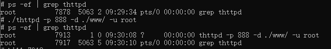
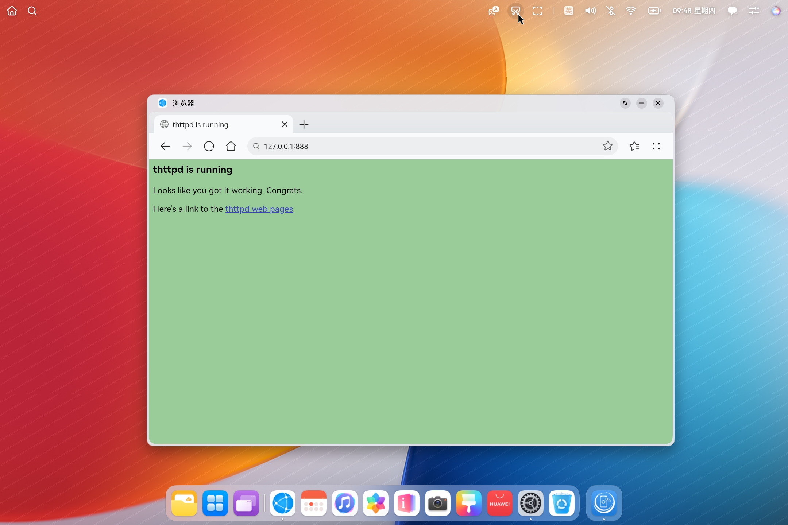

# tinyhttpd集成到应用hap

本库是在RK3568开发板上基于OpenHarmony3.2 Release版本的镜像验证的，如果是从未使用过RK3568，可以先查看[润和RK3568开发板标准系统快速上手](https://gitee.com/openharmony-sig/knowledge_demo_temp/tree/master/docs/rk3568_helloworld)。

## 开发环境

- [开发环境准备](../../../docs/hap_integrate_environment.md)

## 编译三方库

*   下载本仓库

    ```shell
    git clone https://gitee.com/openharmony-sig/tpc_c_cplusplus.git --depth=1
    ```

*   三方库目录结构

    ```shell
    tpc_c_cplusplus/thirdparty/tinyhttpd        #三方库tinyhttpd的目录结构如下
    ├── docs                                    #三方库相关文档的文件夹
    ├── HPKBUILD                                #构建脚本
    ├── HPKCHECK                                #测试脚本
    ├── OAT.xml                                 #扫描结果文件
    ├── SHA512SUM                               #三方库校验文件
    ├── README.OpenSource                       #说明三方库源码的下载地址，版本，license等信息
    ├── README_zh.md                            #三方库简介
    ├── tinyhttpd_oh_pkg.patch                  #用于tinyhttpd库编译的补丁文件
    ```

*   在lycium目录下编译三方库

    编译环境的搭建参考[准备三方库构建环境](../../../lycium/README.md#1编译环境准备)

    ```shell
    cd lycium
    ./build.sh tinyhttpd
    ```

*   三方库头文件及生成的库

    在lycium目录下会生成usr目录，该目录下存在已编译完成的32位和64位三方库

    ```shell
    tinyhttpd/arm64-v8a   tinyhttpd/armeabi-v7a
    ```

*   [测试三方库](#测试三方库)

## 应用中使用三方库

- tinyhttpd最终生成的是tinyhttpd可执行文件，无需引入测试编译，引用源库的测试逻辑即可。

## 测试三方库

- 编译出的可执行文件进行测试，[准备三方库测试环境](../../../lycium/README.md#3ci环境准备)

- 进入到构建目录运行测试用例（注意arm64-v8a为构建64位的目录，armeabi-v7a为构建32位的目录），执行结果如图所示
```shell
  cd /data/tpc_c_cplusplus/thirdparty/tinyhttpd/tinyhttpd-b35e7daf10426f9be1e22ddc0ba8c6d23225c817-arm64-v8a-build
  ./thttpd -p 888 -d ./www -u root                    #此处指定端口号888，执行该行命令前需确定该端口号未被占用
  ps -ef | grep thttpd                                #查验服务是否开启
  127.0.0.1:888
```
&nbsp;
```shell
  #在浏览器页面输入如下内容（本机ip地址:端口号查看）
  127.0.0.1:888
```
&nbsp;

## 参考资料

*   [OpenHarmony三方库地址](https://gitee.com/openharmony-tpc)
*   [OpenHarmony知识体系](https://gitee.com/openharmony-sig/knowledge)
*   [libtomcrypt三方库地址](https://github.com/larryhe/tinyhttpd)

