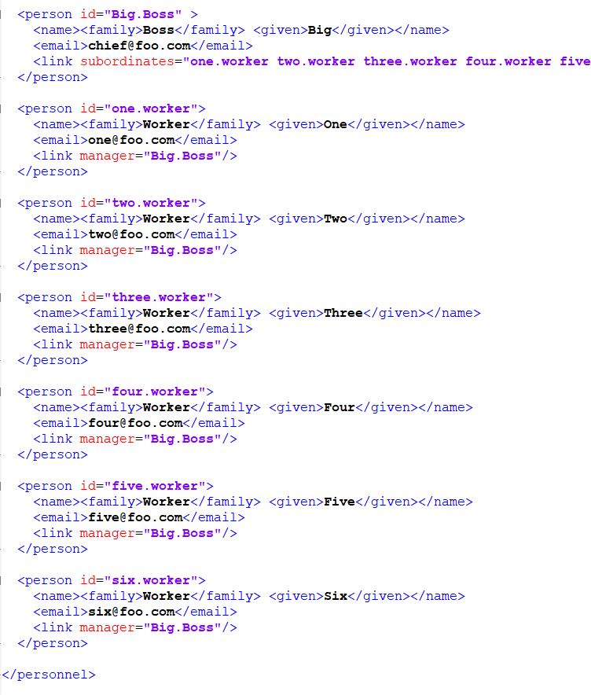
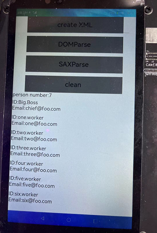

# xerces-c如何集成到应用hap
## 准备应用工程
本库是基于DevEco Studio 3.0 Release版本，在RK3568开发板上验证的，如果是从未使用过RK3568，可以先查看[润和RK3568开发板标准系统快速上手](https://gitee.com/openharmony-sig/knowledge_demo_temp/tree/master/docs/rk3568_helloworld)。
### 准备应用开发环境
开发环境的准备参考：[开发环境准备](https://gitee.com/openharmony-sig/knowledge_demo_temp/blob/master/docs/napi_study/docs/hello_napi.md#%E5%B7%A5%E7%A8%8B%E5%87%86%E5%A4%87)
### 增加构建脚本及配置文件
- 下载本仓库，并解压
- 三方库目录结构
  ```
  tpc_c_cplusplus/thirdparty/xerces-c  #三方库xerces-c的目录结构如下
  ├── adapted               #存放三方库适配需要的代码文件
  ├── docs                  #存放三方库相关文档的文件夹
  ├── CmakeLists.txt        #构建脚本，支持hap包集成
  ├── bundle.json           #三方库组件定义文件
  ├── README.OpenSource     #说明三方库源码的下载地址，版本，license等信息
  ├── README_zh.md   
  ```
- 将xerces-c拷贝至工程xxxx/entry/src/main/cpp/thirdparty目录下
### 准备三方库源码
- 三方库下载地址：[xerces-c](https://github.com/apache/xerces-c), 版本：v3.2.4
  解压后修改库文件名为xerces-c，拷贝至工程xxxx/entry/src/main/cpp/thirdparty/xerces-c目录下
- 依赖库下载地址：[ICU](https://gitee.com/openharmony/third_party_icu.git)，版本：OpenHarmony-3.2-Beta3
  解压后修改库文件名为icu，拷贝至工程xxxx/entry/src/main/cpp/thirdparty目录下
## 应用中使用三方库
- 将三方库加入工程中，目录结构如下
  ```
  demo/entry/src/main/cpp
  ├── thirdparty         #三方库存放目录
  │   ├──  xerces-c      #三方库xerces-c
  │   ├──  icu           #三方库xerces-c的依赖库
  ├── CMakeLists.txt     #工程目录的构建脚本
  ├── .....              #工程目录的其他文件
  ```
- 在工程顶级CMakeLists.txt中引入三方库，增加如下代码
  ```
  add_subdirectory(thirdparty/xerces-c)      #引入子目录下的CMakeLists.txt
  target_link_libraries(工程库名 PUBLIC xerces-c)   #工程依赖三方库xerces
  target_include_directories(工程库名 PRIVATE thirdparty/xerces-c/xerces-c
                                      thirdparty/xerces-c/xerces-c/src
                                      thirdparty/xerces-c/adapted)    #增加三方库头文件目录
  ```
- 三方库接口使用可以参考demo工程 [xerces_demo](https://gitee.com/openharmony-sig/knowledge_demo_temp/tree/master/FA/thirdparty/xerces_demo)
## 编译工程
编译工程，安装应用可以参考 [应用的安装和运行](https://gitee.com/openharmony-sig/knowledge_demo_temp/blob/master/docs/napi_study/docs/hello_napi.md#%E5%AE%89%E8%A3%85%E8%B0%83%E8%AF%95)
## 运行效果
- 在 [xerces_demo](https://gitee.com/openharmony-sig/knowledge_demo_temp/tree/master/FA/thirdparty/xerces_demo)中，使用DOM和SAX解析如下图所示数据
  &nbsp;
- 先创建xml文件，然后分析使用两种方式解析，如下图
  &nbsp;
## 参考资料
- [润和RK3568开发板标准系统快速上手](https://gitee.com/openharmony-sig/knowledge_demo_temp/tree/master/docs/rk3568_helloworld)
- [OpenHarmony三方库地址](https://gitee.com/openharmony-tpc)
- [OpenHarmony知识体系](https://gitee.com/openharmony-sig/knowledge)
- [通过DevEco Studio开发一个NAPI工程](https://gitee.com/openharmony-sig/knowledge_demo_temp/blob/master/docs/napi_study/docs/hello_napi.md)
