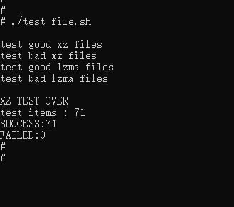

# xz如何集成到系统Rom

## 准备源码工程

本库是基于OpenHarmony-v3.2-Beta1版本，在润和RK3568开发板上验证的。如果是从未使用过RK3568，可以先查看[润和RK3568开发板标准系统快速上手](https://gitee.com/openharmony-sig/knowledge_demo_temp/tree/master/docs/rk3568_helloworld)。

## 准备系统Rom源码

源码获取方法请参照：[OpenHarmony源码下载](https://gitee.com/openharmony/docs/blob/OpenHarmony-v3.2-Beta1/zh-cn/release-notes/OpenHarmony-v3.2-beta1.md#%E6%BA%90%E7%A0%81%E8%8E%B7%E5%8F%96)

## 增加构建脚本及配置文件

- 下载本仓库代码

  ```shell
  cd ~/
  git clone git@gitee.com:openharmony-sig/tpc_c_cplusplus.git --depth=1
  ```

- 三方库目录结构

  ```shell
  cd tpc_c_cplusplus/thirdparty/xz          # 进入到仓库代码库目录
  ```

  ```shell
  xz
  |-- adapted                   # 存放三方库适配需要的代码文件
  |-- docs                      # 存放三方库相关文档的文件夹
  |-- BUILD.gn                  # 构建脚本，支持rom包集成
  |-- bundle.json               # 三方库组件定义文件
  ├── README.OpenSource         #说明三方库源码的下载地址，版本，license等信息
  ├── README_zh.md  
  ```

- 将本仓库xz文件夹拷贝到third_party下

  ```shell
  cp ~/tpc_c_cplusplus/thirdparty/xz   ~/openharmony/third_party/ -arf
  ```

## 准备三方库源码

- 将源码下载到xz目录并将其解压出来。

``` shell
cd ~/openharmony/third_party/xz                       # 进入到xz目录
git clone https://git.tukaani.org/xz.git -b v5.2.6    # 下载三方库xz 5.26版本代码
```

## 系统Rom中引入三方库

准备完三方库代码后，我们需要将三方库加入到编译构建体系中。标准系统编译构建可以参考文档[标准系统编译构建指导](https://gitee.com/openharmony/docs/blob/OpenHarmony-3.2-Beta1/zh-cn/device-dev/subsystems/subsys-build-standard-large.md)。  <br />
我们默认三方库是属于OpenHarmony的thirdparty子系统，如果需要自己定义子系统参考文档[如何为三方库组件中添加一个三方库](https://gitee.com/openharmony-sig/knowledge/blob/master/docs/openharmony_getstarted/port_thirdparty/README.md)  <br />
相关配置已在bundle.json中完成，我们只需要在产品定义中添加xz组件即可。

- 在产品配置文件中添加xz的组件  <br />
  打开//vendor/hihope/rk3568/config.json文件，找到thirdparty子系统并添加xz的组件

  ``` json
  {
  "subsystem": "thirdparty",
  "components": [
      {
        "component": "musl",
        "features": []
      },
      {
        "component": "xz",
        "features": []
      }
    ]
  },
  ```

## 系统Rom中引入三方库测试程序

如果需要编译测试用例，在OpenHarmony源码的vendor/hihope/rk356/config.json文件,对应组件的features中打开编译选项，如下

``` json
  {
  "subsystem": "thirdparty",
  "components": [
      {
        "component": "musl",
        "features": []
      },
      {
        "component": "xz",
        "features": ["enable_xz_test=true"]
      }
    ]
  },
```

## 编译工程

- 选择产品

```shell
hb set      ## hb set 命令会列出所有可选平台，这里我们选择rk3568
```

- 运行编译

```shell
hb build --target-cpu arm         ## 编译32位系统
hb build --target-cpu arm64       ## 编译64位系统
```

- 生成文件的路径，可执行文件和库文件都在out/rk3568/thirdparty/xz目录下，同时也打包到了镜像中

## 运行效果

将编译生成的库和测试文件放到板子上运行，为避免每次将文件推入设备都烧录整个镜像，我们使用hdc_std工具将文件推到开发板上

- 首先将hdc_std工具编译出来

  ```shell
  hb set                    #源码根目录下使用hb set 选择产品ohos-sdk
  hb build                  #最后工具编译出来在out/sdk/ohos-sdk/windows/toolchains/hdc_std.exe
  ```

- 将工具拷贝到Windows，可以为工具目录配置环境变量，也可以在工具所在目录打开windows命令行
- 将原生库测试需要的所有文件打包成xz.tar,并拷贝到windows下
- 将文件推送到开发板，在windows命令行进行如下操作

  ```shell
  hdc_std shell mount -o remount,rw /     #修改系统权限为可读写
  hdc_std file send xz.tar /              #将文件包推入开发板
  hdc_std shell                           #进入开发板
  tar xvf xz.tar                          #解压
                                          #注意需要将库拷贝到/system/lib 或者/system/lib64目录下
  ```

- 运行效果  <br />
  原生库提供了多个测试脚本，这里以运行测试xz与lzma文件的[test_file.sh](../adapted/test_file.sh)为例显示运行效果，如下图：
  &nbsp;

## 参考资料

- [润和RK3568开发板标准系统快速上手](https://gitee.com/openharmony-sig/knowledge_demo_temp/tree/master/docs/rk3568_helloworld)
- [OpenHarmony三方库地址](https://gitee.com/openharmony-tpc)
- [OpenHarmony知识体系](https://gitee.com/openharmony-sig/knowledge)
